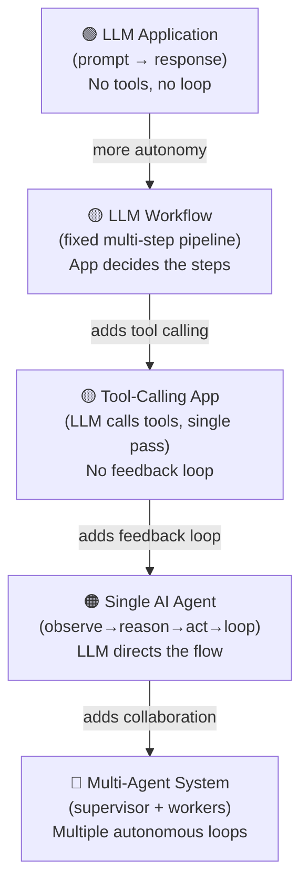
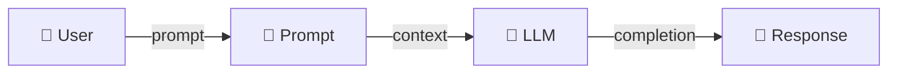
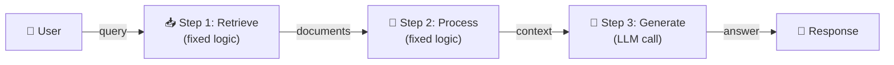
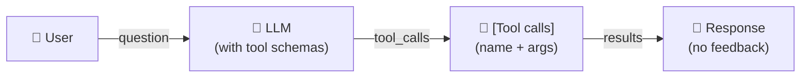
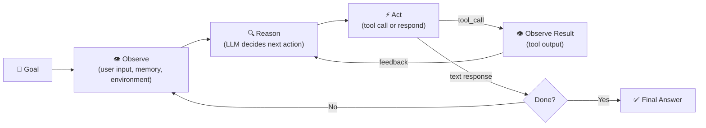
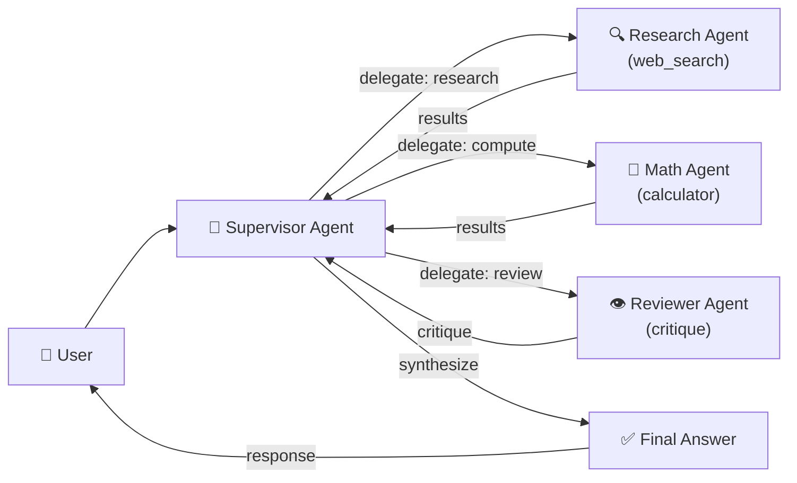
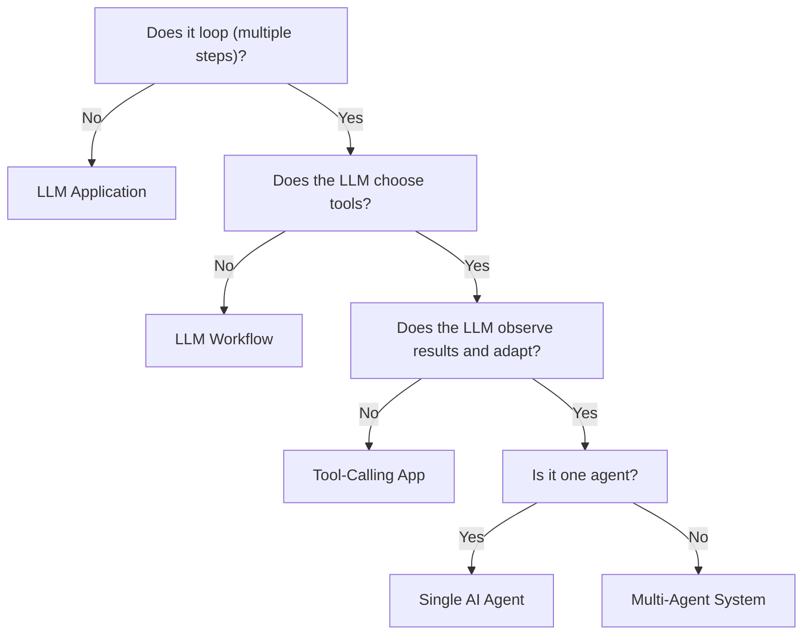
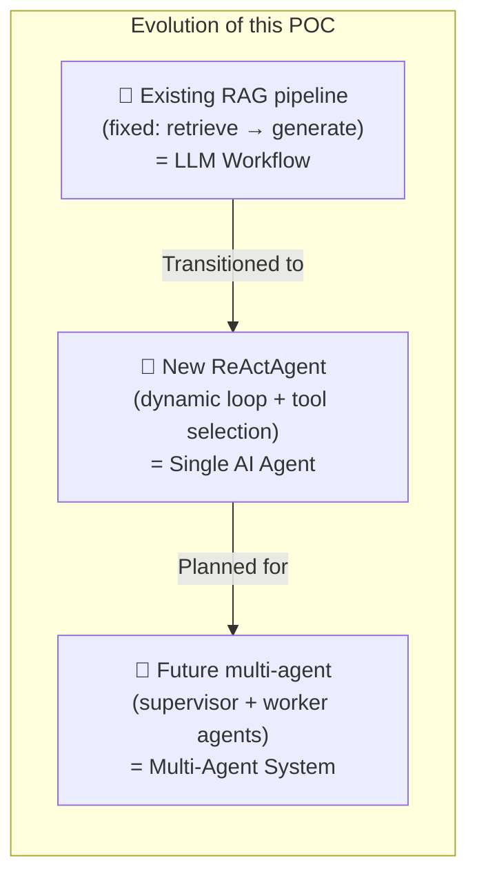

# LLM App vs Workflow vs Agent vs Multi-Agent

> **Quick reference** — which category does your system fall into?

---

## The Spectrum

---

## 1. LLM Application

**One-shot prompt → response. No loop, no tools, no memory.**

- **Single LLM call** — one round-trip, no feedback
- **No tools** — the LLM cannot interact with the outside world
- **No memory** — each request is independent, no history retained
- **Deterministic** within LLM stochasticity — no branching logic

**Examples:** Chatbot, text summarizer, code generator.

---

## 2. LLM Workflow

**Fixed, pre-defined sequence of steps. The application code decides the flow.**

- Steps are **hard-coded** — the application decides the flow, not the LLM
- **No adaptivity** — same sequence runs every time for the same task type
- May or may not use tools — the workflow is predetermined

**Example:** RAG pipeline — `query → vector_search → LLM(prompt+context) → answer`.

---

## 3. Tool-Calling Application

**The LLM can call tools, but in a single pass (no loop).**

- **LLM chooses tools** — but in a single pass, not iteratively
- **No feedback** — the LLM never sees tool results before responding
- **No loop** — one LLM call, one set of tool executions, one response

**Example:** An LLM that can call a calculator once, but doesn't act on the result.

**Why this is NOT an agent:** There's no loop. The LLM calls tools and
immediately responds. It never sees the tool results before producing its
final answer.

---

## 4. Single AI Agent

**LLM makes decisions in a loop, calling tools and observing results.**

- Iterative loop
- LLM chooses tools dynamically
- LLM observes tool results and adapts
- Memory across steps
- LLM decides when to stop

**Example:** A research agent that searches the web, evaluates results,
calculates totals, and writes a report.

**This POC's `ReActAgent`** is a single AI agent.

---

## 5. Multi-Agent System

**Multiple agents collaborate, each with its own loop.**

- Each agent has its own goal, tools, and loop
- Agents communicate via messages, shared memory, or tool calls
- Higher cost and complexity, but specialized capabilities

**Example:** A research team where a supervisor delegates to a web-search
agent, a document-analysis agent, and a writing agent.

---

## Decision Tree

---

## Quick Test: Is it an agent?

Ask these questions:

1. **Does the LLM decide the next action?** (Not just the next word.)
2. **Can it call tools?** (Not just retrieve/generate in a fixed order.)
3. **Does it observe tool results?** (Not just use them in the same pass.)
4. **Does it loop?** (Does it keep going based on results?)
5. **Can it change its mind?** (Based on observations, take a different path.)

If you answered **yes** to all five → it's an agent.
If you answered **yes** to 1–3 only → tool-calling application.
If you answered **no** to all → LLM application.
If 1–4 yes but only one agent → single agent.

---

## In this POC

