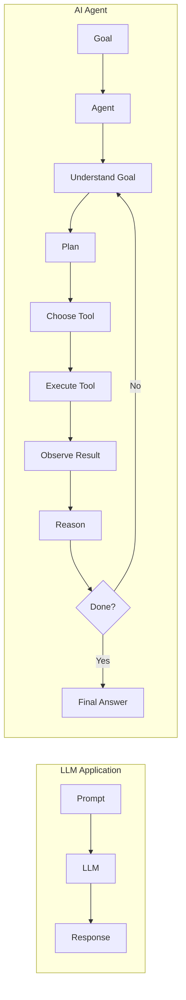
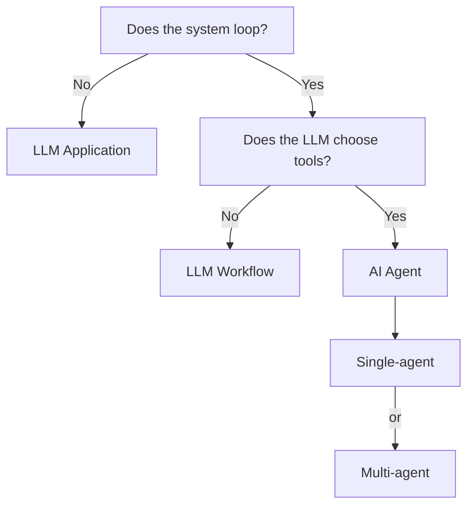
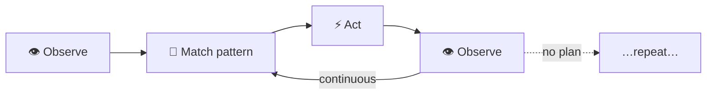
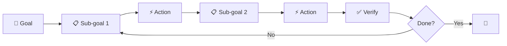
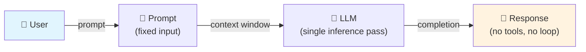
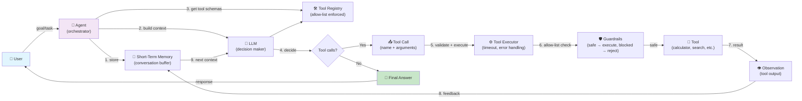

# What is Agentic AI?

> **Goal of this page:** By the end, you should be able to explain what an AI
> agent is, how it differs from a simple LLM application, and why the
> "agent loop" is the defining characteristic.

---

## Table of Contents

1. [What is Agentic AI?](#what-is-agentic-ai)
2. [What is an AI Agent?](#what-is-an-ai-agent)
3. [What makes an application "agentic"?](#what-makes-an-application-agentic)
4. [LLM vs. AI Agent](#llm-vs-ai-agent)
5. [LLM Application vs. Agent](#llm-application-vs-agent)
6. [Workflow vs. Agent](#workflow-vs-agent)
7. [Single-Agent vs. Multi-Agent](#single-agent-vs-multi-agent)
8. [Autonomous vs. Deterministic](#autonomous-vs-deterministic)
9. [Reactive vs. Planning Agents](#reactive-vs-planning-agents)
10. [Visualization](#visualization)
11. [Interview Questions](#interview-questions)

---

## What is Agentic AI?

**Agentic AI** refers to AI systems that can **autonomously** perceive their
environment, **reason** about goals, **plan** a sequence of actions, and
**act** — using tools — to achieve those goals. The word "agentic" captures
the quality of **agency**: the ability to act as an autonomous entity rather
than a passive responder.

The "AI" part is typically (but not necessarily) an LLM. What makes it
agentic is not the intelligence model itself, but the **architecture** around
it: a loop of observation, reasoning, action, and feedback.

---

## What is an AI Agent?

An **AI agent** is a system that:

1. **Perceives** its environment (through messages, tool results, memory).
2. **Reasons** about what to do next (using an LLM or other decision maker).
3. **Acts** by calling tools, making requests, or modifying state.
4. **Observes** the results of those actions.
5. **Repeats** the cycle until the goal is achieved.

### Classic definition (Russell & Norvig)

> An agent is **anything that can be viewed as perceiving its environment
> through sensors and acting upon that environment through actuators**.

In software, this translates to:

| Component | Role |
|-----------|------|
| **Sensors** | The inputs the agent receives (user messages, tool results, memory) |
| **Actuators** | The actions the agent takes (tool calls, API requests, state changes) |
| **Agent program** | The algorithm that maps percepts to actions (the LLM + loop) |
| **Environment** | Everything the agent interacts with (tools, APIs, memory, the user) |

### The agent in this POC

The `ReActAgent` (app/agents/react_agent.py) is a concrete implementation.
It uses an LLM as its decision-making core and a loop of observe-reason-act
to solve tasks.

---

## What makes an application "agentic"?

Not every AI-powered application is an agent. A system is **agentic** when it
has these characteristics:

| # | Characteristic | Description |
|---|----------------|-------------|
| 1 | **Iterative loop** | The system can take multiple steps, observing results between each |
| 2 | **LLM-directed tool selection** | The LLM chooses which tool to call, not hardcoded application code |
| 3 | **LLM-directed arguments** | The LLM generates the arguments for each tool based on context |
| 4 | **Observation feedback** | Tool results are fed back to the LLM to inform the next decision |
| 5 | **Dynamic planning** | The plan can change based on intermediate results |
| 6 | **Memory** | Context is retained across turns within a task |
| 7 | **Termination condition** | The agent decides when the goal is achieved (not a fixed step count) |

A system missing **any** of these is an LLM application or workflow, not an
agent. In particular, an LLM that calls the *same* fixed sequence of tools
every time (e.g., always retrieve-then-generate) is a **workflow**, not an
agent.

---

## LLM vs. AI Agent



**LLM Application:** One-shot. Prompt in, response out. No loop, no tools,
no memory beyond the single prompt.

**AI Agent:** Cyclical. The agent keeps going until the goal is met, using
tools and reasoning at each step.

---

## LLM Application vs. Agent

| Aspect | LLM Application | AI Agent |
|--------|----------------|----------|
| **Flow** | Single prompt → response | Observe → reason → act → observe → … |
| **Tools** | None (or fixed pipeline) | Dynamically selected by the LLM |
| **Planning** | None (the prompt is the plan) | Explicit or implicit plan, can be revised |
| **Memory** | None (each request is fresh) | Retains context across steps |
| **Adaptability** | Fixed behavior per prompt | Adapts based on tool results |
| **Failure recovery** | None (if the answer is wrong, start over) | Can retry, try a different tool, or self-correct |
| **Latency** | One LLM call | Multiple LLM calls (higher, but more capable) |
| **Use when** | Simple Q&A, classification, summarization | Multi-step tasks that need tools |

---

## Workflow vs. Agent

This distinction is **crucial** and often confused in interviews.

### LLM Workflow (deterministic)

A workflow is a **pre-defined sequence** of steps. The application code
decides what happens at each step.

```
Step 1: Retrieve documents (always)
Step 2: Generate answer (always)
Step 3: Return response (always)
```

Example: A RAG pipeline that always does `retrieve(k=5) → generate()`. The LLM
never decides whether to retrieve, what to retrieve, or whether to try again.
It's a fixed function: `f(query) = generate(retrieve(query))`.

### AI Agent (autonomous)

An agent uses an **LLM to decide** what to do at each step. The sequence is
emergent, not pre-defined.

```
Step 1: LLM decides — "I need to search the web"
Step 2: Tool executes → result
Step 3: LLM decides — "I need to calculate something"
Step 4: Tool executes → result
Step 5: LLM decides — "I have enough info, answer the user"
```

### Decision tree



### In this POC

The existing RAG pipeline ([see project analysis](../project/project-analysis.md))
is a **workflow**: retrieve → generate. The new `ReActAgent` is an **agent**:
it loops, calls tools dynamically, and adapts.

---

## Single-Agent vs. Multi-Agent

| Aspect | Single Agent | Multi-Agent |
|--------|-------------|-------------|
| **Components** | One decision maker | Multiple agents |
| **Coordination** | Internal (memory, planning) | Explicit (communication, delegation) |
| **Specialization** | One LLM, multiple tools | Multiple specialized LLMs |
| **Complexity** | Lower | Higher |
| **Use when** | Most tasks | Very complex tasks requiring different skills |

In this POC we start with a **single agent** (the ReAct agent). Multi-agent
patterns are documented in [Multi-Agent Systems](../architecture/multi-agent.md)
and demonstrated in the [experiments](../experiments/multi-agent.md).

---

## Autonomous vs. Deterministic

| Aspect | Autonomous Agent | Deterministic System |
|--------|------------------|---------------------|
| **Decision making** | LLM chooses actions | Pre-defined rules / fixed pipeline |
| **Tool selection** | Dynamic | Static |
| **Execution path** | Emergent | Pre-determined |
| **Reproducibility** | Low (LLM is stochastic) | High |
| **Flexibility** | High | Low |
| **Debugging** | Harder (non-deterministic) | Easier (traceable) |

Most real-world agents are **somewhere in between** — they use deterministic
guardrails (max iterations, tool allow-lists) to constrain autonomous behavior.

---

## Reactive vs. Planning Agents

### Reactive agents

React directly to observations without maintaining an internal plan.



- Fast, simple, no lookahead
- Can get stuck in loops
- Common in simple chatbots

### Planning agents

Build and maintain a plan before acting.



- Slower (upfront planning cost)
- Better for complex, multi-step tasks
- Can recover from partial failures
- Common in advanced agents (ReAct, Reflexion)

### ReAct is a hybrid

ReAct combines reactive (think-act-observe loop) with planning (the reasoning
step acts as lightweight planning). It doesn't build an explicit plan
upfront but reasons step-by-step, which implicitly plans.

---

## Visualization

### Traditional LLM application



**Key limitations:** No tool access, no memory between turns, no adaptive decision-making.

### Agentic application



**Key differences from traditional:** The LLM **directs the flow** — it chooses tools, reasons about results, and decides when to stop. The application provides the **mechanism** (loop, tools, guardrails); the LLM provides the **intelligence**.

The key difference: in the agentic model, **the LLM directs the flow**. It
chooses tools, reasons about results, and decides when to stop. The
application provides the mechanism; the LLM provides the intelligence.

---

## Interview Questions

### Short answer

**Q: What is an AI agent?**
A: An AI agent is a system that perceives its environment, reasons about
goals, takes actions (typically via tools), observes the results, and loops
until the goal is achieved. The key differentiator from an LLM application is
the iterative loop where the LLM dynamically chooses actions.

**Q: What is Agentic AI?**
A: Agentic AI refers to AI systems that exhibit agency — the ability to
act autonomously toward a goal. It's characterized by an agent loop (observe,
reason, act, observe), dynamic tool selection, and memory.

**Q: What makes an application agentic?**
A: An iterative loop with LLM-directed tool selection, observation feedback,
dynamic planning, and memory. The LLM must decide *what* to do next, not just
*what to say*.

### Detailed explanation

**Q: How does an AI agent differ from a traditional LLM application?**

A traditional LLM application takes a prompt and returns a response in a
single pass. There is no feedback loop, no tool calling, and no memory.

An AI agent adds:

1. **Tools**: The agent can call functions (search, calculate, read files)
   to interact with the world. The LLM chooses which tool to call.
2. **Loop**: After a tool executes, the result is fed back to the LLM, which
   can call more tools or produce a final answer.
3. **Memory**: The conversation history and task state persist across turns.
4. **Planning**: The agent can decompose a task and reason about intermediate
   steps.

This allows agents to solve complex, multi-step problems that a single LLM
call cannot handle.

### Follow-up questions

- "When would you NOT use an agent?"
- "What are the downsides of agentic systems?"
- "How do you prevent an agent from going into an infinite loop?"
- "What's the difference between a tool-calling app and an agent?"
- "How does ReAct work?"

### Common mistakes

- Calling any LLM application that uses tools an "agent"
- Confusing a fixed workflow (retrieve → generate) with an agent loop
- Assuming more tools = better agent (quality of reasoning matters more)
- Not designing proper termination conditions
- Ignoring the cost of multiple LLM calls
