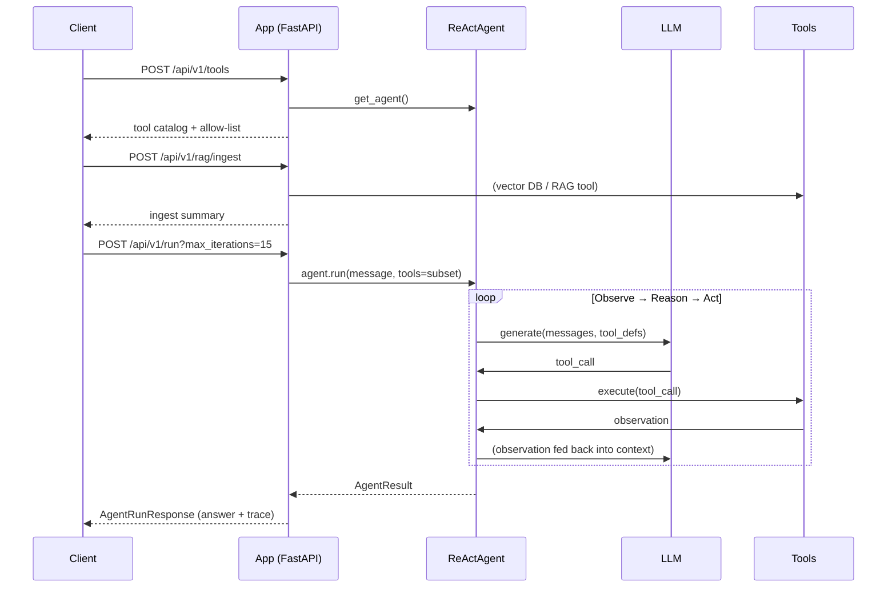

# API Reference

> **Goal:** Know every API endpoint — how to call it, what it does, and
> its contextual meaning in the agentic system.

The FastAPI application exposes a small, purposeful HTTP API. Every endpoint
maps to a stage of the **agent lifecycle**: starting, running, inspecting,
streaming, and bootstrapping knowledge. This guide documents each endpoint,
its request/response shape, and — most importantly — *why* it exists in the
agent architecture.

---

## Getting Started

### Two execution modes

The agent can run in two modes, controlled by `AGENT_SIMULATED_MODE`:

| Mode | `AGENT_SIMULATED_MODE` | LLM | API key needed? |
|------|------------------------|-----|-----------------|
| **Mock (simulated)** | `true` (default) | `MockLLMService` | No — deterministic demo responses |
| **Real** | `false` | `OpenAILLMService` | Yes (`LLM_API_KEY`) |

The mock LLM returns canned tool calls and answers so you can exercise the
full agent loop — planning, tool selection, observation, reflection — without
spending credits or needing network access.

### Running the app

```bash
# Local (mock LLM, no key)
python -m uvicorn app.main:app --reload
# API:  http://localhost:8000/api/v1
# Docs: http://localhost:8000/docs

# Local (real LLM)
cp .env.example .env
# Edit .env: AGENT_SIMULATED_MODE=false, LLM_API_KEY=your-key
python -m uvicorn app.main:app --reload

# Docker
docker-compose up --build
# API:  http://localhost:8000/api/v1
# Docs: http://localhost:8001
```

### Base URL

All endpoints share the prefix:

```
http://localhost:8000/api/v1
```

### Interactive docs

FastAPI auto-generates a Swagger UI and a ReDoc page from the route
declarations. These are the fastest way to learn the exact request shapes:

- `http://localhost:8000/docs` — Swagger UI (try requests in-browser)
- `http://localhost:8000/redoc` — ReDoc (alternative view)

### When to use which endpoint?

| You want to… | Use |
|---|---|
| Run the agent and just get the answer | `POST /chat` |
| Run the agent with full control + full trace | `POST /run` |
| Stream live events as the agent works | `POST /chat/stream` |
| Inspect the available tools | `GET /tools` |
| Seed the knowledge base for RAG | `POST /rag/ingest` |
| Check the service is alive | `GET /health` |

---

## Endpoints

### `GET /` — Root

A landing endpoint that advertises the service, its version, the active
execution mode, and the available entry points. Useful as a smoke test and
for service discovery.

**Response** `200 OK`

```json
{
  "message": "Agentic AI POC",
  "app": "Agentic AI POC",
  "version": "0.1.0",
  "simulated_mode": true,
  "docs": "/docs",
  "api": "/api/v1",
  "endpoints": {
    "chat": "POST /api/v1/chat",
    "chat_stream": "POST /api/v1/chat/stream",
    "run": "POST /api/v1/run",
    "tools": "GET /api/v1/tools",
    "rag_ingest": "POST /api/v1/rag/ingest",
    "health": "GET /api/v1/health"
  }
}
```

> **Contextual meaning:** This is the *table of contents* for the API. The
> `simulated_mode` flag tells the caller whether tool calls and answers come
> from the mock LLM (deterministic, offline) or a real provider (live, billed).

---

### `GET /api/v1/health` — Health check

A lightweight liveness probe. Docker and orchestrators typically poll this
to decide whether to route traffic to a container.

**Response** `200 OK`

```json
{
  "status": "ok",
  "service": "Agentic AI POC",
  "simulated_mode": true,
  "model": "gpt-4o-mini"
}
```

> **Contextual meaning:** `simulated_mode` and `model` come straight from the
> loaded `Settings`. They let an operator confirm, at a glance, which LLM
> backend and which model the service is actually wired to — critical when
> toggling between demo and production modes.

---

### `POST /api/v1/chat` — Run the agent (simple)

The simplest way to invoke the agent. Send a user message and get back the
agent's final answer *plus* the full execution trace.

> **Contextual meaning:** This endpoint represents the **one-shot agent**
> interaction model: *goal → agent.run → answer*. It mirrors the `/chat`
> path in the data-flow diagram — the user message is buffered in
> short-term memory, the agent loop runs, and the final answer is returned.
> No per-request overrides are accepted here; everything uses the
> environment defaults (`AGENT_MAX_ITERATIONS`, the configured tool
> allow-list, etc.).

**Request body**

| Field | Type | Required | Description |
|-------|------|----------|-------------|
| `message` | `string` | yes | The user's goal / query for the agent. |

**Example**

```bash
curl -X POST http://localhost:8000/api/v1/chat \
  -H "Content-Type: application/json" \
  -d '{"message": "What is the capital of France?"}'
```

**Response** `200 OK`

```json
{
  "success": true,
  "answer": "The capital of France is Paris.",
  "final_state": "COMPLETED",
  "total_steps": 1,
  "total_tool_calls": 0,
  "total_llm_calls": 1,
  "trace": [
    {
      "step_number": 1,
      "state": "THINKING",
      "reasoning": "The user asked a direct factual question...",
      "llm_response": { "content": "The capital of France is Paris.", ... },
      "tool_calls": [],
      "tool_results": []
    }
  ],
  "error": null
}
```

**Response fields**

| Field | Meaning |
|-------|---------|
| `success` | Whether the agent reached a `COMPLETED` state. A `false` here means the run was `FAILED` or hit `MAX_ITERATIONS`. |
| `answer` | The agent's final text answer (null if it failed before producing one). |
| `final_state` | The terminal `AgentState` of the run — see the [State](#agent-lifecycle-states) note below. |
| `total_steps` | How many observe→reason→act cycles the agent performed. |
| `total_tool_calls` | Aggregate number of tool invocations across the whole run. |
| `total_llm_calls` | How many times the LLM was called (one per loop iteration). |
| `trace` | The full step-by-step trace (only present when `AGENT_TRACE_ENABLED=true`). Each entry shows the state, reasoning, tool calls, and results. |
| `error` | Error message if the run failed, otherwise null. |

---

### `POST /api/v1/run` — Run the agent (full control)

A more configurable entry point. Accepts the same `message`, but also a
**query parameter** to override the iteration budget and a request body field
to restrict which tools the agent may use.

> **Contextual meaning:** Where `/chat` is the *simple* interface, `/run` is
> the *programmatic* interface — the one an orchestrator, a test harness, or
> a higher-level "meta-agent" would call. It exposes two levers that the
> simple endpoint intentionally hides:
>
> 1. **`max_iterations`** (query param) — lets the caller cap the agent's
>    planning budget *without redeploying*. A short task may only need 3
>    iterations; a complex multi-step task may need 30. This is a
>    guardrail surfaced as configuration.
> 2. **`tools`** (body field) — restricts the tool registry to a subset of
>    names. This is the *allow-list-as-a-parameter* pattern: instead of
>    granting every registered tool, the caller scopes the agent to exactly
>    the capabilities it should need (principle of least privilege).

**Query parameters**

| Name | Type | Default | Constraints | Description |
|------|------|---------|-------------|-------------|
| `max_iterations` | `integer` | `10` | `1 ≤ n ≤ 50` | Maximum loop iterations before the agent is force-terminated. |

**Request body** — same `ChatRequest` shape as `/chat`, plus two optional
overrides:

| Field | Type | Default | Description |
|-------|------|---------|-------------|
| `message` | `string` | — | The user's goal / query. |
| `conversation_id` | `string` | `null` | Group related turns so short-term memory can be associated. |
| `max_iterations` | `integer` | `null` | *Body-level* override (takes effect only if the query param is unset). Either override source is respected; the last one checked wins by the precedence in the handler. |
| `tools` | `array<string>` | `null` | Restrict the agent to these tool names (e.g. `["calculator"]`). |
| `stream` | `boolean` | `false` | Hint that the caller prefers streaming (use `/chat/stream` instead). |

**Example** — cap iterations and restrict to the calculator tool:

```bash
curl -X POST "http://localhost:8000/api/v1/run?max_iterations=5" \
  -H "Content-Type: application/json" \
  -d '{
    "message": "If I spend $12.50 on coffee at $4.75 each, how many days until I've spent $100?",
    "tools": ["calculator"]
  }'
```

**Response** — same `AgentRunResponse` shape as `/chat`. The `trace` field
is the list of per-step event dicts (one per agent-loop iteration), and
`total_tool_calls` will reflect only the restricted toolset.

```json
{
  "success": true,
  "answer": "It will take 9 days to spend $100 at $4.75 per coffee.",
  "final_state": "COMPLETED",
  "total_steps": 2,
  "total_tool_calls": 1,
  "total_llm_calls": 2,
  "trace": [ { "event_type": "agent_start", ... }, { "event_type": "llm_call", ... } ],
  "error": null
}
```

> **When iteration budget matters:** If `final_state` is `MAX_ITERATIONS`,
> the agent hit its cap without reaching `COMPLETED`. Look at the last few
> trace entries — the LLM is likely looping on the same tool call. Raising
> `max_iterations` *may* help, but a recurring observation usually signals a
> prompt/tool-design problem rather than a budget problem.

---

### `GET /api/v1/tools` — List available tools

Returns the full tool registry as seen by the agent: every tool's name,
description, parameter schema, and category. This is exactly the
`tools` array the LLM receives — exposing it lets a client or UI render
buttons/forms and validate calls before the agent makes them.

> **Contextual meaning:** This is the **tool catalog**. In the architecture
> diagram, the *Tool Registry* is the bridge between the application's
> actuators and the LLM's planner. Listing it externally means clients can
> build their own tool-use UIs that stay in sync with what the agent can
> actually do.

**Response** `200 OK`

```json
{
  "tools": [
    {
      "name": "calculator",
      "description": "A simple calculator...",
      "parameters_schema": {
        "type": "object",
        "properties": { "expression": { "type": "string" } },
        "required": ["expression"]
      },
      "category": "general"
    },
    { "name": "datetime_now", ... },
    { "name": "file_reader", ... },
    { "name": "web_search", ... },
    { "name": "rag_query", ... }
  ],
  "allow_list": ["calculator", "datetime", "file_reader", "search", "rag_query"],
  "total": 5
}
```

**Response fields**

| Field | Meaning |
|-------|---------|
| `tools` | Full list of `ToolInfo` — name, description, parameter JSON schema, category. |
| `allow_list` | The names the agent is currently permitted to call (from `TOOL_ALLOW_LIST`). `"all"` means no restriction. |
| `total` | Count of tools in the registry. |

---

### `POST /api/v1/chat/stream` — Run the agent with streaming (SSE)

Runs the agent like `/chat`, but emits **Server-Sent Events (SSE)** so a
client can render the agent's progress as it thinks, calls tools, and observes
results.

> **Contextual meaning:** Streaming turns the agent loop inside-out. Instead
> of returning a single opaque trace after the fact, it publishes the trace
> *as a sequence of events*. Each event corresponds to a moment in the
> observe→reason→act cycle, so a frontend can animate the agent's decision
> making — showing "thinking", then the tool it chose, then the tool's
> result, then "reasoning" again. This is the observability story made
> user-visible.

**Request body** — same `ChatRequest` as `/chat`.

**Response** — `text/event-stream`. Each event is a JSON `ChatResponse`
pushed as `data: {json}\n\n`. The `type` field discriminates the event:

| `type` | When emitted | `ChatResponse` fields populated | Meaning |
|--------|-------------|---------------------------------|---------|
| `start` | At run begin | `content` (status text) | The agent is starting. |
| `tool_call` | When the LLM requests a tool | `tool_call` (`name`, `arguments`) | The agent decided to act — here's the tool and its arguments. |
| `tool_result` | After a tool executes | `tool_result` (`tool_name`, `success`, `execution_time`) | The observation — the tool ran and succeeded/failed. |
| `end` | Run finished | `answer` (or `error`) | The final answer (or error) is ready. |

**Example**

```bash
curl -N -X POST http://localhost:8000/api/v1/chat/stream \
  -H "Content-Type: application/json" \
  -d '{"message": "What time is it in Tokyo?"}'
```

Sample event stream:

```
data: {"type":"start","content":"Agent starting...","tool_call":null,"tool_result":null,"step":null,"answer":null,"error":null}

data: {"type":"tool_call","tool_call":{"name":"datetime_now","arguments":"{\"timezone\":\"Asia/Tokyo\"}"},"tool_result":null,"step":null,"answer":null,"error":null}

data: {"type":"tool_result","tool_result":{"tool_name":"datetime_now","success":true,"execution_time":0.04},"step":null,"answer":null,"error":null}

data: {"type":"end","answer":"It is currently 09:48 AM JST on September 6, 2026.","error":null}
```

> **Tip:** In JavaScript, consume with `EventSource` or fetch the stream and
> split on blank lines. The `tool_call` / `tool_result` events are the richest
> — they let you highlight *why* the agent picked a tool and *what it saw*.

---

### `POST /api/v1/rag/ingest` — Seed the knowledge base

Loads documents into the vector database (Qdrant) so the `rag_query` tool
can answer questions grounded in them. This is a **setup** endpoint — it is
not part of the agent loop itself, but it *feeds* the loop: the RAG tool
retrieves from this collection at runtime.

> **Contextual meaning:** This is the **"RAG-as-a-tool" bootstrapping step**.
> In a fixed RAG pipeline, ingestion and retrieval are coupled at build time.
> In this agentic design, retrieval is a *tool* the LLM calls on demand — so
> the knowledge base must be populated *before* the agent needs it. Think of
> this endpoint as "teaching the agent's memory" before asking it questions.

**Request body**

| Field | Type | Description |
|-------|------|-------------|
| `documents` | `array<Document>` | Documents to index. |

Each `Document`:

| Field | Type | Description |
|-------|------|-------------|
| `id` | `string` | Optional unique id (one is auto-generated if omitted). |
| `content` | `string` | Full text to index. |
| `metadata` | `object` | Optional key/value metadata to store alongside the chunk. |

**Example**

```bash
curl -X POST http://localhost:8000/api/v1/rag/ingest \
  -H "Content-Type: application/json" \
  -d '{
    "documents": [
      {
        "id": "doc-1",
        "content": "CommandCode is an AI coding agent that runs in your terminal...",
        "metadata": { "source": "about" }
      },
      {
        "content": "The ReAct pattern stands for Reason, Act — observe, reason, act, observe...",
      }
    ]
  }'
```

**Response** `200 OK`

```json
{
  "message": "Ingested 2 documents into collection 'agentic-docs': created 3 chunks (chunk_size=500, overlap=100)."
}
```

> **Configuration knobs** (env vars): `RAG_CHUNK_SIZE` (default 500),
> `RAG_CHUNK_OVERLAP` (default 100), `QDRANT_COLLECTION`
> (default `agentic-docs`), `EMBEDDING_MODEL` (default
> `sentence-transformers/all-MiniLM-L6-v2`). Documents are split into
> overlapping chunks so a retrieval query can match a snippet that spans a
> chunk boundary.

---

## Agent Lifecycle States

Every agent run terminates in one of these `final_state` values
(`AgentState` enum). They form an explicit state machine; each transition is
recorded in the trace.

| State | Meaning | When you see it |
|-------|---------|-----------------|
| `IDLE` | Created, not yet started. | Diagnostic only. |
| `RUNNING` | Inside the loop. | Not usually terminal. |
| `THINKING` | LLM is reasoning / deciding. | Appears in trace entries. |
| `TOOL_CALLING` | LLM emitted a tool call. | Trace entry before execution. |
| `OBSERVING` | Processing tool results. | Trace entry after execution. |
| `PLANNING` | Decomposing goal into sub-steps. | Trace entry (planned agents). |
| `REFLECTING` | Self-critique / reviewing output. | Trace entry (when enabled). |
| `COMPLETED` | Finished successfully. | Good — the agent answered. |
| `FAILED` | Terminated due to an error. | `error` field is populated. |
| `MAX_ITERATIONS` | Hit the iteration cap. | Loop too long — see `/run` note. |
| `STOPPED` | Manually stopped. | Diagnostic only. |

---

## The Agent Loop in Action

These endpoints don't operate in isolation — they compose the agent lifecycle.
A typical session:



1. **`GET /tools`** — discover what the agent can do (or inspect the
   allow-list).
2. **`POST /rag/ingest`** — seed knowledge *before* the agent needs it.
3. **`POST /run`** — run the agent with a tuned iteration budget and a
   restricted toolset. Inspect the returned trace to confirm the agent chose
   the right tools.
4. **`POST /chat/stream`** — for a live UI, stream the same loop event by
   event instead of waiting for completion.

## Web UI (Streamlit)

A minimal Streamlit frontend lets you talk to the agent in a browser instead of
crafting `curl` requests by hand. It's wired to the same HTTP API documented
above.

**Run the whole stack (API + Qdrant + UI):**

```bash
docker-compose up --build
```

Then open `http://localhost:8501`. From the sidebar you can:

- **Chat** — messages go to `POST /api/v1/chat/stream`, so each tool call and
  result appears as the agent thinks and acts.
- **List tools** — fetches `GET /api/v1/tools`.
- **Ingest documents** — posts `{"documents": [...]}` to `POST /api/v1/rag/ingest`
  to ground the agent on your own text.
- **Check health** — calls `GET /api/v1/health`.

The sidebar's *API base URL* defaults to `http://localhost:8000` (local runs)
or `http://api:8000` (inside the Docker Compose network). Override it with the
`API_URL` environment variable. To run the UI standalone against a running API:

```bash
pip install streamlit requests
API_URL=http://localhost:8000 streamlit run streamlit_app.py
```

## Related documentation

- **[Agent Architecture](architecture/agent-architecture.md)** — components
  and data flow
- **[Agent Loop](architecture/agent-loop.md)** — the ReAct cycle step by step
- **[Tool Calling](architecture/tool-calling.md)** — how the LLM selects tools
- **[RAG + Agents](architecture/rag-agents.md)** — retrieval as a tool
- **[Observability](architecture/observability.md)** — traces and debugging
- **[Agent Configuration](../.env)** — all environment variables
