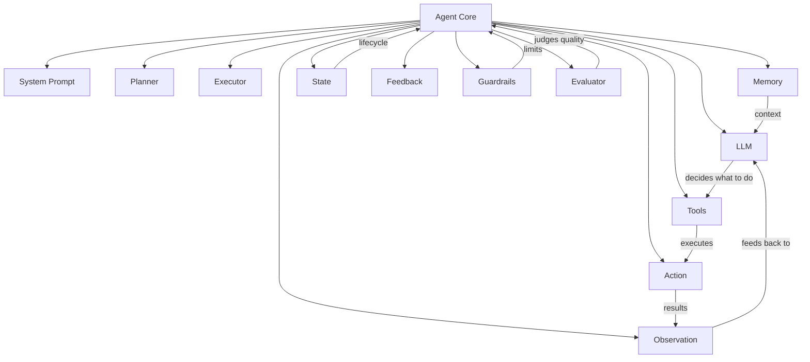
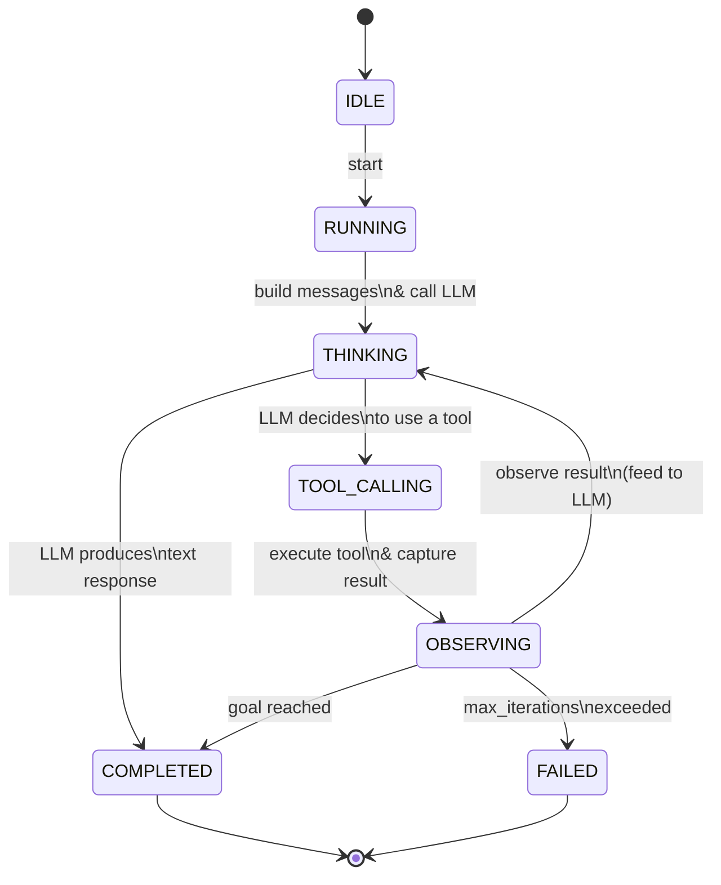
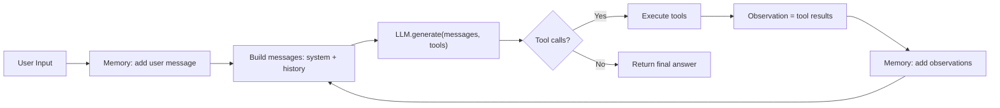

# Agent Architecture

> **Goal:** Understand the major components of an AI agent and how they interact.

---

## The Major Components

An AI agent is composed of several interacting subsystems. Each has a
specific responsibility, and the separation of concerns makes the agent
understandable, debuggable, and extensible.



### 1. Agent (orchestrator)

The **agent** is the core orchestrator. It runs the agent loop, manages
state transitions, coordinates between memory and the LLM, applies
guardrails, and decides when to stop.

In this POC, the `ReActAgent` (source (app/agents/react_agent.py))
implements the loop explicitly:

```python
while iteration < max_iterations:
    messages = build_messages()        # system + memory
    response = await llm.generate(messages, tools)    # LLM decides
    if response.has_tool_calls:
        results = await execute_tools(response.tool_calls)  # execute
        memory.add(results)            # observe + loop
    else:
        return response.content        # final answer
```

### 2. LLM (decision maker)

The **LLM** is the brain — it reads the conversation history and decides
the next action: call a tool or respond to the user.

- In this POC: `LLMInterface` (app/llm/service.py) (abstract) with
  `OpenAILLMService` (app/llm/service.py) (real) and
  `MockLLMService` (app/llm/mock.py) (simulated).
- The LLM receives **tools** as structured definitions (name, description,
  parameters) and can output tool calls in its response.

### 3. System Prompt

The **system prompt** is the agent's constitution — it defines behavior,
personality, constraints, and how to use tools.

In this POC: `DEFAULT_SYSTEM_PROMPT` in `app/agents/base.py` (app/agents/base.py).

**Why it matters:** The system prompt is the single most impactful lever
for agent behavior. A well-crafted prompt can make the difference between
an agent that reliably completes tasks and one that loops forever.

### 4. Tools

**Tools** are the agent's actuators — functions it can call to interact with
the world (calculate, search, read files, retrieve documents).

- Base class: `Tool` (app/tools/base.py)
- Registry: `ToolRegistry` (app/tools/base.py)
- Implementations: `CalculatorTool`, `DateTimeTool`, `FileReaderTool`,
  `WebSearchTool`, `RAGRetrieverTool`

### 5. Tool Registry

The **tool registry** is the catalog of available tools. It enforces:

- **Allow-list** — only registered tools can be called
- **Discovery** — converting tools to LLM-readable definitions
- **Metadata** — tool descriptions, categories, parameter schemas

### 6. Planner

The **planner** determines what to do. In a ReAct agent, the LLM itself
is the planner (its reasoning between tool calls). In more advanced agents,
a dedicated planning step decomposes a goal into sub-tasks.

### 7. Executor

The **executor** carries out tool calls. It:

1. Looks up the tool by name
2. Parses and validates arguments
3. Executes with a timeout
4. Catches errors → produces an observation (never crashes)

In this POC: `BaseAgent._execute_tool` in `app/agents/base.py` (app/agents/base.py).

### 8. Memory

**Memory** retains information across the agent's steps:

- **Short-term** (conversation buffer) — current task context
- **Working** (scratchpad) — intermediate task state
- **Long-term** (persistent) — facts/prefs across sessions

### 9. State

**State** tracks where the agent is in its lifecycle:



State transitions are logged to the trace for debugging.

### 10. Observation

An **observation** is what the agent sees at each step — the result of a
tool call, a new memory entry, or the initial user query. Observations
are fed back into the LLM's context window.

### 11. Action

An **action** is what the agent does — a tool call or a final text response.
Actions are decided by the LLM and executed by the executor.

### 12. Feedback

**Feedback** closes the loop — tool results are returned to the LLM, which
can then reason about them and decide the next action. Feedback can also
come from humans (approval/rejection) or evaluators (quality scores).

### 13. Guardrails

**Guardrails** are safety boundaries applied by the *application*:

- Tool allow-list
- Maximum iterations
- Timeouts
- Input/output validation
- Human approval for risky actions

**Principle:** The LLM decides *what* to do; the application decides *what
is allowed*.

### 14. Evaluator

The **evaluator** judges whether the agent's outputs are correct or helpful.
This can run at the end of a task (final answer quality) or continuously
(self-critique / reflection).

---

## Data Flow



## Component Interactions

| Component | Reads from | Writes to | Triggers |
|-----------|-----------|-----------|----------|
| Agent loop | Memory, LLM response | Memory, State, Trace | LLM call, tool execution |
| LLM | Memory (messages), Tool definitions | (returns) response | Next loop iteration |
| Tools | Tool arguments | (returns) result | Observation |
| Memory | Messages, observations | Message store | Next LLM call |
| Guardrails | Tool name, arguments | (returns) allowed/blocked | Tool execution |
| Trace | All events | Event log | (logging only) |

---

## Related documentation

- **[Agent Loop](agent-loop.md)** — the step-by-step cycle
- **[Tool Calling](tool-calling.md)** — how tools work
- **[Memory](memory.md)** — short-term, working, long-term
- **[State](state.md)** — the state machine
- **[Guardrails & Security](security.md)** — safety boundaries
