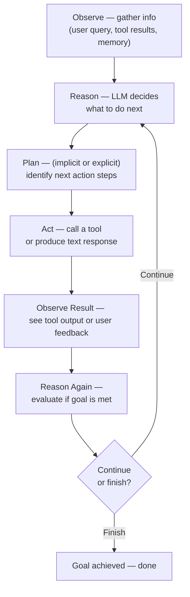
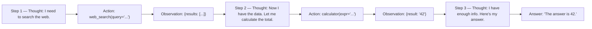
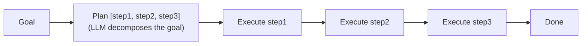
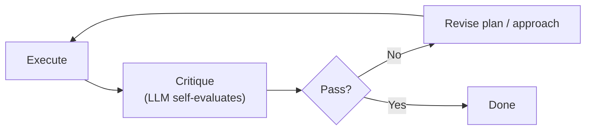

# Agent Loop

> **Goal:** Understand the agent loop — the core mechanism that makes an
> agent "agentic" — and see how it is implemented in this POC.

---

## What is the Agent Loop?

The **agent loop** is the iterative cycle that an agent runs:



At each iteration, the agent:

1. **Observes** — gathers current information (user input, tool results, memory).
2. **Reasons** — uses the LLM to decide what to do.
3. **Plans** — (implicitly or explicitly) decides on the next action.
4. **Acts** — calls a tool or produces a response.
5. **Observes the result** — sees what happened.
6. **Repeats** — until the goal is achieved or a stop condition is met.

The loop is what fundamentally distinguishes an agent from a stateless
LLM call. Without a loop, there is no adaptation, no recovery from errors,
and no multi-step problem solving.

---

## The ReAct Loop

**ReAct** (Yao et al., 2022) is the most common agent loop pattern. It
interleaves **reasoning** (chain-of-thought) with **acting** (tool calls):



This format makes the agent's reasoning **observable** — you can read each
step of its thought process and tool usage.

---

## Termination Conditions

An agent loop must have clear **stop conditions** — otherwise it loops
forever.

| Condition | Description | Example |
|-----------|-------------|---------|
| **Text response** | The LLM produces a final answer (no tool calls) | LLM outputs "The answer is 42." |
| **Max iterations** | A safety cap on the number of loop iterations | `max_iterations=10` |
| **Stop token** | The LLM outputs a special "done" signal | `DONE` / `FINISHED` |
| **Empty action** | The LLM returns no tool calls and no text | Recovery needed |
| **Error** | An unrecoverable error occurs | LLM returns `finish_reason="error"` |
| **Human stop** | A human operator stops the agent | Button click in UI |

### Why maximum iterations matters

Without a cap, an agent can loop indefinitely — calling a tool, getting a
result, calling another tool, etc., never converging. The max-iterations
cap is a **hard guardrail** that prevents runaway execution.

In this POC: `AgentConfig.max_iterations` (default: 10), enforced in
`ReActAgent.run` (app/agents/react_agent.py).

---

## Error Handling

| Error type | Recovery strategy |
|------------|------------------|
| Tool timeout | Retry with simpler params, or skip and explain |
| Tool failure | Try a different tool, or answer from prior knowledge |
| Invalid args | Ask the LLM to retry with corrected args |
| LLM no-response | Send a clarification prompt |
| Repeated failures | Terminate with an error message |

---

## Infinite Loops

**Infinite loops** are the agent's arch-nemesis. They happen when the agent
keeps calling tools without making progress.

### Prevention strategies

| Strategy | How it works |
|----------|-------------|
| **Max iterations** | Hard cap on loop iterations |
| **Duplicate detection** | Detect repeated identical tool calls and warn |
| **Progress tracking** | Track whether each step makes progress |
| **Timeout** | Kill the agent if it runs too long |
| **Divergence detection** | If the LLM keeps switching between tools, intervene |

### In this POC

The `ReActAgent` enforces `max_iterations` and logs every step to the
trace. The trace makes loops visible — you can see exactly how many times
each tool was called and with what arguments.

---

## Implementation in this POC

The `ReActAgent` (app/agents/react_agent.py) implements the loop
explicitly — **no framework hides it**:

```python
async def run(self, user_input: str) -> AgentResult:
    self.memory.add_user(user_input)
    iteration = 0

    while iteration < max_iterations:
        iteration += 1
        # 1. Observe: build messages from memory
        messages = self._build_messages()

        # 2. Reason: call the LLM
        llm_response = await self._llm_call(messages, iteration)

        # 3. Act: if tool calls, execute and observe; else return answer
        if llm_response.has_tool_calls:
            self.memory.add(assistant_message_with_tool_calls)
            for tool_call in llm_response.tool_calls:
                result = await self._execute_tool(tool_call)  # with guardrails
                self.memory.add(tool_result_message)           # observe
            continue  # back to the top of the loop

        if llm_response.content:
            return AgentResult(answer=llm_response.content, ...)  # done

    # Max iterations reached
    return AgentResult(error="Max iterations reached", ...)
```

### Trace output

Each step is logged to the `ExecutionTrace`:

```
[  0.000s]    agent_start | step=0 | user_input=What is 2+2?
[  0.001s]    state_change | step=1 | IDLE → RUNNING
[  0.002s]      llm_call | step=1 | model=mock | tools=5
[  0.003s]     tool_call | step=1 | tool=calculator | args={"expression": "2 + 2"}
[  0.004s]    tool_result | step=1 | tool=calculator | success=True
[  0.005s]      llm_call | step=2 | model=mock | tools=5
[  0.006s]    state_change | step=2 | RUNNING → COMPLETED
[  0.007s]    agent_end | step=2 | success=True | steps=2 | tool_calls=1
```

---

## Other Loop Approaches

### Plan-and-Execute

The agent first creates a plan, then executes each step:



### Reflexion

After completing a task, the agent reflects on its performance and tries again:



### Choice guide

| Pattern | When to use |
|---------|-------------|
| **ReAct** | General purpose, simple implementation |
| **Plan-and-Execute** | Complex tasks requiring upfront planning |
| **Reflexion** | High accuracy requirements, self-improvement needed |

---

## Trade-offs

| More planning/layers | → | Higher cost, more latency, better reliability |
| More iterations | → | Higher cost, risk of loops, better problem-solving |
| More tools | → | More capabilities, harder to reason about |
| Detailed reasoning | → | Larger context, higher token cost, more transparency |

---

## Interview Questions

**Q: What is an agent loop?**
A: An iterative cycle where the agent observes its environment (including
tool results), reasons about what to do next using an LLM, acts by calling
tools or responding, and repeats until the goal is achieved.

**Q: What are the termination conditions for an agent loop?**
A: (1) The LLM produces a final text response, (2) a maximum iteration cap
is reached, (3) a stop signal is emitted, (4) an error occurs, or (5) a
human stops it.

**Q: How do you prevent infinite loops?**
A: Use a max-iterations cap, detect duplicate tool calls, track progress,
apply timeouts, and monitor the execution trace.

**Q: What's the difference between ReAct and Plan-and-Execute?**
A: ReAct interleaves reasoning with tool calls in a single loop.
Plan-and-Execute first creates an explicit plan, then executes each step.
ReAct is simpler; Plan-and-Execute is more structured.

### Follow-up questions
- "How would you detect that an agent is stuck in a loop?"
- "What happens if a tool returns an error?"
- "How do you handle partial results?"
- "How do you decide the maximum number of iterations?"

### Common mistakes
- Not having a termination condition
- Not catching tool errors (letting them crash the agent)
- Not tracking conversation history properly (losing context)
- Not logging trace information (making loops impossible to debug)
