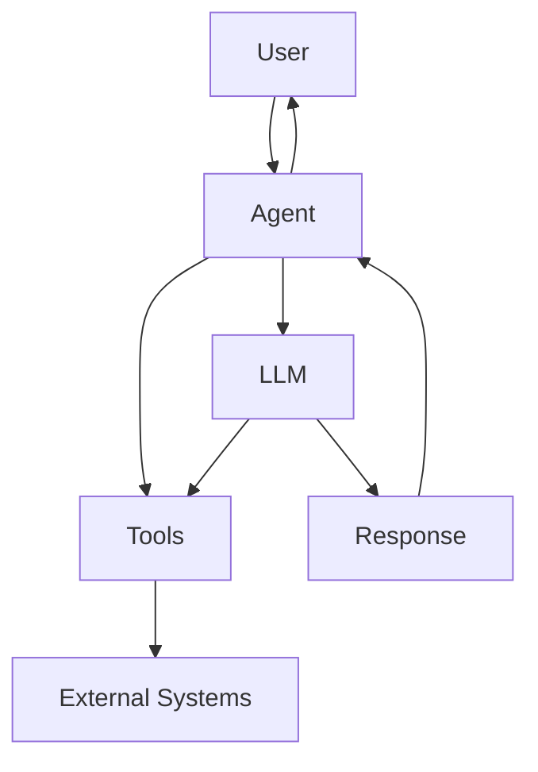
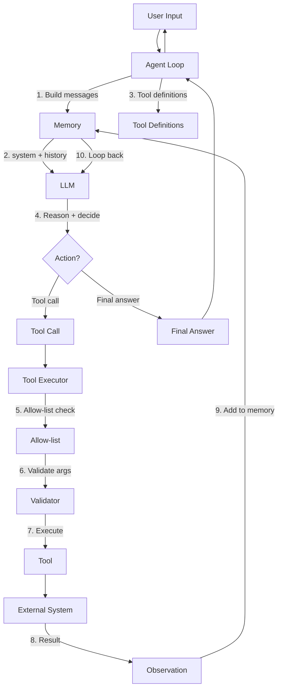
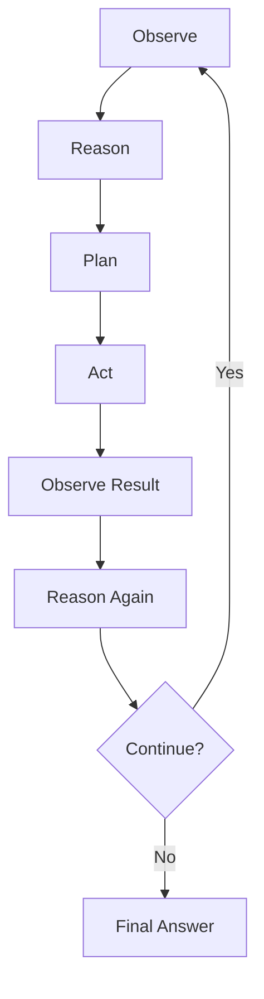
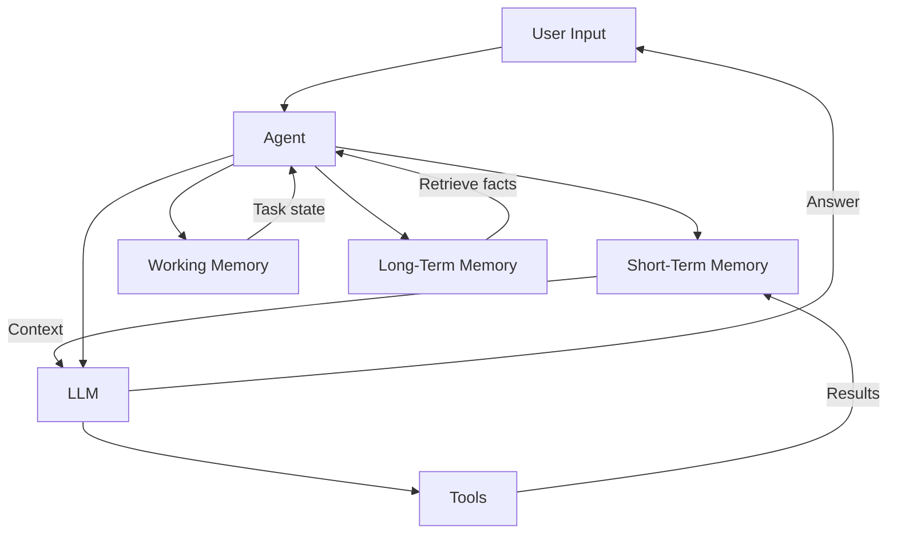
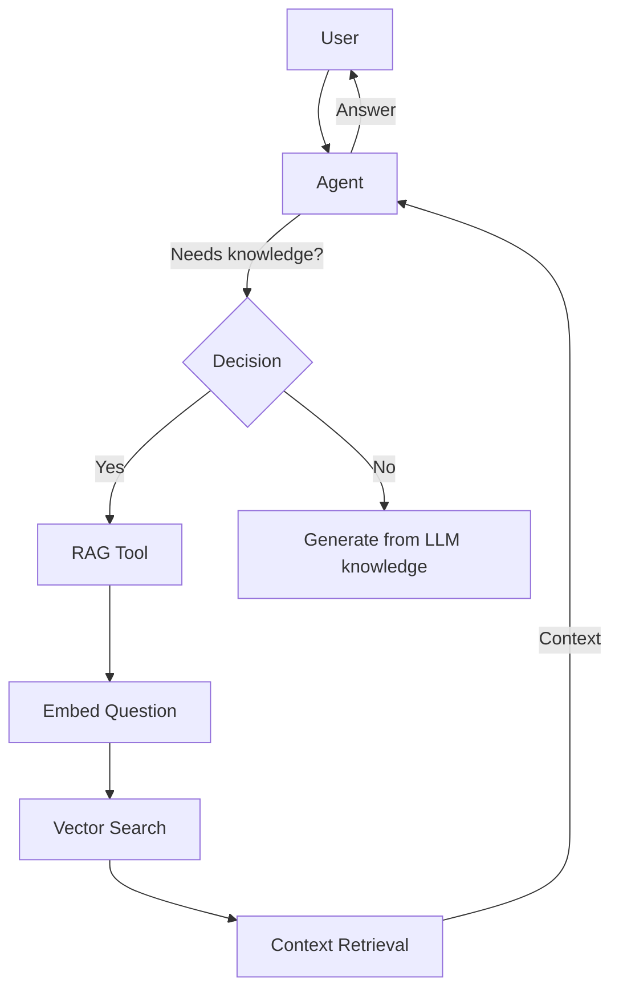
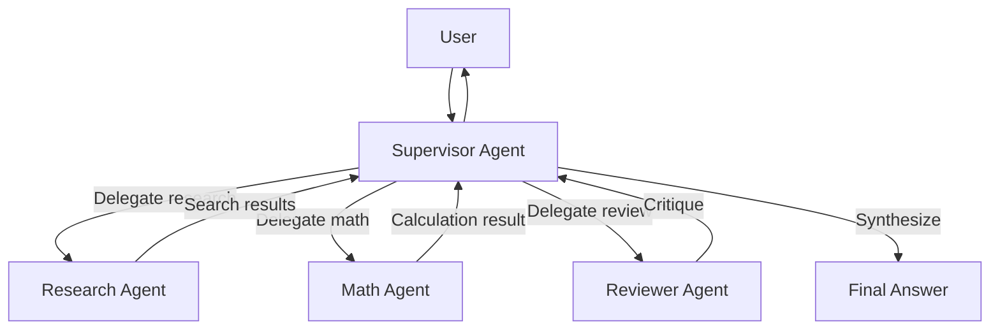
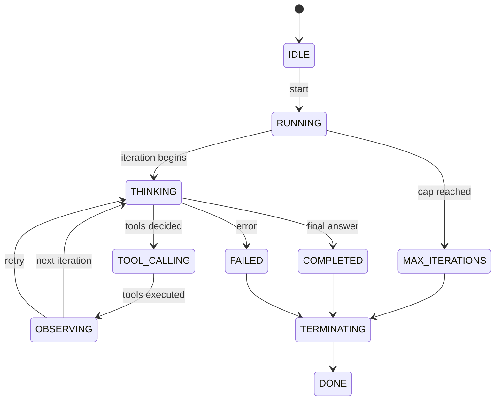
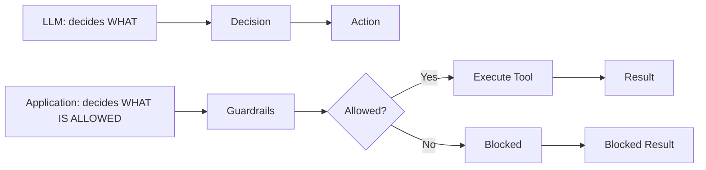

# Architecture Diagrams

> **Visual reference** — the key diagrams for agentic AI architecture.

---

## 1. Basic Agent

---

## 2. Tool-Using Agent

---

## 3. Agent Loop

---

## 4. Agent with Memory

---

## 5. Agent with RAG

---

## 6. Multi-Agent Architecture

---

## 7. Agent State Machine

---

## 8. Security Boundaries

