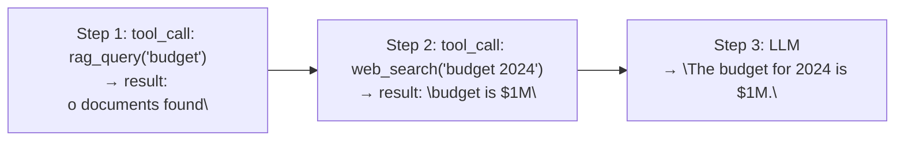

# Agent Evaluation

> **Goal:** Understand how to evaluate AI agents, what metrics to track,
> and why evaluation is harder than for simple LLM applications.

---

## Why Agent Evaluation is Hard

Evaluating agents is fundamentally harder than evaluating a simple LLM
response because:

1. **Multiple steps** — correctness depends on a chain of decisions
2. **Non-determinism** — the LLM may produce different results each time
3. **Tool dependencies** — a tool failure can cause a wrong answer
4. **Partial success** — the agent might be 90% right
5. **No single ground truth** — some tasks have multiple valid answers
6. **Cost** — running thousands of evaluations is expensive

---

## Metrics to Track

### Task-level metrics

| Metric | Description | How to measure |
|--------|-------------|----------------|
| **Task success rate** | % of tasks the agent completes correctly | Compare final answer to ground truth |
| **Correctness** | Accuracy of the final answer | Exact match, semantic similarity, or LLM judge |
| **Tool selection accuracy** | Did the agent choose the right tool? | Compare to expected tool usage |
| **Tool argument accuracy** | Were the arguments correct? | Check args against expected values |
| **Plan quality** | Was the plan reasonable? | Human review or LLM judge |

### Efficiency metrics

| Metric | Description |
|--------|-------------|
| **Latency** | Total time to complete the task |
| **Token usage** | Total tokens consumed (prompt + completion) |
| **Cost** | Monetary cost of the LLM calls |
| **Number of tool calls** | How many tools were invoked |
| **Number of LLM calls** | How many LLM queries were made |
| **Number of iterations** | How many loop iterations ran |

### Reliability metrics

| Metric | Description |
|--------|-------------|
| **Failure rate** | % of tasks that failed completely |
| **Retry rate** | % of tool calls that needed retrying |
| **Timeout rate** | % of calls that timed out |
| **Infinite loop rate** | % of runs that hit max iterations |

---

## Evaluation Methods

### 1. Ground truth comparison

Each test case has a known correct answer. The agent's answer is compared
using exact match, fuzzy match, or semantic similarity.

**Pros:** Simple, automated
**Cons:** Many tasks don't have a single correct answer

### 2. LLM judge

An LLM evaluates whether the agent's response is correct, helpful, and
complete. This is useful for open-ended tasks.

**Pros:** Handles nuanced, subjective criteria
**Cons:** Adds cost, the judge itself can be wrong

### 3. Human evaluation

Humans review agent outputs and score them.

**Pros:** Most accurate for subjective tasks
**Cons:** Expensive, slow, not reproducible

### 4. Synthetic datasets

Pre-built datasets of (question, expected answer) pairs.

**Pros:** Standardized, comparable
**Cons:** May not reflect real-world complexity

---

## Evaluation in this POC

The `ExecutionTrace` collects metrics automatically:

```python
class AgentResult(BaseModel):
    answer: str
    final_state: AgentState
    total_steps: int
    total_tool_calls: int
    total_llm_calls: int
    total_llm_tokens: int
    total_tool_execution_time: float
    trace: list[TraceEvent]
    error: Optional[str]
```

### Running evaluations

```bash
# Run evaluation on the test dataset
python -m app.cli --eval
```

### Sample evaluation dataset

Tests in `tests/test_evaluation.py` check:

| Task | Expected behavior |
|------|-------------------|
| "What is 23 * 47 + 15?" | Calls calculator, answers 1096 |
| "What time is it?" | Calls datetime_now, answers with current time |
| "What is the capital of France?" | Calls web_search or rag_query |
| "Read sample_knowledge.md" | Calls file_reader, returns content |

---

## Debugging Failed Evaluations

When an agent fails, the trace helps you debug:

- **Wrong tool selection?** → Check the system prompt and tool descriptions
- **Wrong tool arguments?** → Check argument validation, provide examples in the prompt
- **Infinite loop?** → Check termination conditions, reduce max iterations or add duplicate detection
- **Poor final answer?** → The LLM may have seen incorrect tool results; check the tool output
- **Slow execution?** → Identify slow tools, add parallel execution

### Trace-based debugging



If the final answer is wrong, check whether the tool results were correct.
If they were wrong, the problem is in the tool or its inputs.

---

## Interview Questions

**Q: How do you evaluate an AI agent?**
A: Evaluate across task-level metrics (success rate, correctness, tool
selection/argument accuracy) and efficiency metrics (latency, token usage,
cost, number of tool/LLM calls). Use ground truth comparison for
deterministic tasks, LLM judges for open-ended ones, and human eval for
subjective criteria.

**Q: How do you measure task success?**
A: Compare the agent's final answer to a ground truth using exact match,
semantic similarity, or an LLM judge. Also check whether the agent completed
all sub-tasks (not just produced a plausible answer).

**Q: How do you evaluate tool selection?**
A: Compare the agent's tool calls against the expected tools for the task.
A tool selection is "correct" if the agent chose a tool that could lead to
the correct answer, and "incorrect" if it chose an irrelevant tool.

**Q: How do you measure agent cost?**
A: Track total token usage (prompt + completion) across all LLM calls,
multiply by per-token pricing, and also track the number of tool calls
(which may incur external API costs). Compute cost per task and cost per
success.

**Q: How do you evaluate agent reliability?**
A: Run the agent on the same task multiple times and measure consistency.
Track failure rate, retry rate, timeout rate, and how often the agent hits
max iterations.

**Q: Why is evaluating agents harder than evaluating LLM responses?**
A: Agents involve multiple steps, non-determinism, tool dependencies,
partial success, and no single ground truth. A wrong final answer could be
due to a wrong tool choice, incorrect tool arguments, a tool failure, or
an LLM reasoning error — evaluation must isolate which.

### Follow-up questions
- "How do you handle evaluating open-ended tasks?"
- "How do you detect tool selection errors?"
- "What metrics would you track in production?"
- "How do you version your evaluation dataset?"

### Common mistakes
- Only measuring final answer correctness (ignoring process)
- Not tracking token usage and cost
- Evaluating on too few samples (not statistically significant)
- Not accounting for non-determinism (running once)
- Ignoring failure modes (timeouts, errors)
