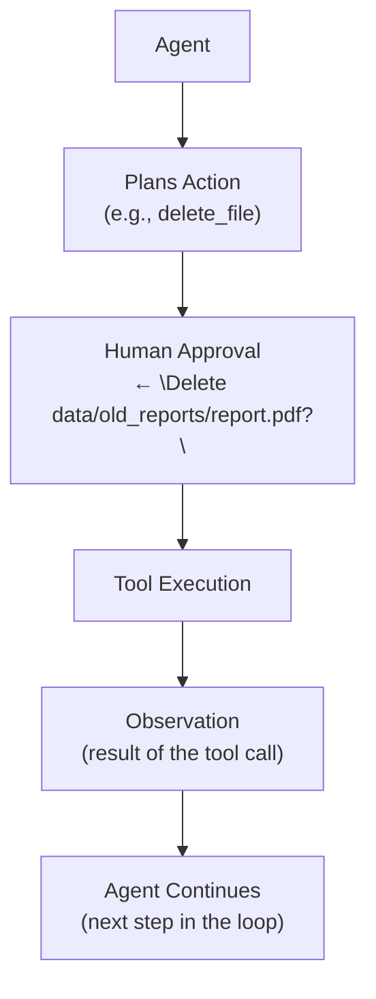
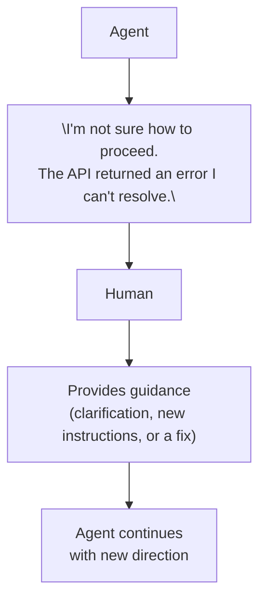

# Human-in-the-Loop

> **Goal:** Understand how and when humans interact with agents during
> execution — approval gates, escalation, pausing, and resuming.

---

## What is Human-in-the-Loop (HITL)?

**Human-in-the-loop (HITL)** inserts a human operator into the agent's
execution loop. The agent can pause, ask for approval, or escalate to a
human before taking certain actions.

Not all agent actions need human approval — only **high-risk** or
**irreversible** ones.

---

## When to Involve Humans

| Scenario | Approval needed? |
|----------|-----------------|
| Read-only operations (search, read file) | No |
| Math calculations | No |
| Sending an email | Yes |
| Deleting a file | Yes |
| Making a financial transaction | Yes |
| Modifying production data | Yes |
| Accessing sensitive data | Yes |
| Uncertain about the plan | Yes (escalation) |

### Approval before tool execution



### Escalation

When the agent is stuck or uncertain, it escalates to a human:



---

## Pausing and Resuming

The agent can be:
- **Paused** — stopped mid-execution (e.g., waiting for human approval)
- **Resumed** — continued after the human responds

### State during pause

When paused, the agent saves:
- Conversation history
- Working memory
- Current step in the plan
- Pending tool calls

### Implementation

In this POC, the `HitlApprover` protocol defines the approval interface:

```python
class HitlApprover(Protocol):
    async def approve(self, tool_name: str, arguments: dict) -> bool:
        """Return True to approve, False to reject."""
```

When `AgentConfig.human_in_the_loop` is True and the tool is in
`required_approval_tools`, the agent calls `approver.approve()` before
executing.

The built-in `AutoApprover` approves everything (for testing).
The `InteractiveApprover` prompts the user.

---

## Human Approval Patterns

### 1. Approve-all tools

Every tool call requires approval. Safe but slow.

### 2. Approve high-risk tools

Only tools in a "high-risk" set require approval (e.g., `execute_command`,
`delete_file`). Configured via `required_approval_tools`.

### 3. Risk-based approval

The agent assesses risk and asks for approval only when risk is high.

### 4. Approval with timeout

If the human doesn't respond within a timeout, the action is blocked
(default deny).

---

## In this POC

`app/agents/types.py` (app/agents/types.py) defines the `HitlApprover`
protocol and two implementations:

```python
class AutoApprover(HitlApprover):
    async def approve(self, tool_name, arguments) -> bool:
        return True  # Approve everything

class InteractiveApprover(HitlApprover):
    async def approve(self, tool_name, arguments) -> bool:
        response = input(f"Approve '{tool_name}' with {arguments}? (y/n): ")
        return response.lower() in ("y", "yes")
```

The agent checks approval in `_execute_tool`:

```python
if self.config.human_in_the_loop and tool_name in self.config.required_approval_tools:
    approved = await self.approver.approve(tool_name, parsed_args)
    if not approved:
        return ToolExecutionResult(..., content="[blocked by human]")
```

### Try it

```bash
python -m app.cli
> What time is it in New York?
# agent calls datetime_now → asks for approval → you approve → answer
```

---

## Interview Questions

**Q: What is human-in-the-loop?**
A: Inserting a human operator into the agent's execution loop. The agent
pauses and asks for approval before taking high-risk actions, or escalates
to a human when uncertain.

**Q: How do you implement approval before tool execution?**
A: Define an approval interface (e.g., a `approve(tool_name, arguments)`
method). Before executing a tool, check if it's in a "requires approval"
list. If so, call the approver and only proceed if approved.

**Q: What types of tool calls should require human approval?**
A: Irreversible or high-risk actions: deleting files, making payments,
sending messages to users, modifying production data, executing shell
commands. Read-only or safe operations typically don't need approval.

**Q: How do you handle human escalation?**
A: When the agent can't proceed (e.g., repeated failures, unknown task),
it can present the problem to the human with context and ask for guidance.
The human provides instructions, and the agent resumes.

**Q: What's the trade-off of more human involvement?**
A: More safety and reliability, but higher latency and cost (humans are
slow). The right balance depends on the risk of the action and the
task's criticality.

### Follow-up questions
- "How do you timeout a human approval request?"
- "How do you handle a human rejecting an action?"
- "How do you decide which tools need approval?"
- "What happens if the human says nothing?"

### Common mistakes
- Requiring approval for every action (too slow)
- Not requiring approval for irreversible actions (dangerous)
- No timeout on approval requests (agent hangs)
- Not clearly explaining what the agent wants to do
