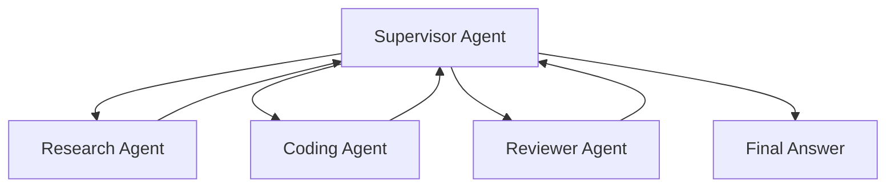
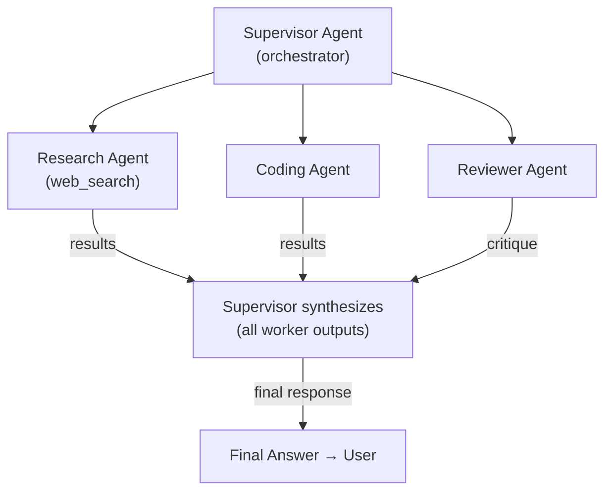
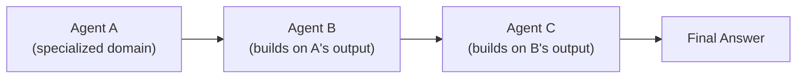
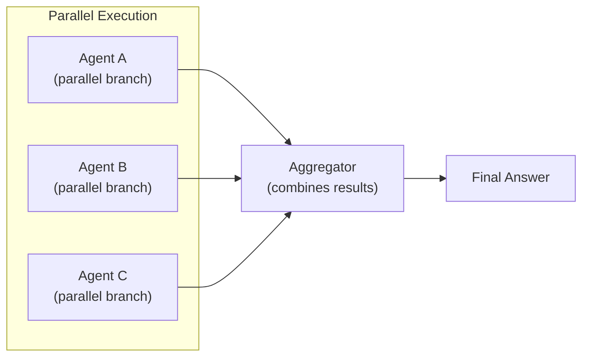
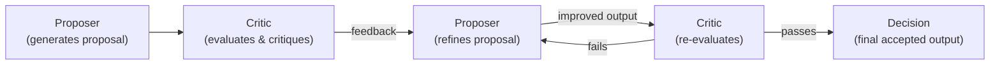
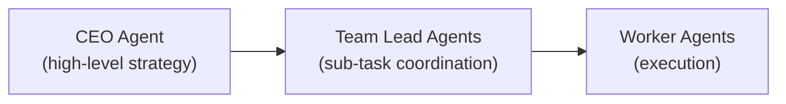

# Multi-Agent Systems

> **Goal:** Understand what multi-agent systems are, why use them, the
> common architectures, and when to avoid them.

---

## What is a Multi-Agent System?

A **multi-agent system (MAS)** consists of **multiple agents** that
collaborate to achieve a goal. Each agent may have its own tools, memory,
and specialties.

---

## Why Use Multiple Agents?

| Reason | Explanation |
|--------|-------------|
| **Specialization** | Each agent excels at one task (research, coding, review) |
| **Parallelism** | Multiple agents work simultaneously |
| **Modularity** | Easier to develop, test, and swap individual agents |
| **Scalability** | Can add more specialized agents as needed |
| **Robustness** | If one agent fails, others can compensate |

---

## Multi-Agent Architectures

### Supervisor pattern

A **supervisor** (or orchestrator) agent delegates work to worker agents
and aggregates their results.

- The supervisor decides which agent to invoke and when
- Worker agents have specialized tools or prompts
- The supervisor aggregates results into a final answer

### Sequential agents

Agents run one after another, each building on the previous agent's output.

### Parallel agents

Multiple agents work simultaneously on different aspects of a task.

### Debate / Critic pattern

Two or more agents debate or critique each other's proposals. The best
proposal wins or is refined iteratively.

### Hierarchical agents

Agents are organized in a hierarchy — high-level agents delegate to
lower-level agents.

---

## Agent Communication

Agents exchange information through:

| Mechanism | Use case |
|-----------|----------|
| **Direct handoff** | Supervisor sends task to worker, receives result |
| **Shared blackboard** | Agents write to/read from a shared memory |
| **Message passing** | Agents send structured messages to each other |
| **Tool delegation** | One agent's tool is another agent |

---

## When to Use Multi-Agent

| Scenario | Recommendation |
|----------|----------------|
| Simple Q&A | Single agent or LLM app |
| Multi-step task, one domain | Single agent |
| Multi-domain expertise needed | Multi-agent |
| High reliability required | Multi-agent (with debate/critique) |
| Low latency required | Single agent |
| Complex research task | Multi-agent (research + analysis + writing) |

---

## Disadvantages of Multi-Agent Systems

- **Higher cost** — more LLM calls (multiple agents)
- **Higher latency** — coordination overhead
- **Complexity** — harder to debug and orchestrate
- **Failure propagation** — one agent's error cascades
- **Communication overhead** — agents need to exchange information efficiently
- **Non-determinism** — harder to reproduce results

---

## In this POC

The current implementation uses a **single agent** (ReActAgent). Multi-agent
patterns are documented here and in the
[experiments](../experiments/multi-agent.md). They can be added later by
treating another agent as a **tool** (the supervisor calls a worker agent
as if it were a function).

---

## Interview Questions

**Q: What is a multi-agent system?**
A: A system composed of multiple AI agents that collaborate to achieve a
goal. Each agent may have its own tools, memory, and specialties. A
supervisor or orchestrator coordinates them.

**Q: Why use multiple agents?**
A: Specialization (each agent excels at one domain), parallelism (agents
work simultaneously), modularity (swap individual agents), and robustness
(if one fails, others compensate).

**Q: What is a supervisor agent?**
A: An orchestrator agent that delegates work to worker agents, monitors
their progress, and aggregates results. The workers have specialized tools
or prompts.

**Q: How do agents communicate?**
A: Through direct handoff (delegation and result passing), shared memory
(blackboard), or message passing. The supervisor typically collects results.

**Q: What are the disadvantages of multi-agent systems?**
A: Higher cost (more LLM calls), higher latency (coordination), increased
complexity (harder to debug), failure propagation, and non-determinism.
They're overkill for simple tasks.

**Q: When should you NOT use a multi-agent system?**
A: For simple tasks that a single agent or even a fixed workflow can handle.
Multi-agent adds cost and complexity that's only justified for complex,
multi-domain, or high-reliability tasks.

### Follow-up questions
- "How would you design a multi-agent research system?"
- "How do you handle failures between agents?"
- "What's the difference between a supervisor agent and a router?"
- "How do agents share memory?"
- "How does LangGraph handle multi-agent?"

### Common mistakes
- Using multi-agent for simple tasks (unnecessary cost)
- Not defining clear agent boundaries (overlapping responsibilities)
- Poor communication protocols (information loss)
- No fallback when a worker agent fails
