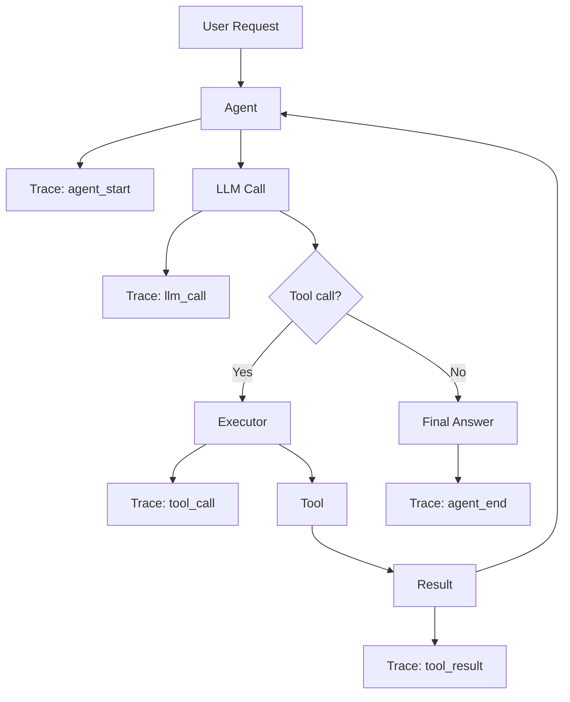

# Observability

> **Goal:** Understand how to observe and debug agent execution through
> traces, logs, and metrics.

---

## Why Observability Matters

Agents are **non-deterministic** and **multi-step**. Without observability,
debugging is guesswork:

- "Why did the agent call the wrong tool?"
- "Why did it loop 10 times?"
- "Where is the latency coming from?"
- "How much did this cost?"

Observability provides **visibility** into the agent's decision-making
process.

---

## What to Observe

| Event | What it tells you |
|-------|-------------------|
| **Agent start** | When the agent began, what the user asked |
| **State transitions** | Where the agent is in its lifecycle |
| **LLM calls** | Which model, what prompt length, what response |
| **Tool calls** | Which tool, what arguments, when |
| **Tool results** | What happened, how long it took, success/failure |
| **Errors** | What went wrong and where |
| **Retries** | If a step was retried and why |
| **Agent end** | Final state, total steps, total cost |

---

## Execution Trace

An **execution trace** is a chronological log of all events in an agent's
run. In this POC: `ExecutionTrace` (app/observability/trace.py).

### Example trace

```text
[  0.000s]    agent_start | step=0 | user_input=What is 23 * 47 + 15?
[  0.001s]    state_change | step=1 | IDLE → RUNNING
[  0.002s]      llm_call | step=1 | model=mock | tools=5 | tokens_prompt=0
[  0.003s]     tool_call | step=1 | tool=calculator | args={"expression": "23 * 47 + 15"}
[  0.005s]    tool_result | step=1 | tool=calculator | success=True | duration=0.002s
[  0.006s]      llm_call | step=2 | model=mock | tools=5
[  0.007s]    state_change | step=2 | RUNNING → COMPLETED
[  0.008s]    agent_end | step=2 | success=True | steps=2 | tool_calls=1 | total_tokens=0
```

### Trace event types

| Event type | Fields |
|------------|--------|
| `agent_start` | step, user_input |
| `state_change` | step, old_state, new_state |
| `llm_call` | step, model, tools, tokens_prompt, tokens_completion |
| `tool_call` | step, tool, arguments, blocked (if guardrail) |
| `tool_result` | step, tool, success, duration, error |
| `llm_error` | step, error |
| `agent_end` | step, success, total_steps, total_tool_calls, total_llm_calls, error |

---

## Observability Diagram



---

## How Observability Helps Debug

### Wrong tool selection

If the agent calls `calculator` for "What is the capital of France?":
- Trace shows: `tool_call: calculator` with `args={"expression": "What is the capital of France?"}`
- Root cause: the tool descriptions are confusing, or the system prompt
  doesn't distinguish tools well
- Fix: revise tool descriptions or add a `web_search` tool with a clearer description

### Infinite loops

If the agent keeps calling the same tool:
- Trace shows repeated `tool_call` for the same tool with the same/different args
- Root cause: the tool isn't returning useful information, or the LLM doesn't
  recognize the answer is complete
- Fix: improve the tool's output, add duplicate detection, reduce max_iterations

### Poor prompts

If the agent doesn't use tools when it should:
- Trace shows: `llm_call` returns text without tool_calls
- Root cause: the system prompt doesn't encourage tool use, or tool descriptions
  are insufficient
- Fix: revise the system prompt, add examples of tool use

### Unexpected tool arguments

If a tool gets bad arguments:
- Trace shows: `tool_call` with unexpected `arguments`
- Root cause: the tool schema is unclear, or the LLM is confused
- Fix: improve the parameter descriptions, add examples, add validation

### Slow execution

If the agent is slow:
- Trace shows timing for each `tool_result` and `llm_call`
- Root cause: slow tool (e.g., RAG retrieval) or many sequential LLM calls
- Fix: parallelize independent tool calls, cache results, optimize the slow tool

### High token consumption

- Trace shows `tokens_prompt` and `tokens_completion` for each LLM call
- Root cause: large context (memory not truncated), verbose prompts
- Fix: implement memory truncation/summarization, optimize system prompt

---

## Metrics Dashboard

| Metric | Current | Threshold | Status |
|--------|---------|-----------|--------|
| Avg. steps per task | 3.2 | 10 | ✅ |
| Avg. tool calls per task | 1.8 | 5 | ✅ |
| Token usage per task | 1,200 | 10,000 | ✅ |
| Error rate | 5% | 15% | ✅ |
| Timeout rate | 0% | 2% | ✅ |
| Max iterations hit | 2% | 5% | ✅ |

---

## Interview Questions

**Q: How do you observe agent execution?**
A: Through an execution trace — a chronological log of all events (agent
start, state transitions, LLM calls, tool calls, tool results, errors, agent
end). Each event has timestamps, step numbers, and relevant context.

**Q: What should you log for an agent?**
A: Agent start/end, state transitions, each LLM call (model, tokens),
each tool call (name, arguments, blocked status), tool results (success,
duration, error), and any errors or retries.

**Q: How do you debug an agent that's using the wrong tool?**
A: Check the trace to see which tool was called and with what arguments.
Then review the system prompt and tool descriptions — the LLM likely
matched the wrong tool because the descriptions were ambiguous. Add
clearer descriptions or examples.

**Q: How do you debug an infinite loop?**
A: Check the trace for repeated tool calls. Add duplicate detection (same
tool + same arguments). Reduce max_iterations. Improve termination
conditions. Review why the agent doesn't reach a conclusion.

**Q: How do you measure latency and cost?**
A: Time each LLM call and tool call. Sum token usage across all LLM calls.
Multiply by per-token pricing for cost. Track these per task in the trace.

**Q: What's the difference between observability and evaluation?**
A: Evaluation measures whether the agent is *correct* (task success, accuracy).
Observability is about understanding *what happened* and *why* — traces,
logs, and metrics. Observability enables debugging; evaluation measures quality.

### Follow-up questions
- "How would you build a dashboard for agent observability?"
- "What metrics would you alert on in production?"
- "How do you correlate traces across microservices?"
- "How do you sample traces to control storage costs?"

### Common mistakes
- Not logging enough context (can't reproduce issues)
- Logging too much (expensive storage, privacy concerns)
- Not timing each step (can't find bottlenecks)
- Not logging tool arguments (can't debug wrong-tool issues)
- No structured logging (hard to query/analyze)
- Not tracking token usage (can't optimize cost)
