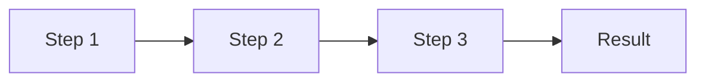
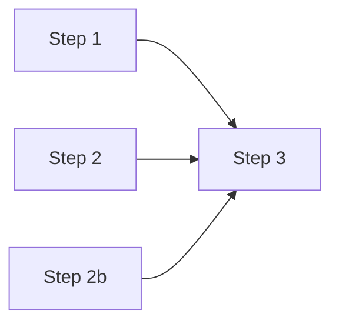
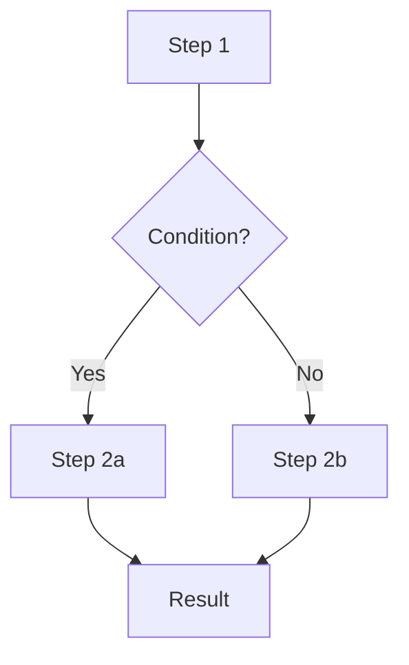
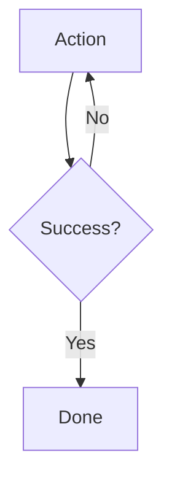
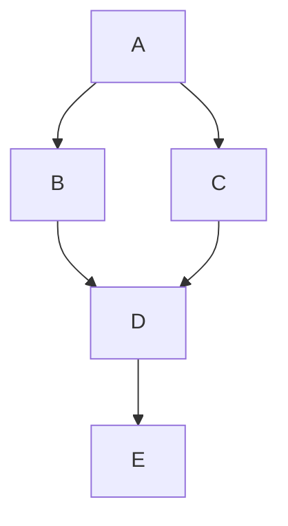
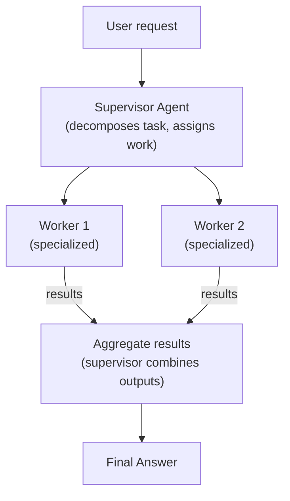
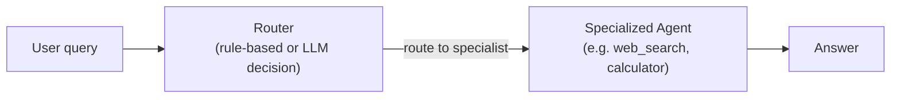

# Orchestration

> **Goal:** Understand orchestration patterns for agents, how to coordinate
> multiple steps, and when to prefer workflows over agents.

---

## What is Orchestration?

**Orchestration** is the coordination of multiple components or steps to
achieve a goal. In agentic systems, orchestration can be:

- **Deterministic** — a fixed sequence of steps (workflow)
- **Autonomous** — the LLM decides the sequence (agent)

---

## Orchestration Patterns

### Sequential workflows

Steps run one after another, each feeding into the next:

- Pros: Simple, predictable, easy to debug
- Cons: No adaptivity, fails if a step doesn't apply

### Parallel execution

Independent steps run simultaneously:

- Pros: Faster (parallel)
- Cons: More complex coordination, harder to debug

### Conditional branching

The workflow branches based on conditions:

### Loops

Repeat a step until a condition is met:

### State machines

The workflow progresses through explicit states (similar to the agent
state machine in [State](state.md)).

### DAG-based workflows

A directed acyclic graph of tasks with dependencies:

Tools like Airflow, Prefect, and Temporal model workflows as DAGs.

---

## Orchestration Patterns for Agents

### Supervisor pattern

A supervisor agent delegates to worker agents or tools and aggregates results.

See [Multi-Agent Systems](multi-agent.md) for details.

### Router pattern

A lightweight router (LLM or rules) decides which specialized agent or tool
to invoke for a given request.

### Human-in-the-loop

Human approval is part of the workflow (see
[Human-in-the-Loop](human-in-the-loop.md)).

---

## Deterministic Workflows vs. Autonomous Agents

| Aspect | Deterministic Workflow | Autonomous Agent |
|--------|-----------------------|------------------|
| **Decision making** | Pre-defined (code decides) | LLM decides |
| **Predictability** | High | Low (LLM is stochastic) |
| **Flexibility** | Low | High |
| **Debugging** | Easy | Harder |
| **Cost** | Lower (fewer LLM calls) | Higher |
| **Use when** | Well-defined, repeatable | Complex, unpredictable |

### When to use a workflow instead of an agent

- The steps are **always the same**
- The decision points are **known and limited**
- **Reproducibility** is critical (e.g., financial calculations)
- **Latency and cost** must be minimized
- The task is **simple** enough for a fixed pipeline

### When to use an agent

- Steps **vary** based on input
- The agent needs to **adapt** to unexpected results
- The task is **multi-step and complex**
- You need **external tool use**
- **Exploration** or **discovery** is required

---

## In this POC

The agent loop itself is a form of orchestration — it coordinates the LLM
calls, tool executions, and memory management. The ReAct agent uses an
**autonomous** loop where the LLM decides each step.

The existing RAG pipeline (before enhancement) was a **deterministic workflow**:
retrieve → generate → return.

You can combine both: a workflow that uses an agent for specific sub-tasks,
or an agent that uses workflow-style tools.

---

## Interview Questions

**Q: What is orchestration in the context of agents?**
A: The coordination of multiple steps or components to achieve a goal.
In agents, orchestration can be deterministic (fixed workflow) or
autonomous (LLM-driven loop).

**Q: What is the difference between a workflow and an agent?**
A: A workflow has a pre-defined, deterministic sequence of steps decided
by the code. An agent uses an LLM to dynamically decide what to do at each
step. Workflows are predictable and cheap; agents are flexible but more
expensive and harder to debug.

**Q: When would you prefer a workflow over an agent?**
A: When the steps are always the same, reproducibility is critical,
latency/cost must be minimized, or the task is simple enough for a fixed
pipeline.

**Q: What is the supervisor pattern?**
A: A supervisor (or orchestrator) coordinates worker agents or tools.
It delegates tasks, monitors progress, and aggregates results. Workers
specialize in specific domains.

**Q: What is the router pattern?**
A: A lightweight router decides which specialized component (agent, tool,
or service) to invoke for a given request. It's cheaper than a full
supervisor but less flexible.

### Follow-up questions
- "How do you handle failures in a workflow?"
- "How do you make a workflow observable?"
- "When should workflows and agents be combined?"
- "What is a DAG-based workflow?"

### Common mistakes
- Using agents for simple, fixed-step tasks (unnecessary cost)
- Not handling failures in workflows (one step fails → whole pipeline fails)
- Over-orchestrating (too many steps = higher latency)
- Not making workflows observable (hard to debug)
