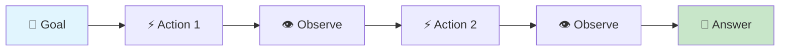
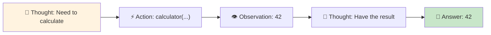
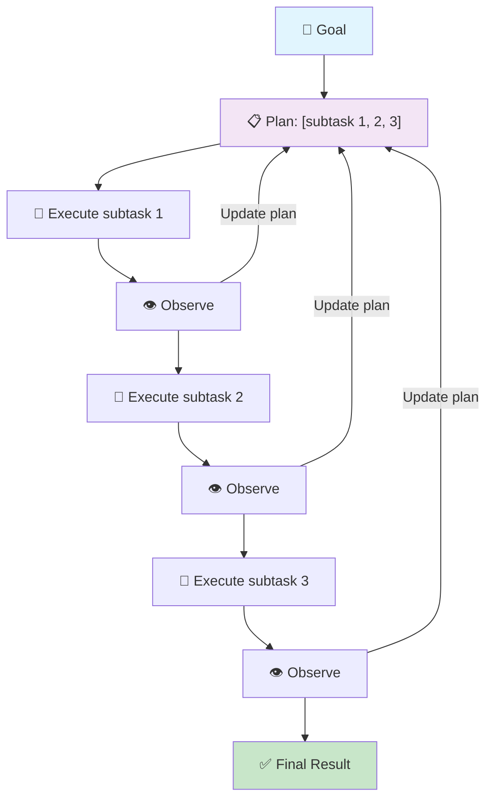
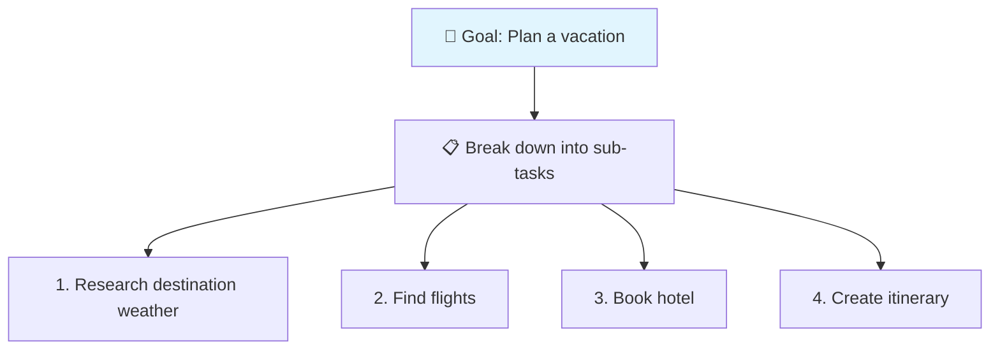
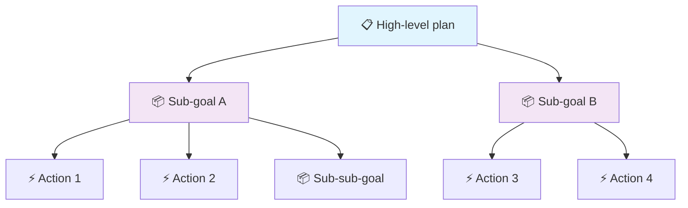
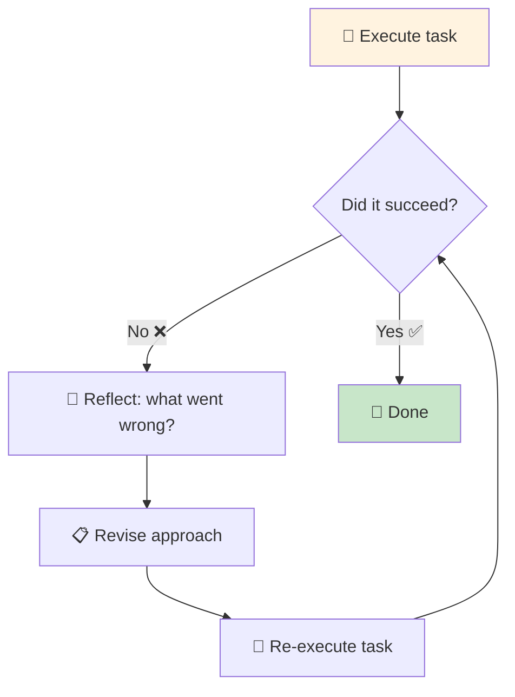
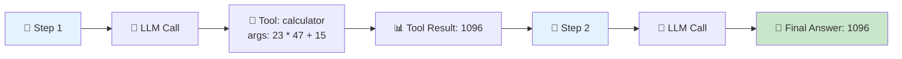

# Planning and Reasoning

> **Goal:** Understand how agents plan, the different planning approaches,
> and the trade-offs between more planning vs. more latency/cost.

---

## What is Agent Planning?

**Planning** is the process by which an agent decides on a sequence of
actions to achieve its goal. Unlike a hardcoded workflow, an agent's plan
is **dynamic** — it can be revised based on new information.

---

## Direct Execution (No Explicit Plan)

The simplest approach: the LLM directly takes actions one step at a time,
without an explicit plan.

- Pros: Fast, low latency, simple
- Cons: Can be inefficient, no global view, easy to loop

### ReAct-style reasoning

ReAct interleaves reasoning with action:

The reasoning step is lightweight "thinking" that accompanies each action.
It's not a formal plan, but it provides some structure.

**Key insight:** In ReAct, the "plan" is implicit in the reasoning chain.
The LLM doesn't maintain a global plan; it reasons about each step
individually.

---

## Plan-and-Execute

In **Plan-and-Execute**, the agent first creates an explicit plan, then
executes it step by step.

- Pros: Better global view, more structured, easier to track progress
- Cons: Upfront planning cost (extra LLM call), can be over-planning

### Implementation in this POC

The `ReActAgent` uses direct execution with ReAct-style reasoning. A
`Planner` component can be added on top (see
`app/agents/react_agent.py` (app/agents/react_agent.py)).

---

## Task Decomposition

Breaking a complex goal into smaller, manageable sub-tasks.

Task decomposition is essential for complex agents. Without it, the agent
struggles with goals that require many steps.

---

## Hierarchical Planning

Planning at multiple levels of abstraction:

---

## Iterative Planning

The agent starts with a simple understanding and refines its plan as it
learns more. This is natural in the ReAct loop — each observation can
change the agent's approach.

---

## Reflection and Self-Correction

After completing (or failing) a task, the agent can reflect:

This is the basis of **Reflexion** (ICLR 2023).

In this POC, the agent's state and trace enable reflection — you can
review what went wrong and adjust.

---

## Observable Planning vs. Hidden Chain-of-Thought

### Hidden (unobservable) chain-of-thought

Some systems use an LLM's "thinking" field internally but never expose it.
The application only sees the final tool calls and response.

- Pros: Clean output for the user
- Cons: Hard to debug, can't verify reasoning

### Observable planning

The planning/reasoning is part of the visible conversation or logged to
a trace. You can inspect each step.

- Pros: Debuggable, auditable, educational
- Cons: More verbose output

### This POC uses observable planning

Every step is logged in the `ExecutionTrace`. You can read exactly what the
agent did at each step.

---

## Trade-offs Summary

| More planning | → | Better task completion, higher cost, more latency |
| More iterations | → | Better problem-solving, risk of loops, higher cost |
| More tools | → | More capabilities, harder to reason about |
| Detailed reasoning | → | Larger context, higher token cost, more transparency |

**When to plan more:** Complex, multi-step tasks with high reliability requirements.
**When to plan less:** Simple, single-step tasks where speed matters.

---

## Interview Questions

**Q: What is plan-and-execute?**
A: An agent architecture where the LLM first creates an explicit plan
(a list of sub-tasks), then executes each sub-task in sequence, using tools.
The plan can be updated if new information arises.

**Q: What is the difference between planning and reasoning?**
A: Reasoning is the step-by-step thinking that accompanies each action
(ReAct "Thought"). Planning is the higher-level decomposition of a goal
into sub-tasks. In ReAct, planning is implicit; in Plan-and-Execute,
planning is explicit and separate.

**Q: What is task decomposition?**
A: Breaking a complex goal into smaller, manageable sub-tasks. Each
sub-task can be executed and verified independently.

**Q: What is reflection in agentic systems?**
A: After completing a task, the agent reviews its performance — what
worked, what didn't — and uses this to improve future performance.
Reflexion is a technique where this reflection is automated.

**Q: What are the trade-offs of more planning?**
A: More planning increases cost (extra LLM calls for planning), latency
(waiting for the plan), and context size (the plan takes tokens). But
it can improve task completion for complex goals. The trade-off depends
on task complexity vs. cost/latency budget.

### Follow-up questions
- "When would you avoid autonomous planning?"
- "How does hidden chain-of-thought hurt debugging?"
- "What's the difference between hierarchical and iterative planning?"

### Common mistakes
- Over-planning simple tasks (high cost, unnecessary latency)
- No plan at all (inefficient, error-prone)
- Not updating the plan when new information arrives
- Exposing too much internal reasoning to the user
