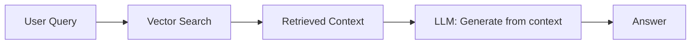
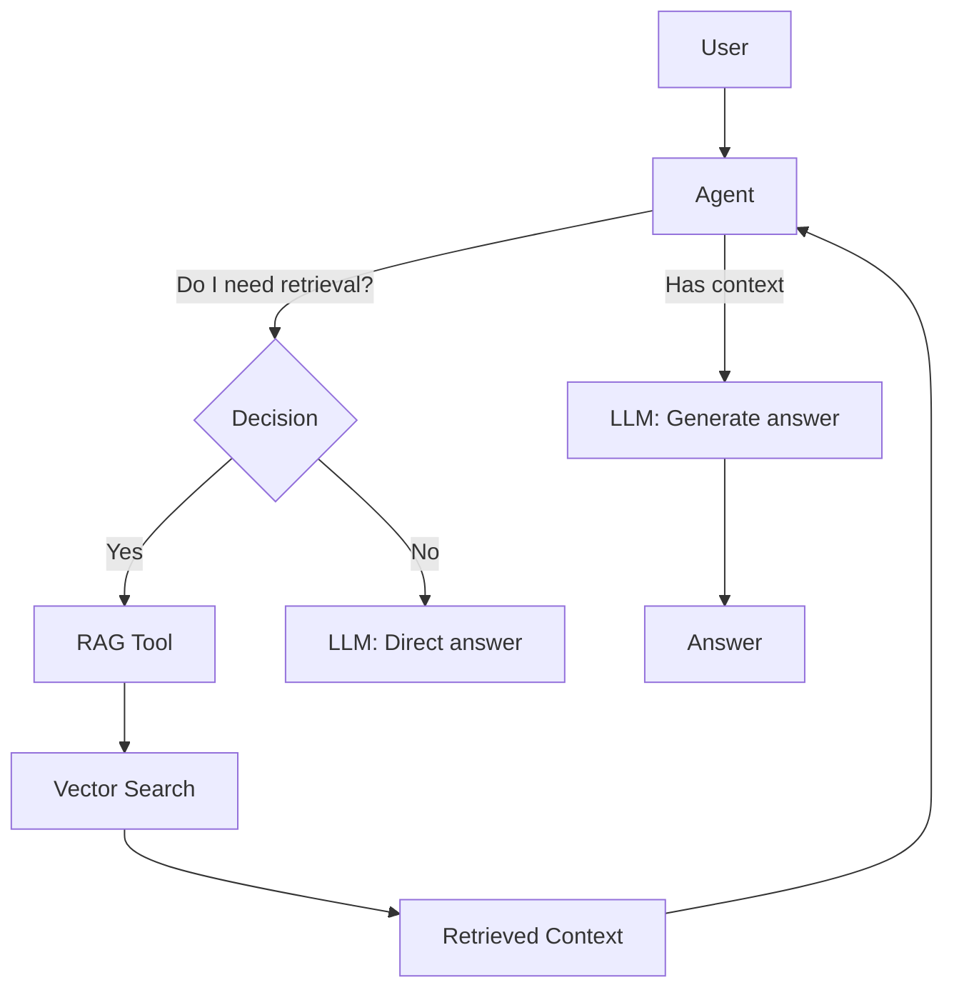
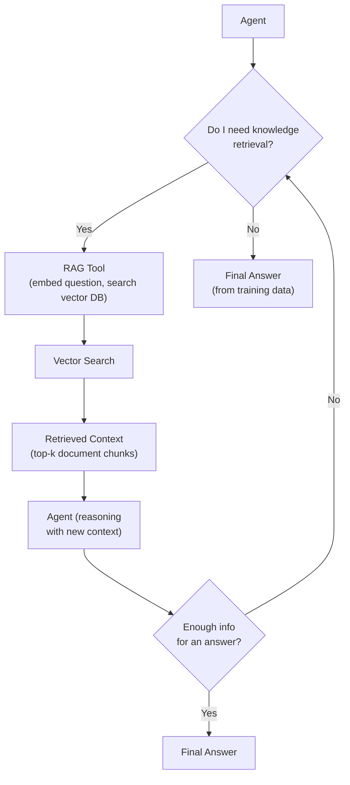

# RAG and Agents

> **Goal:** Understand how RAG integrates with agents, the difference
> between a RAG pipeline and an agent using RAG as a tool, and how
> retrieval augments agent capabilities.

---

## RAG Recap

**RAG** (Retrieval-Augmented Generation) combines a vector database with an
LLM. The flow:

```
Query → Vector Search → Retrieved Documents → LLM (with context) → Answer
```

The existing POC (see
[Project Analysis](../project/project-analysis.md)) implements a RAG
pipeline: ingest documents, search by embedding similarity, retrieve
context, and generate an answer.

---

## RAG Pipeline vs. Agent Using RAG as a Tool

This distinction is **critical** and frequently tested.

### RAG Pipeline (workflow)



- **Fixed flow**: Always retrieve, then generate.
- **No choice**: The application decides when to retrieve.
- **No adaptation**: Retrieval always happens the same way.
- **Not an agent**: It's a deterministic pipeline.

### Agent Using RAG as a Tool



- **Dynamic**: The LLM decides whether retrieval is needed.
- **Adaptive**: The LLM chooses how many times to retrieve, what to search for.
- **Agentic**: The retrieval is one tool among many.

### Key differences

| Aspect | RAG Pipeline | Agent + RAG Tool |
|--------|-------------|-----------------|
| **Retrieval timing** | Always (fixed) | Only when the LLM decides |
| **Search query** | Same as user query | LLM can rephrase/expand |
| **Iterations** | One retrieve + one generate | Multiple retrieve-observe cycles |
| **Other tools** | No | Can combine with calculator, search, etc. |
| **Recovery** | No | Can retry with different query |

---

## How an Agent Uses RAG

The agent decides to use RAG based on the task:



### When to invoke retrieval

The LLM should invoke RAG when:
- The question requires specific knowledge not in its training data
- The question is about domain-specific documents
- The answer should be grounded in sources

### Multiple retrievals

An agent can call RAG multiple times in a loop, refining its query:

```
Iteration 1: RAG("machine learning applications") → generic results
Iteration 2: RAG("supervised learning applications in healthcare 2024") → better results
→ Final answer
```

---

## RAG in this POC

The RAG retriever is implemented as a **tool** that the agent can call:

`app/rag/retriever.py` (app/rag/retriever.py)

```python
class RAGRetrieverTool(Tool):
    name = "rag_query"
    description = "Retrieve information from the knowledge base using semantic search."
    parameters = {"type": "object", "properties": {"question": {"type": "string"}}}

    async def execute(self, question: str) -> ToolResult:
        # 1. Embed the question
        query_vector = await self._embedding_service.embed(question)
        # 2. Search the vector DB
        hits = await self._vector_db.search(query_vector, top_k=5)
        # 3. Build context
        context = "\n\n".join(h.text for h in hits)
        # 4. Generate grounded answer
        prompt = f"Answer the question based on the following context:\n\n{context}\n\nQuestion: {question}"
        answer = await self._llm_service.generate_simple(prompt)
        return ToolResult(self.name, f"{answer}\n\nSources: {len(hits)} documents")
```

The agent calls this tool just like any other — it's in the tool registry.

### Vector embeddings as memory

The existing project uses vector embeddings for RAG. In agentic systems,
vector storage **can be** used as one possible memory mechanism (long-term
memory via semantic search), but vector databases are **not synonymous**
with agent memory.

See [Memory](memory.md) for details on how RAG and memory relate.

---

## Interview Questions

**Q: How does an agent use RAG?**
A: The agent receives RAG as a tool in its tool registry. When the agent
determines it needs external knowledge, it calls the RAG tool (which embeds
the query, searches the vector DB, and generates a grounded answer). The
result is fed back as an observation, and the agent continues.

**Q: What is the difference between RAG and agent memory?**
A: RAG retrieves information from a document corpus to ground responses in
external sources. Agent memory stores conversational context, user
preferences, and learned facts. RAG is about external knowledge; memory is
about internal state.

**Q: When should an agent invoke a retrieval tool?**
A: When the question requires specific knowledge beyond the LLM's training
data, when the answer should be grounded in sources, or when the LLM is
unsure and wants to verify information.

**Q: How would you improve poor retrieval?**
A: (1) Re-formulate the query (the LLM can rephrase), (2) increase top_k,
(3) use hybrid search (keyword + vector), (4) filter by metadata,
(5) rerank retrieved documents.

**Q: How does an agent decide whether to retrieve information?**
A: The LLM reasons about the question. If the question asks about specific
domain knowledge, recent events, or things the LLM is uncertain about, it
will decide to call the retrieval tool. The decision is part of the
agent's reasoning step.

### Follow-up questions
- "Is RAG a form of memory?"
- "How do you handle conflicting information between retrieved docs?"
- "When would you NOT use retrieval?"
- "How does retrieval-augmented generation differ from tool-augmented agents?"

### Common mistakes
- Always retrieving even when the LLM knows the answer (wasted cost)
- Never retrieving (confabulation/hallucination)
- Using the exact user query for retrieval (suboptimal — the LLM can rephrase)
- Confusing vector DB with agent memory
- Not tracking which documents were retrieved (no citations)
