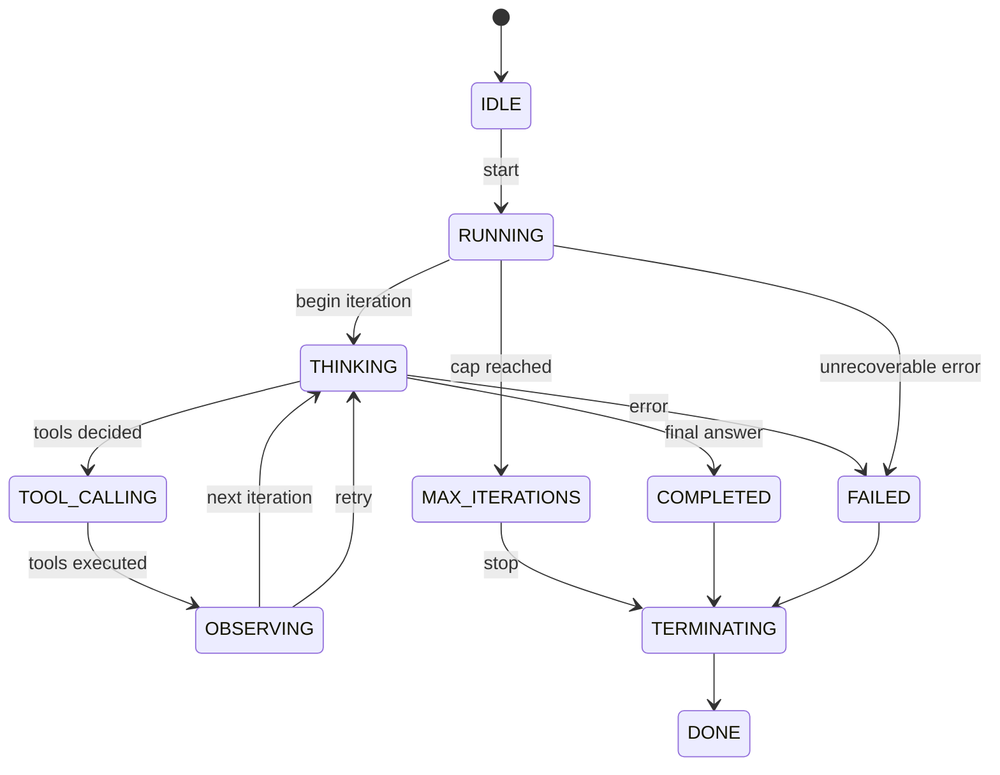

# Agent State

> **Goal:** Understand why state matters in agents, the state machine
> model, and how state management becomes important in long-running agents.

---

## Why State Matters

State is the agent's **memory of where it is**. Without state, the agent
can't:

- Know how many steps it has taken
- Track which tools have been called
- Decide when it's done
- Recover from failures

State turns an agent from a stateless function into a **stateful process**.

---

## State Machine Model

The agent progresses through a series of discrete states:



### States explained

| State | Meaning |
|-------|---------|
| **IDLE** | Agent created, not yet running |
| **RUNNING** | Agent is processing a user request |
| **THINKING** | LLM is being called to decide the next action |
| **TOOL_CALLING** | The agent is executing tool(s) |
| **OBSERVING** | The agent is processing tool results |
| **COMPLETED** | The agent produced a final answer |
| **FAILED** | An unrecoverable error occurred |
| **MAX_ITERATIONS** | The iteration cap was reached |
| **TERMINATING** | The agent is cleaning up and shutting down |

### In this POC

The `AgentState` enum is defined in
`app/agents/types.py` (app/agents/types.py) and the state machine
logic is in `BaseAgent._transition_to()` in
`app/agents/base.py` (app/agents/base.py).

```python
class AgentState(str, Enum):
    IDLE = "idle"
    RUNNING = "running"
    THINKING = "thinking"
    TOOL_CALLING = "tool_calling"
    OBSERVING = "observing"
    COMPLETED = "completed"
    FAILED = "failed"
    MAX_ITERATIONS = "max_iterations"
    TERMINATING = "terminating"
    DONE = "done"
```

---

## Types of State

### Agent state

The agent's lifecycle state (the state machine above).

### Task state

Information about the current task:
- The original user request
- Current sub-task
- Tasks completed
- Tasks pending

### Tool execution state

Information about tool calls:
- Which tools were called
- Their arguments
- Results
- Success/failure status

### Conversation state

The message history and memory state.

### Persistent state

State that survives across sessions:
- User preferences
- Learned facts
- Session summaries

---

## State Transitions

Every transition has a trigger and an effect:

| From | To | Trigger | Effect |
|------|----|---------|--------|
| IDLE | RUNNING | `run()` called | Initialize memory, reset counters |
| RUNNING | THINKING | Iteration begins | Log step, set timers |
| THINKING | TOOL_CALLING | LLM returns tool call | Validate + execute tools |
| THINKING | COMPLETED | LLM returns text | Set final answer |
| TOOL_CALLING | OBSERVING | All tools done | Process results |
| OBSERVING | THINKING | Continue | Check max iterations |
| THINKING | MAX_ITERATIONS | `iteration >= max` | Log error, stop |
| (any) | FAILED | Exception | Log error, stop |
| COMPLETED/MAX_ITERATIONS/FAILED | TERMINATING | Stop condition | Cleanup |
| TERMINATING | DONE | Cleanup done | Return result |

### State transition example

```
User: "What is 23 * 47 + 15?"

1. IDLE → RUNNING           (agent.run called)
2. RUNNING → THINKING        (first iteration)
3. THINKING → TOOL_CALLING   (LLM says "call calculator")
4. TOOL_CALLING → OBSERVING  (calculator returns 1096)
5. OBSERVING → THINKING      (second iteration)
6. THINKING → COMPLETED      (LLM says "the answer is 1096")
7. COMPLETED → TERMINATING   (return result)
8. TERMINATING → DONE        (cleanup)
```

### In this POC

State transitions are recorded in the `ExecutionTrace`:

```python
def _transition_to(self, state: AgentState) -> None:
    old_state = self._state
    self._state = state
    if self.trace:
        self.trace.log("state_change", old=old_state, new=state)
```

---

## Long-Running Agents

In long-running agents (agents that run for minutes, hours, or days),
state management is critical:

### Checkpointing

Periodically save the agent's state to disk so it can be resumed after a
crash. The state includes:
- Conversation history
- Working memory
- Current task state
- Trace

### Pausing and resuming

The agent can be paused (e.g., for human approval) and resumed later. The
state machine handles this: `RUNNING → PAUSED → RUNNING`.

### Concurrency

Multiple agents or agent instances need isolated state to avoid
interference. Each agent instance has its own memory and state.

### Event sourcing

For production systems, all state transitions can be stored as an event
log. This provides:
- Full auditability
- The ability to replay history
- Debugging without reproduction

---

## Interview Questions

**Q: What is agent state?**
A: The agent's current condition in its lifecycle (e.g., thinking,
tool-calling, completed) plus the data it retains (conversation history,
task state, working memory). State lets the agent track progress and
decide what to do next.

**Q: Why is state important in agents?**
A: Without state, the agent can't track how many steps it has taken, which
tools it has called, or whether it is done. State enables:
- Iteration counting (max iterations guardrail)
- Progress tracking (which tasks are complete)
- Recovery (resuming after interruption)
- Debugging (tracing what happened)

**Q: How would you model an agent as a state machine?**
A: Define discrete states (idle, running, thinking, tool_calling,
observing, completed, failed) and transitions triggered by events (LLM
response, tool result, error, iteration cap). Each state has associated
behavior.

**Q: How do you handle state in long-running agents?**
A: Use checkpointing (periodic saves to disk), event sourcing (append-only
log of all events), and state isolation (each agent instance has its own
state). For distributed agents, use a shared state store like Redis or a
database.

**Q: What's the difference between agent state and task state?**
A: Agent state is the agent's lifecycle (running, thinking, etc.).
Task state is the data about the current task (sub-tasks, progress,
intermediate results). They are related but independent.

### Follow-up questions
- "How would you checkpoint and resume an agent?"
- "What's the difference between state and memory?"
- "How do you handle concurrent agent state?"
- "How do you serialize agent state for persistence?"

### Common mistakes
- Not tracking iteration count (infinite loops)
- Mixing state types (lifecycle vs. task vs. conversation)
- Not checkpointing long-running agents
- Sharing state across concurrent agent instances
- Losing state on errors
