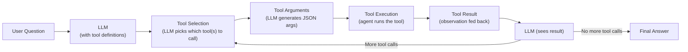
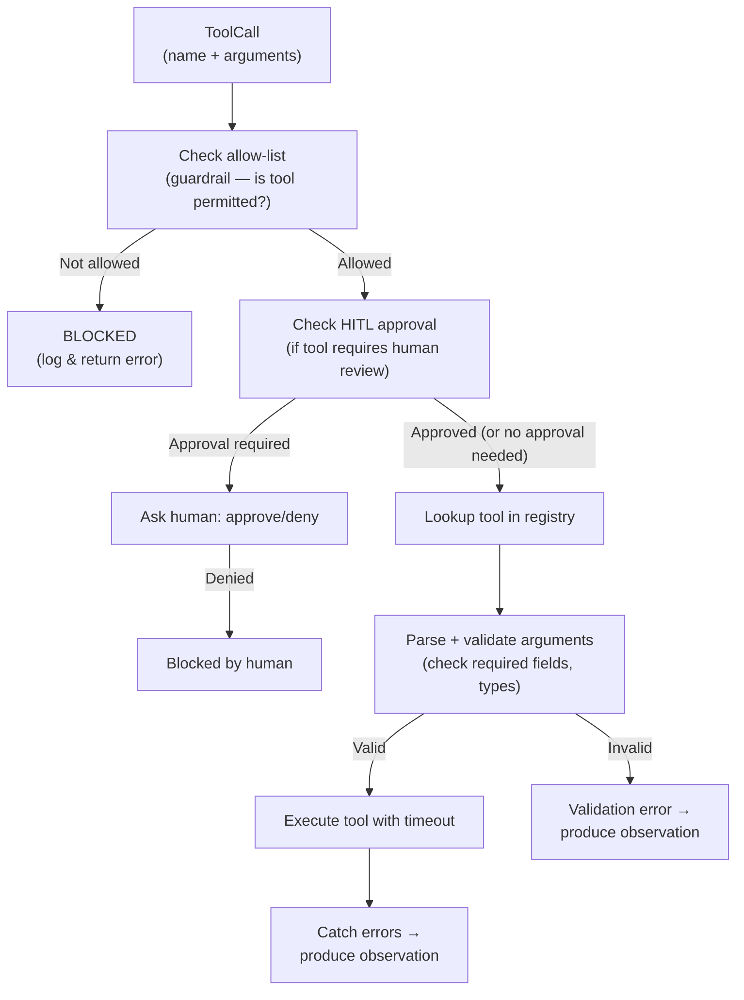

# Tool Calling

> **Goal:** Understand what tools are, why agents need them, how the LLM
> selects and uses them, and how to implement them safely.

---

## What is a Tool?

A **tool** is a callable function that an agent can invoke to interact with
its environment. Tools let the agent:

- **Compute** (calculator)
- **Retrieve** (search the web, query a database)
- **Act** (send an email, write a file, make an API call)
- **Observe** (read a file, check the weather)

A tool has three parts:

| Part | Description | Example |
|------|-------------|---------|
| **Name** | Identifier the LLM uses to call the tool | `calculator` |
| **Description** | Human-readable explanation of what the tool does | "Evaluates math expressions" |
| **Parameters** | JSON Schema defining accepted arguments | `{"expression": {"type": "string"}}` |

---

## Why Agents Need Tools

LLMs have **two fundamental limitations**:

1. **Knowledge cutoff** — they don't know about events after their training data.
2. **No external interaction** — they can't read files, make API calls, or compute
   in real time.

| Without tools | With tools |
|---------------|-----------|
| "I don't know the current weather" | Calls `weather_tool` → gets real data |
| "The result is approximately 42" | Calls `calculator` → gets exact answer |

**Key insight:** The LLM decides *which* tool to call and *what* arguments
to use. The application provides the mechanism and enforces safety.

---

## Tool Schemas

Tools are defined using **JSON Schema** for their parameters.

Example — the Calculator tool:

```json
{
  "type": "function",
  "function": {
    "name": "calculator",
    "description": "Evaluates mathematical expressions and returns the result.",
    "parameters": {
      "type": "object",
      "properties": {
        "expression": {
          "type": "string",
          "description": "A mathematical expression like '2 + 2' or 'sqrt(144)'.",
        }
      },
      "required": ["expression"]
    }
  }
}
```

In this POC, tools generate their own schema. See
`app/tools/base.py` (app/tools/base.py) and
`app/tools/calculator.py` (app/tools/calculator.py).

---

## Function Calling

**Function calling** is the protocol by which an LLM requests a tool to be
invoked. The flow:



### The LLM response format

When the LLM decides to use a tool, the response contains:

```json
{
  "choices": [{
    "message": {
      "role": "assistant",
      "content": null,
      "tool_calls": [{
        "id": "call_abc123",
        "type": "function",
        "function": {
          "name": "calculator",
          "arguments": "{\"expression\": \"2 + 2\"}"
        }
      }]
    },
    "finish_reason": "tool_calls"
  }]
}
```

Key fields:
- `tool_calls[].id` — links request to result
- `tool_calls[].function.name` — which tool to call
- `tool_calls[].function.arguments` — JSON string of arguments

### Multiple tools per turn

The LLM can call multiple tools in a single response (if they're
independent). This is more efficient than sequential calls.

### In this POC

The `OpenAILLMService` handles the conversion to/from the OpenAI format.
The `MockLLMService` generates the same format for testing offline.

---

## Tool Selection

Tool selection is the LLM's decision about **which** tool(s) to call.

### How the LLM selects

The LLM considers:
1. **Tool descriptions** — what each tool does
2. **Tool schemas** — what arguments each tool accepts
3. **Conversation history** — what's already been tried
4. **The user's goal** — what they're asking for

### Prompt design for selection

The system prompt should:
- List all available tools with descriptions
- Explain when to use each
- Tell the LLM to avoid unnecessary tool calls

### Tool name best practices

Avoid ambiguous names. `search` could mean web or vector. More specific:
`web_search`, `vector_search`, `rag_query`.

In this POC: `calculator`, `datetime_now`, `file_reader`, `web_search`, `rag_query`.

---

## Tool Arguments

The LLM generates arguments as a **JSON string**. This is fragile:

- The LLM might produce invalid JSON
- Required arguments might be missing
- Values might be the wrong type

### Handling argument errors

In this POC, `Tool._parse_arguments` handles:
1. Empty arguments → `{}`
2. Invalid JSON → retry with closing brace
3. Missing required args → caught by `_validate_args`

### Best practices
- Make schemas permissive with defaults for optional args
- Validate on the application side — never trust LLM-generated arguments
- Provide clear descriptions to help the LLM generate correct arguments

---

## Tool Execution

When the LLM calls a tool, the agent's executor runs it:



In this POC: `BaseAgent._execute_tool` in `app/agents/base.py` (app/agents/base.py).

---

## Tool Results

Tool results are fed back to the LLM as **tool messages**. In this POC,
`ToolResult.to_observation()` formats the result, and `ToolExecutionResult.to_message()`
converts it to a `ConversationMessage` with `role=TOOL`.

---

## Tool Errors

Errors are **observations**, not crashes. The agent catches exceptions and
returns them as tool results so the LLM can reason about them.

Error message format:
```
[tool_name] Error: ValueError: expression must not be empty
```

---

## Implementation in this POC

### Tool base class

`app/tools/base.py` (app/tools/base.py):

```python
class Tool(ABC):
    name: str
    description: str
    parameters: dict
    
    @abstractmethod
    async def execute(self, **kwargs) -> ToolResult: ...
    
    async def call(self, arguments: str) -> ToolResult:
        # Parse JSON, validate, execute with timeout, catch errors
```

### Available tools

| Tool | File | Category |
|------|------|----------|
| `calculator` | tools/calculator.py (app/tools/calculator.py) | Math |
| `datetime_now` | tools/datetime_tool.py (app/tools/datetime_tool.py) | Utility |
| `file_reader` | tools/file_reader.py (app/tools/file_reader.py) | Utility |
| `web_search` | tools/web_search.py (app/tools/web_search.py) | Search |
| `rag_query` | rag/retriever.py (app/rag/retriever.py) | RAG |

### Try it

```bash
python -m app.cli
> What is 23 * 47 + 15?
# The agent calls calculator → gets 1096 → answers
```

---

## Security Boundaries

```mermaid
flowchart LR
    subgraph LLM["LLM decides WHAT (untrusted)"]
        L1["\"Call calculator\""]
        L2["\"Call execute_command\""]
        L3["\"Call file_reader\""]
    end
    subgraph App["Application decides WHAT IS ALLOWED (trusted)"]
        A1["\"calculator\" in allow-list → ALLOWED"]
        A2["\"execute_command\" NOT in allow-list → BLOCKED"]
        A3["\"file_reader\" requires approval → HITL gate"]
    end
    L1 --> A1
    L2 --> A2
    L3 --> A3
```

See [Guardrails & Security](security.md) for details.

---

## Interview Questions

**Q: What is function calling?**
A: A protocol that lets an LLM request invocation of a function defined by
the application. The LLM outputs the function name and arguments as
structured JSON; the application executes the function and returns the result.

**Q: How does an LLM decide which tool to call?**
A: The LLM receives tool definitions (name, description, parameter schema)
in its context. Based on the user's query and tool descriptions, it
probabilistically selects the best-matching tool and generates arguments.

**Q: How are tool arguments generated?**
A: The LLM generates a JSON string matching the parameter schema. The
application parses this JSON and passes the arguments to the function.

**Q: How do you validate tool arguments?**
A: Validate on the application side — check required fields, types, and
ranges. Never trust LLM-generated arguments directly.

**Q: How do you handle tool failures?**
A: Catch exceptions, return the error as a tool result (observation), and
let the LLM decide how to recover.

**Q: How do you prevent an agent from calling unauthorized tools?**
A: Maintain an allow-list of permitted tools. Before executing any tool
call, check if the tool name is in the allow-list. Optionally add
human-in-the-loop approval for high-risk tools.

### Follow-up questions
- "How would you prevent the calculator from being used to execute arbitrary code?"
- "What happens if the LLM generates malformed JSON for tool arguments?"
- "How do you handle calling multiple tools in parallel?"
- "How do you ensure idempotent tool calls?"

### Common mistakes
- Trusting LLM-generated arguments without validation
- Not catching tool exceptions (crashing the agent)
- Allowing unrestricted tool access
- Using vague tool names that confuse the LLM
