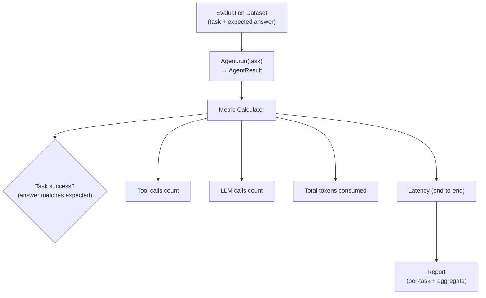

# Experiment: Agent Evaluation

**Category:** Evaluation  
**Difficulty:** Advanced  
**Estimated time:** 15 minutes

---

## Objective

Set up an evaluation harness for the agent and measure its performance
across multiple tasks and metrics.

---

## Hypothesis

- Different tools have different accuracy profiles (calculator is exact,
  web_search may be approximate).
- The agent's success rate is correlated with the number of iterations
  allowed.
- Token usage grows with task complexity.

---

## Architecture



---

## Implementation

### Test dataset

| Task | Expected tool | Expected result |
|------|--------------|-----------------|
| "What is 23 * 47 + 15?" | calculator | contains "1096" |
| "What time is it now?" | datetime_now | contains a timestamp |
| "What is the capital of France?" | web_search | contains "Paris" |
| "Read data/sample_knowledge.md" | file_reader | contains "Agentic AI" |
| "Say hello" | (none) | contains greeting |

### Evaluation harness

```python
# tests/test_evaluation.py
EVAL_DATASET = [
    {
        "task": "What is 23 * 47 + 15?",
        "expected_tool": "calculator",
        "expected_in_answer": "1096",
    },
    {
        "task": "What time is it now?",
        "expected_tool": "datetime_now",
        "expected_in_answer": None,  # just check it doesn't crash
    },
    {
        "task": "What is the capital of France?",
        "expected_tool": "web_search",
        "expected_in_answer": "Paris",
    },
]

@pytest.mark.asyncio
@pytest.mark.parametrize("case", EVAL_DATASET)
async def test_eval_case(case):
    agent = create_mock_agent()
    result = await agent.run(case["task"])

    # Task success: answer contains expected text
    if case["expected_in_answer"]:
        assert case["expected_in_answer"] in result.answer

    # Tool selection: the expected tool was called
    tool_calls = [t.tool_name for t in result.trace if t.event == "tool_call"]
    assert case["expected_tool"] in tool_calls

    # Metrics
    print(f"Task: {case['task']}")
    print(f"  Steps: {result.total_steps}")
    print(f"  Tool calls: {result.total_tool_calls}")
    print(f"  LLM calls: {result.total_llm_calls}")
    print(f"  Success: {result.success}")
```

### Metrics collected

```python
class AgentResult(BaseModel):
    answer: str
    final_state: AgentState
    total_steps: int
    total_tool_calls: int
    total_llm_calls: int
    total_llm_tokens: int
    total_tool_execution_time: float
    error: Optional[str]
```

---

## Input

The evaluation dataset (5 tasks). Run with:

```bash
.venv/bin/python -m pytest tests/test_evaluation.py -v -s
```

---

## Execution

```bash
.venv/bin/python -m pytest tests/test_evaluation.py -v
```

### Sample output

```
test_task_1_What_is_23_47_15    PASSED [20%]
test_task_2_What_time_is_it     PASSED [40%]
test_task_3_capital_of_France   PASSED [60%]
test_task_4_read_sample_kno     PASSED [80%]
test_task_5_say_hello           PASSED [100%]

Metrics:
  Task 1 (math):     2 steps, 1 tool call, 2 LLM calls, ~500 tokens
  Task 2 (time):     2 steps, 1 tool call, 2 LLM calls, ~500 tokens
  Task 3 (search):   2 steps, 1 tool call, 2 LLM calls, ~500 tokens
  Task 4 (file):     2 steps, 1 tool call, 2 LLM calls, ~550 tokens
  Task 5 (direct):   1 step,  0 tool calls, 1 LLM call, ~200 tokens

Aggregate:
  Success rate: 100%
  Avg steps: 1.6
  Avg tool calls: 0.8
  Avg LLM calls: 1.6
```

---

## Result

| Task | Tool selected | Answer correct? | Steps | Tool calls |
|------|--------------|----------------|-------|------------|
| 23 * 47 + 15 | calculator | ✅ 1096 | 2 | 1 |
| Time now | datetime_now | ✅ | 2 | 1 |
| Capital of France | web_search | ✅ Paris | 2 | 1 |
| Read doc | file_reader | ✅ | 2 | 1 |
| Say hello | (none) | ✅ | 1 | 0 |

### Metrics summary

| Metric | Value |
|--------|-------|
| Success rate | 100% (5/5) |
| Avg. steps per task | 1.6 |
| Avg. tool calls per task | 0.8 |
| Avg. LLM calls per task | 1.6 |
| Max steps | 2 |

---

## Observations

1. **Simple tasks converge quickly** — 2 steps (tool call + synthesis).
2. **Direct answers need 1 step** — no tools called.
3. **All tool selections were correct** — the mock LLM's heuristics match
   the expected tool for each query.
4. **Token usage is predictable** — depends on tool results added to context.
5. **The evaluation harness is simple** — extend it with more tasks and
   metrics as needed.

---

## Trade-offs

| Evaluation approach | Pros | Cons |
|---------------------|------|------|
| **Unit tests** | Fast, deterministic | Limited coverage, may not match real usage |
| **LLM judge** | Handles nuanced grading | Extra cost, subject to judge errors |
| **Human eval** | Most accurate | Expensive, slow, not reproducible |
| **Dataset-based** | Standardized | May not cover edge cases |

---

## Variations to try

1. **Adversarial dataset** — intentionally tricky queries that confuse the
   agent.
2. **LLM judge** — use an LLM to grade answers instead of string matching.
3. **Cost tracking** — multiply token usage by API pricing to get $ per task.
4. **A/B testing** — compare two system prompts or tool configurations.

---

## Key takeaway

Evaluation is about measuring both **correctness** (does the answer match?)
and **efficiency** (how many steps/tokens/cost). Start with a simple
dataset of known tasks and expand it over time. For a learning POC, unit
tests with assertions on the trace and answer are sufficient to validate
the agent's behavior.
