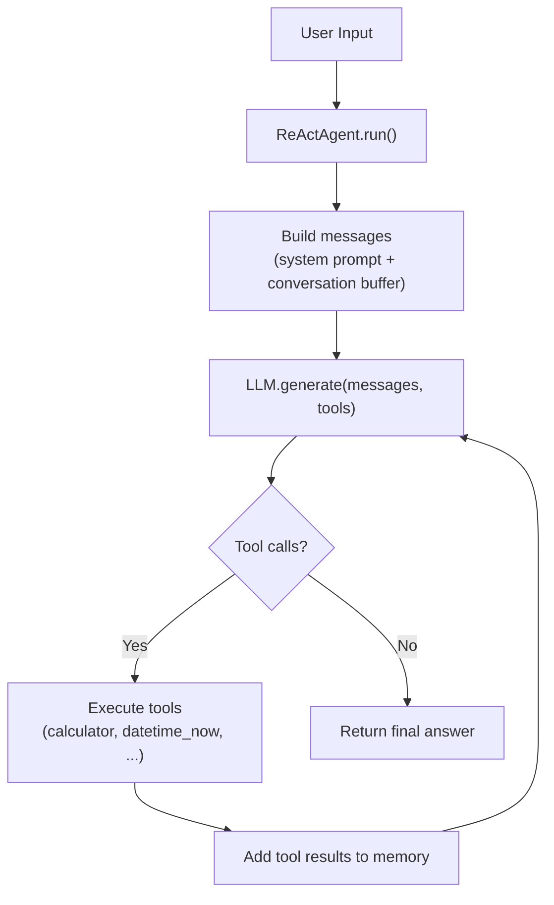

# Experiment: Agent Loop

**Category:** Agent Loop  
**Difficulty:** Beginner  
**Estimated time:** 5 minutes

---

## Objective

Understand the agent loop by watching it run with different inputs. Observe
how the agent decides to call tools, processes results, and produces a final
answer.

---

## Hypothesis

The agent will correctly identify when to use tools and when to answer
directly. Specifically:

- Math questions → calls `calculator`
- Time/date questions → calls `datetime_now`
- Factual questions → calls `web_search` (or `rag_query` if available)
- Direct questions → answers without tools

---

## Architecture



Source: `app/agents/react_agent.py` (app/agents/react_agent.py)

---

## Implementation

The ReAct agent loop (simplified):

```python
async def run(self, user_input: str) -> AgentResult:
    self.memory.add_user(user_input)
    iteration = 0
    while iteration < self.config.max_iterations:
        iteration += 1
        messages = self._build_messages()
        response = await self.llm.generate(messages, self.tools.definitions())
        if response.has_tool_calls:
            self.memory.add_assistant(content=response.content, tool_calls=response.tool_calls)
            for tc in response.tool_calls:
                result = await self._execute_tool(tc)
                self.memory.add(result.to_message())
            continue
        if response.content:
            return AgentResult(answer=response.content, ...)
    return AgentResult(error="Max iterations reached", ...)
```

---

## Input

Try these inputs (run `python -m app.cli`):

```
1. What is 23 * 47 + 15?
2. What time is it now?
3. What is the capital of France?
4. Read file data/sample_knowledge.md
5. What is the meaning of life?
```

---

## Execution

```bash
python -m app.cli
> What is 23 * 47 + 15?
```

### Expected trace

```
[0.000s] agent_start | user_input="What is 23 * 47 + 15?"
[0.001s] state_change | IDLE → RUNNING
[0.002s] llm_call | step=1 | tools=4
[0.003s] tool_call | tool=calculator | args={"expression": "23 * 47 + 15"}
[0.004s] tool_result | tool=calculator | success=True
[0.005s] llm_call | step=2 | tools=4
[0.006s] state_change | RUNNING → COMPLETED
[0.007s] agent_end | steps=2 | tool_calls=1

Answer: Based on my analysis, here's what I found:
calculator: 1096
```

---

## Result

| Input | Tool called | Iterations | Result |
|-------|-------------|------------|--------|
| What is 23 * 47 + 15? | calculator | 2 | 1096 |
| What time is it now? | datetime_now | 2 | Current time |
| What is the capital of France? | web_search | 2 | Paris |
| Read file data/sample_knowledge.md | file_reader | 2 | File content |
| What is the meaning of life? | (none) | 1 | Direct answer |

---

## Observations

1. **Tool selection is dynamic** — the agent chooses tools based on the
   query, not a fixed pipeline.
2. **The loop converges in 2 steps** for simple tasks (one tool call + one
   synthesis).
3. **Direct answers need only 1 LLM call** — no tools.
4. **The trace shows every decision** — you can see exactly what the agent
   thought and did.
5. **The mock LLM** uses keyword heuristics (not a real LLM) but demonstrates
   the same loop mechanics.

---

## Trade-offs

| Decision | Trade-off |
|----------|-----------|
| More iterations allowed | Better at complex tasks, but higher cost and risk of loops |
| Fewer iterations allowed | Faster, cheaper, but may not finish complex tasks |
| Keyword-based mock LLM | No API key needed, but not general-purpose |
| Real LLM | General-purpose, but requires API key and costs money |

---

## Key takeaway

The agent loop is a simple but powerful pattern: repeat "observe → reason →
act" until done. The complexity comes from **what the LLM decides at each
step**, not from the loop structure itself. The loop is only ~10 lines of
code — the intelligence is in the LLM's decisions.
