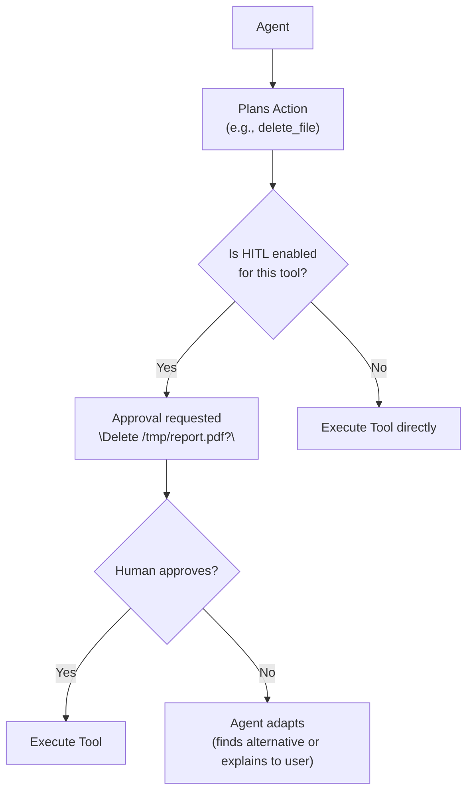

# Experiment: Human-in-the-Loop

**Category:** Safety  
**Difficulty:** Intermediate  
**Estimated time:** 10 minutes

---

## Objective

Observe how human approval gates work and how they affect agent behavior,
latency, and safety.

---

## Hypothesis

- With HITL enabled, high-risk tool calls require human approval before
  execution.
- This increases latency but prevents dangerous actions.
- The agent can explain its plan before asking for approval.

---

## Architecture



Source: `app/agents/base.py` (app/agents/base.py),
`app/agents/types.py` (app/agents/types.py)

---

## Implementation

### The HitlApprover protocol

```python
class HitlApprover(Protocol):
    async def approve(self, tool_name: str, arguments: dict) -> bool:
        """Return True to approve, False to reject."""
```

### Two implementations

```python
class AutoApprover(HitlApprover):
    """Approves everything — for testing."""
    async def approve(self, tool_name, arguments) -> bool:
        return True

class InteractiveApprover(HitlApprover):
    """Prompts the user on the CLI."""
    async def approve(self, tool_name, arguments) -> bool:
        response = input(f"Approve '{tool_name}' with {arguments}? (y/n): ")
        return response.lower() in ("y", "yes")
```

### Agent integration

```python
# In BaseAgent._execute_tool
if self.config.human_in_the_loop:
    if (self.config.required_approval_tools 
            and tool_name in self.config.required_approval_tools):
        
        approved = await self.approver.approve(tool_name, parsed_args)
        if not approved:
            self.trace.log("tool_blocked", tool=tool_name, reason="human_rejected")
            return ToolExecutionResult(
                tool_name=tool_name,
                success=False,
                content=f"[{tool_name}] Action blocked by human approval."
            )
```

### Configuration

```python
config = AgentConfig(
    human_in_the_loop=True,
    required_approval_tools={"file_reader", "web_search"},  # high-risk tools
    approver=InteractiveApprover(),
)
```

---

## Input

Interactive conversation:

```
> What is the capital of France?
# Agent wants to call web_search → asks for approval
# You: y
# Agent executes → answers

> What is 23 * 47 + 15?
# Agent wants to call calculator → no approval needed (not in required list)
# Agent answers directly
```

---

## Execution

```bash
# The CLI demo uses AutoApprover by default
# To enable interactive approval, modify the config:
python -m app.cli
```

### Expected trace with approval

```
[0.002s] llm_call | step=1 | tools=4
[0.003s] tool_call | tool=web_search | args={"query": "capital of France"} | blocking
[0.003s] approval_requested | tool=web_search | approved=True
[0.004s] tool_result | tool=web_search | success=True
[0.005s] llm_call | step=2 | tools=4
```

### Expected trace with rejection

```
[0.003s] tool_call | tool=web_search | args={"query": "..."} | blocking
[0.003s] approval_requested | tool=web_search | approved=False
[0.003s] tool_blocked | tool=web_search | reason="human_rejected"
[0.004s] tool_result | tool=web_search | success=False | content="Action blocked by human"
```

When the tool is blocked, the agent sees the failure as an observation and
can try a different approach or explain to the user.

---

## Result

| Tool action | Approval needed? | Outcome if approved | Outcome if denied |
|-------------|-----------------|---------------------|-------------------|
| calculator | No (not in list) | Executes immediately | N/A |
| datetime_now | No | Executes immediately | N/A |
| web_search | Yes (in list) | Executes → result | Agent sees error, adapts |
| file_reader | Yes (in list) | Executes → content | Agent sees error, adapts |

---

## Observations

1. **Approval adds latency** — each approved tool call waits for human input.
2. **Approval improves safety** — dangerous tools can't run without consent.
3. **The agent can recover** — if a tool is denied, the agent sees the error
   and can find an alternative or explain to the user.
4. **Not all tools need approval** — read-only, safe tools can run
   automatically.
5. **The approver is pluggable** — you can swap `InteractiveApprover` for
   a Slack bot, email approval, or an automated risk scorer.

---

## Trade-offs

| HITL enabled | Pros | Cons |
|-------------|------|------|
| On | Safer, prevents dangerous actions | Higher latency, requires human attention |
| Off | Faster, fully autonomous | Risk of unintended actions |
| **When to enable** | Irreversible or high-risk tools | All tools or low-risk only |

---

## Variations to try

1. **Timeout on approval** — if the human doesn't respond in N seconds,
   the action is denied automatically.
2. **Risk-based approval** — only ask for approval for high-risk tools,
   auto-approve low-risk ones.
3. **Approval summary** — show the human a summary of what the agent plans
   to do, not just one tool call.

---

## Key takeaway

Human-in-the-loop is a safety mechanism, not a performance feature. It
trades latency for safety by inserting human approval into the agent's
decision-making loop. The key design choices are: which tools need approval,
how the approval interface works, and how the agent recovers when an action
is denied.
