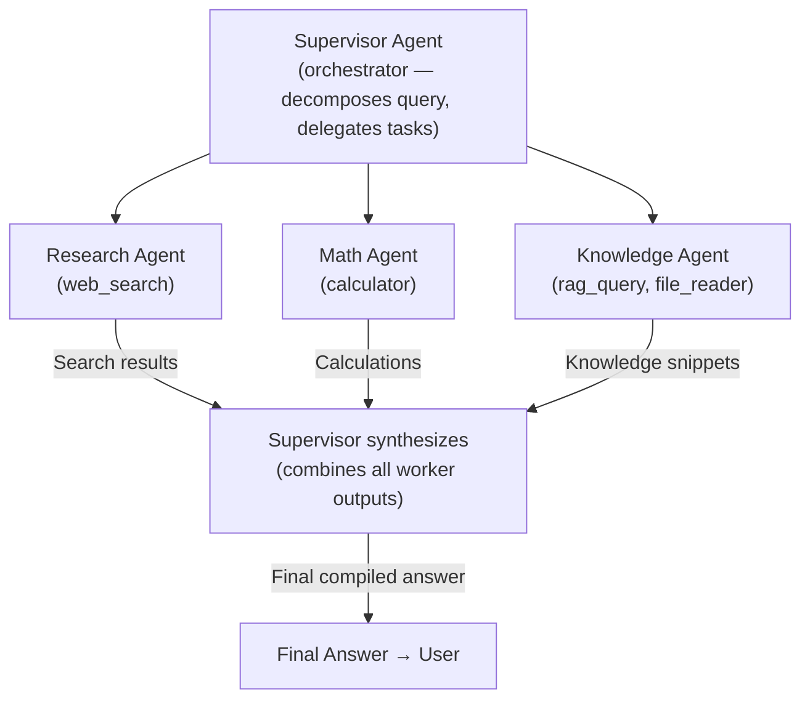

# Experiment: Multi-Agent System

**Category:** Multi-Agent  
**Difficulty:** Advanced  
**Estimated time:** 15 minutes

---

## Objective

Implement and observe a simple multi-agent system where a supervisor agent
delegates work to specialized worker agents.

---

## Hypothesis

- A **supervisor agent** can decompose a task and delegate sub-tasks to
  specialized agents.
- The supervisor can aggregate results from multiple agents into a final answer.
- Multi-agent adds cost (more LLM calls) but improves quality on
  complex, multi-domain tasks.

---

## Architecture



### Implementation approach

A **worker agent** is used as a **tool**. The supervisor calls it like any
other tool:

```python
# Worker agent as a tool
class AgentTool(Tool):
    def __init__(self, worker_agent: ReActAgent):
        self._agent = worker_agent

    async def execute(self, task: str) -> ToolResult:
        result = await self._agent.run(task)
        return ToolResult(self.name, result.answer)
```

The supervisor's tool registry includes the worker agent as a tool:

```python
supervisor_tools = ToolRegistry()
supervisor_tools.register(AgentTool(research_agent, name="research_agent"))
supervisor_tools.register(AgentTool(math_agent, name="math_agent"))
```

---

## Implementation

### Step 1: Create specialized worker agents

```python
# A math specialist
math_agent = ReActAgent(
    llm=mock_llm,
    tools=ToolRegistry([CalculatorTool()]),
    config=AgentConfig(max_iterations=5),
)

# A research specialist
research_agent = ReActAgent(
    llm=mock_llm,
    tools=ToolRegistry([WebSearchTool()]),
    config=AgentConfig(max_iterations=5),
)
```

### Step 2: Create the supervisor

```python
# Supervisor has all tools + can call worker agents
supervisor_tools = ToolRegistry()
supervisor_tools.register(CalculatorTool())
supervisor_tools.register(WebSearchTool())
supervisor_tools.register(
    AgentTool(math_agent, name="math_agent")
)
supervisor_tools.register(
    AgentTool(research_agent, name="research_agent")
)

supervisor = ReActAgent(
    llm=mock_llm,
    tools=supervisor_tools,
    config=AgentConfig(max_iterations=15),
)
```

### Step 3: Run a complex task

```python
result = await supervisor.run(
    "A plane travels 500 km at 800 km/h, then 300 km at 600 km/h. "
    "What is the average speed? Also, what is the latest aviation news?"
)
```

The supervisor should:
1. Delegate the math to `math_agent` (which uses `calculator`)
2. Delegate the news to `research_agent` (which uses `web_search`)
3. Synthesize both results into a final answer

---

## Input

```
A plane travels 500 km at 800 km/h, then 300 km at 600 km/h.
What is the average speed? Also, what is the latest aviation news?
```

---

## Execution

```bash
# This experiment requires the full implementation
# Run with: python -m app.cli --multi-agent
```

### Expected trace

```
Step 1: Supervisor → tool_call: calculator("500/800 + 300/600")
  → Result: 1.25
Step 2: Supervisor → tool_call: calculator("800/1.25") (or similar)
  → Result: 640
Step 3: Supervisor → tool_call: web_search("latest aviation news")
  → Result: [news articles...]
Step 4: Supervisor → Final Answer: "The average speed is 640 km/h..."
```

In a multi-agent setup:
```
Step 1: Supervisor → tool_call: math_agent("calculate average speed...")
  → Worker calls calculator → returns 640
Step 2: Supervisor → tool_call: research_agent("latest aviation news")
  → Worker calls web_search → returns news
Step 3: Supervisor → Final Answer
```

---

## Result

| Metric | Single Agent | Multi-Agent |
|--------|-------------|-------------|
| LLM calls | 3-4 | 5-6 |
| Tool calls | 2-3 | 3-4 (incl. agent-as-tool calls) |
| Specialization | None | Each agent has focused tools |
| Flexibility | High | High |
| Cost | Lower | Higher |

---

## Observations

1. **Specialization improves quality** — each worker agent has focused tools
   and can reason about its domain.
2. **Multi-agent adds cost** — each worker is itself an agent (loop overhead).
3. **Supervisor design matters** — a poorly designed supervisor may
   mis-delegate or fail to aggregate results.
4. **Worker agents can be reused** — the same math agent can serve multiple
   supervisors.
5. **Parallelism opportunity** — independent worker agents can run in
   parallel (not sequential).

---

## Trade-offs

| Aspect | Single Agent | Multi-Agent |
|--------|-------------|-------------|
| Cost | Lower (fewer LLM calls) | Higher |
| Latency | Lower | Higher |
| Specialization | None | Each agent has focused tools/prompts |
| Parallelism | Limited | Workers can run in parallel |
| Complexity | Lower | Higher (coordination, communication) |
| Debugging | Simpler | Harder (trace across agents) |

---

## When to use multi-agent

| Scenario | Use multi-agent? |
|----------|-----------------|
| Simple Q&A | ❌ No |
| Multi-domain task | ✅ Yes |
| High reliability required | ✅ Yes (debate/critique pattern) |
| Low latency required | ❌ No |
| Complex research | ✅ Yes |

---

## Variations to try

1. **Parallel workers** — have the supervisor call multiple workers
   simultaneously instead of sequentially.
2. **Debate pattern** — two agents propose answers, a third judges.
3. **Hierarchical** — workers can delegate to sub-workers.

---

## Key takeaway

Multi-agent systems trade cost and complexity for specialization and
robustness. The supervisor pattern — where one agent delegates to
specialized workers — is the most common multi-agent architecture. The key
design insight: **treat a worker agent as a tool** from the supervisor's
perspective.
