# Experiment: Planning Strategies

**Category:** Planning  
**Difficulty:** Intermediate  
**Estimated time:** 10 minutes

---

## Objective

Compare different planning strategies and their effect on task completion,
cost, and latency.

---

## Hypothesis

- **Direct execution (ReAct):** Fast for simple tasks, but struggles with
  complex multi-step tasks.
- **Plan-and-execute:** Better for complex tasks, but higher upfront cost.
- **No planning (zero-shot):** Cheapest, but fails on multi-step tasks.

---

## Three Strategies

### Strategy A: Direct Execution (ReAct)

The agent takes one action at a time, reasoning between each step.

```
Goal → Think → Act → Observe → Think → Act → Observe → Answer
```

**In this POC:** `ReActAgent`

### Strategy B: Plan-and-Execute

The agent first creates a plan, then executes each step.

```
Goal → Plan [1, 2, 3] → Execute 1 → Execute 2 → Execute 3 → Answer
```

**In this POC:** Not yet implemented — described conceptually.

### Strategy C: Zero-Shot (No Tools)

The LLM answers directly without any tools.

```
Goal → Answer
```

---

## Architecture

```mermaid
flowchart TD
    subgraph StrategyA["ReAct (Direct)"]
        A1[Goal] --> A2[Think + Act + Observe loop]
        A2 --> A3[Final Answer]
    end
    subgraph StrategyB["Plan-and-Execute"]
        B1[Goal] --> B2[Create Plan]
        B2 --> B3[Execute step 1]
        B3 --> B4[Execute step 2]
        B4 --> B5[Execute step 3]
        B5 --> B6[Final Answer]
    end
    subgraph StrategyC["Zero-Shot"]
        C1[Goal] --> C2[LLM generates answer]
        C2 --> C3[Final Answer]
    end
```



---

## Implementation

### Strategy A: ReAct (already implemented)

```python
# app/agents/react_agent.py
agent = ReActAgent(llm=mock_llm, tools=registry, config=config)
result = await agent.run("What is 23 * 47 + 15?")
# → LLM decides to call calculator → gets 1096 → answers
```

### Strategy B: Plan-and-Execute (conceptual)

```python
# Pseudo-code — not yet implemented
plan = await llm.generate(f"Create a plan for: {task}")
# Plan: ["Calculate 23*47=1081", "Add 15", "Report result"]

for step in plan:
    action = await llm.generate(f"Execute: {step}")
    # ... call tools, observe, continue
```

Trade-off: One extra LLM call for planning, but each step is more targeted.

### Strategy C: Zero-Shot

```python
# No tools, no loop
result = await mock_llm.generate([user_message])
# → "The answer is approximately 1096." (LLM guesses)
```

Trade-off: Fast and cheap, but the LLM may be wrong (no calculator).

---

## Input

Task: **"What is 23 * 47 + 15?"**

---

## Execution

Run the demo:

```bash
python -m app.cli
> What is 23 * 47 + 15?
```

### Results comparison

| Strategy | Steps | Tool calls | LLM calls | Cost | Correct? |
|----------|-------|------------|-----------|------|----------|
| ReAct (A) | 2 | 1 | 2 | Medium | ✅ Exact |
| Plan-and-Execute (B) | 3 | 1 | 3 | Higher | ✅ Exact |
| Zero-shot (C) | 1 | 0 | 1 | Low | ⚠️ Approximate |

---

## Result

### ReAct (Strategy A)

```
Step 1: LLM → tool_call: calculator("23 * 47 + 15")
Step 2: tool_result → 1096 → LLM → "The answer is 1096."
```

- **Strengths:** Minimal overhead, correct result
- **Weaknesses:** No explicit plan; could be inefficient on complex tasks

### Plan-and-Execute (Strategy B, conceptual)

```
Step 1: LLM → Plan: ["Calculate 23*47", "Add 15", "Report"]
Step 2: calculator("23 * 47") → 1081
Step 3: calculator("1081 + 15") → 1096
Step 4: LLM → "The answer is 1096."
```

- **Strengths:** Explicit structure, easier to track progress
- **Weaknesses:** More LLM calls, more latency, might over-plan

### Zero-Shot (Strategy C, conceptual)

```
Step 1: LLM → "The answer is approximately 1096."
```

- **Strengths:** Fastest, cheapest
- **Weaknesses:** LLM might be wrong (no verification tool)

---

## Observations

1. **For simple tasks**, ReAct and zero-shot are similar — but ReAct is
   verifiable (it calls a tool).
2. **For complex tasks** (multi-step, uncertain), ReAct is significantly
   more reliable because it can verify intermediate results.
3. **Planning adds cost** — an extra LLM call for the plan, but can prevent
   wasted effort on large tasks.
4. **More planning ≠ better** — for a simple calculation, planning is
   unnecessary overhead.

---

## Trade-offs Summary

| More planning | → | Higher cost, more latency, better reliability on complex tasks |
| Less planning | → | Lower cost, lower latency, risk of failure on complex tasks |
| More iterations | → | Better problem-solving, risk of loops, higher cost |
| Fewer iterations | → | Lower cost, may not finish complex tasks |

**Rule of thumb:**
- **Simple task** → direct execution (ReAct or even zero-shot)
- **Complex task** → plan-and-execute
- **High reliability** → ReAct with more iterations and reflection

---

## Variations to try

1. **Change max_iterations** — set to 1 and observe the agent failing on
   multi-step tasks.
2. **Remove tools** — observe the agent falling back to direct answers.
3. **Add a reflection step** — after the answer, have the agent critique
   its own work.

---

## Key takeaway

There is no single best planning strategy. The right choice depends on
task complexity, cost budget, and reliability requirements. ReAct is a
good default; Plan-and-Execute suits complex tasks; zero-shot is fine for
simple, known-answer tasks.
