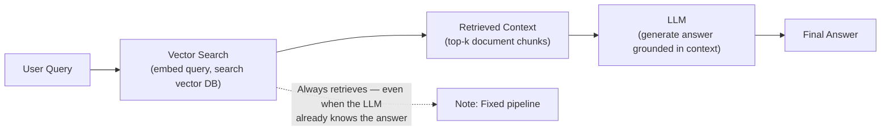
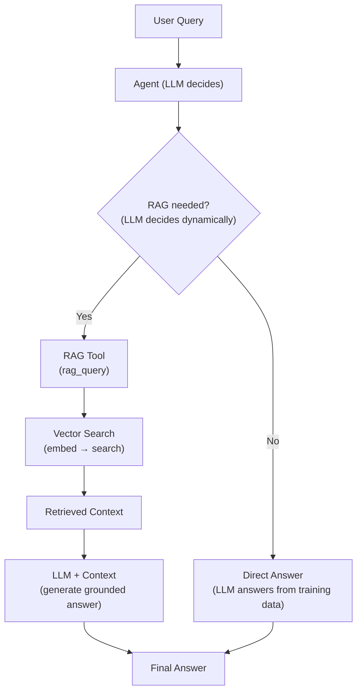
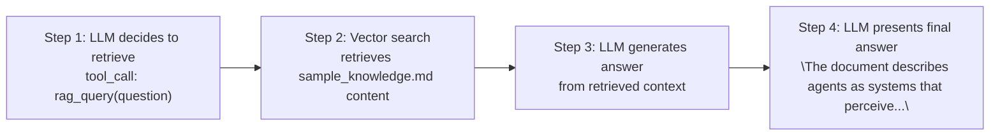

# Experiment: RAG Agent

**Category:** RAG  
**Difficulty:** Intermediate  
**Estimated time:** 10 minutes

---

## Objective

Compare a fixed RAG pipeline (retrieve → generate) with an agent that
uses RAG as one of its tools. Demonstrate that the agent can decide
*whether* and *when* to retrieve.

---

## Hypothesis

- A **RAG pipeline** always retrieves, even when the answer is known.
- An **agent using RAG as a tool** retrieves only when it decides the
  knowledge is needed, and can combine multiple tools.

---

## Architecture

### Fixed RAG pipeline



### Agent with RAG as a tool



---

## Implementation

### RAG pipeline (existing, fixed)

```python
# Simplified — see existing vector-db-poc
def rag_pipeline(query):
    # 1. Always retrieve
    context = vector_search(query, top_k=5)
    # 2. Always generate
    prompt = f"Answer based on: {context}\n\nQuestion: {query}"
    return llm.generate(prompt)
```

### Agent with RAG as a tool

```python
# app/rag/retriever.py
class RAGRetrieverTool(Tool):
    name = "rag_query"
    description = "Retrieve information from the knowledge base using semantic search."

    async def execute(self, question: str) -> ToolResult:
        # Embed the question
        query_vector = await self._embedding_service.embed(question)
        # Search vector DB
        hits = await self._vector_db.search(query_vector, top_k=5)
        # Build context
        context = "\n\n".join(h.text for h in hits)
        # Generate grounded answer
        prompt = f"Context:\n{context}\n\nQuestion: {question}\nAnswer:"
        answer = await self._llm_service.generate_simple(prompt)
        return ToolResult(self.name, answer + f"\n\nSources: {len(hits)} documents")
```

The agent includes this tool in its registry:

```python
tools.register(CalculatorTool())
tools.register(RAGRetrieverTool(llm_service=llm))
# ... other tools
```

Now the LLM can **choose** when to retrieve.

Source: `app/rag/retriever.py` (app/rag/retriever.py)

---

## Input

1. "What is the meaning of life?" → The LLM knows this; retrieval isn't helpful.
2. "What does the sample knowledge document say about agents?" → Needs retrieval.
3. "What is 23 * 47 + 15?" → Needs calculator, not retrieval.

---

## Execution

To run the RAG agent, you need sentence-transformers and a vector DB.
For the demo with the mock LLM, the RAG tool is included when available:

```bash
# Install RAG dependencies (optional)
pip install sentence-transformers qdrant-client

# Run with RAG tool available
python -m app.cli
> What does the sample knowledge document say about agents?
```

### Expected flow



---

## Result

| Query | RAG pipeline | Agent with RAG tool |
|-------|-------------|---------------------|
| "What is the meaning of life?" | Always retrieves (wasted cost) | May skip retrieval (saves cost) |
| "What does the document say about agents?" | Retrieves → generates | Retrieves → generates |
| "23 * 47 + 15" | Always retrieves (useless) | Uses calculator instead |

### Key difference

- **RAG pipeline:** `f(query) = generate(retrieve(query))` — always retrieves.
- **Agent + RAG tool:** The LLM **decides** at runtime whether to retrieve.

---

## Observations

1. **The agent is more efficient** — it doesn't retrieve when it knows the
   answer.
2. **The agent can combine tools** — e.g., retrieve facts, then calculate.
3. **The agent can refine its query** — instead of using the exact user
   query for retrieval, it can rephrase for better results.
4. **RAG pipeline is simpler and more predictable** — good for
   document QA where retrieval is always needed.
5. **Agent + RAG is more flexible** — good for general assistants.

---

## Trade-offs

| Approach | Pros | Cons |
|----------|------|------|
| **RAG pipeline** | Simple, predictable, low cost | Retrieves even when not needed |
| **Agent + RAG tool** | Flexible, efficient | More LLM calls, higher cost |

---

## Variations to try

1. **Remove RAG tool** — the agent falls back to web_search or direct answer.
2. **Add web_search alongside RAG** — let the agent choose between internal
   knowledge base and web search.
3. **Make the agent rephrase queries** — instead of using the user's exact
   words, have the LLM generate a better search query.

---

## Key takeaway

The difference between a RAG **pipeline** and an agent **using RAG as a tool**
is the difference between **fixed** and **dynamic** retrieval. A pipeline
always retrieves; an agent retrieves only when the LLM decides it's helpful.
This gives the agent flexibility to combine retrieval with other tools and
to skip it when unnecessary.
