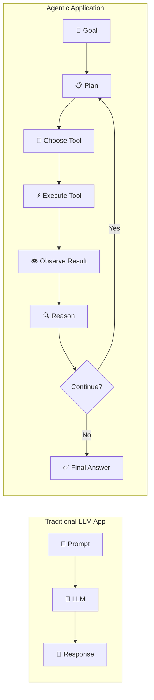

# Agentic AI POC

A hands-on **Agentic AI learning laboratory** — a Python project that helps you
**understand, implement, experiment with, and discuss AI agents**.

## What you'll learn

This repository covers Agentic AI from first principles to interview-ready depth:

| Area | What you'll learn |
|------|-------------------|
| **Fundamentals** | What an AI agent is, how it differs from an LLM app or workflow |
| **Architecture** | Agent components: LLM, tools, memory, planning, state, guardrails |
| **Agent Loop** | The ReAct pattern: observe → reason → act → observe → … |
| **Tool Calling** | How the LLM selects tools, generates arguments, and processes results |
| **Planning** | ReAct reasoning, plan-and-execute, task decomposition |
| **Memory** | Short-term, working, and long-term memory for agents |
| **RAG + Agents** | Using retrieval as a tool vs. a fixed RAG pipeline |
| **Multi-Agent** | Supervisor pattern, agent collaboration, specialization |
| **Orchestration** | Sequential, parallel, conditional, and DAG-based workflows |
| **Human-in-the-Loop** | Approval gates, escalation, pausing agents |
| **Security** | Prompt injection, tool abuse, sandboxing, permission boundaries |
| **Evaluation** | Measuring agent success, tool accuracy, cost |
| **Observability** | Traces, execution logs, debugging agent decisions |
| **Experiments** | Hands-on labs you can run |
| **Interview Prep** | Beginner to system design questions + answers |

## Getting started

- **[Project Analysis](project/project-analysis.md)** — understand the existing codebase
- **[Agentic AI Fundamentals](agentic-ai/fundamentals.md)** — start here if new to agents
- **[Agent Loop](architecture/agent-loop.md)** — the core concept
- **[Interview Preparation](interview-preparation/beginner.md)** — for technical interviews

## Code vs. Documentation

Every concept is paired with an **implementation** you can read and run:



Run the demo:

```bash
python -m app.cli          # Interactive CLI (mock LLM, no API key)
python -m pytest tests/    # Run all tests
```
