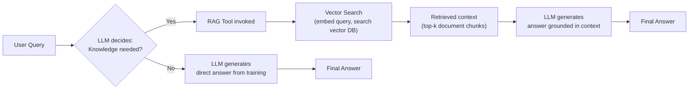
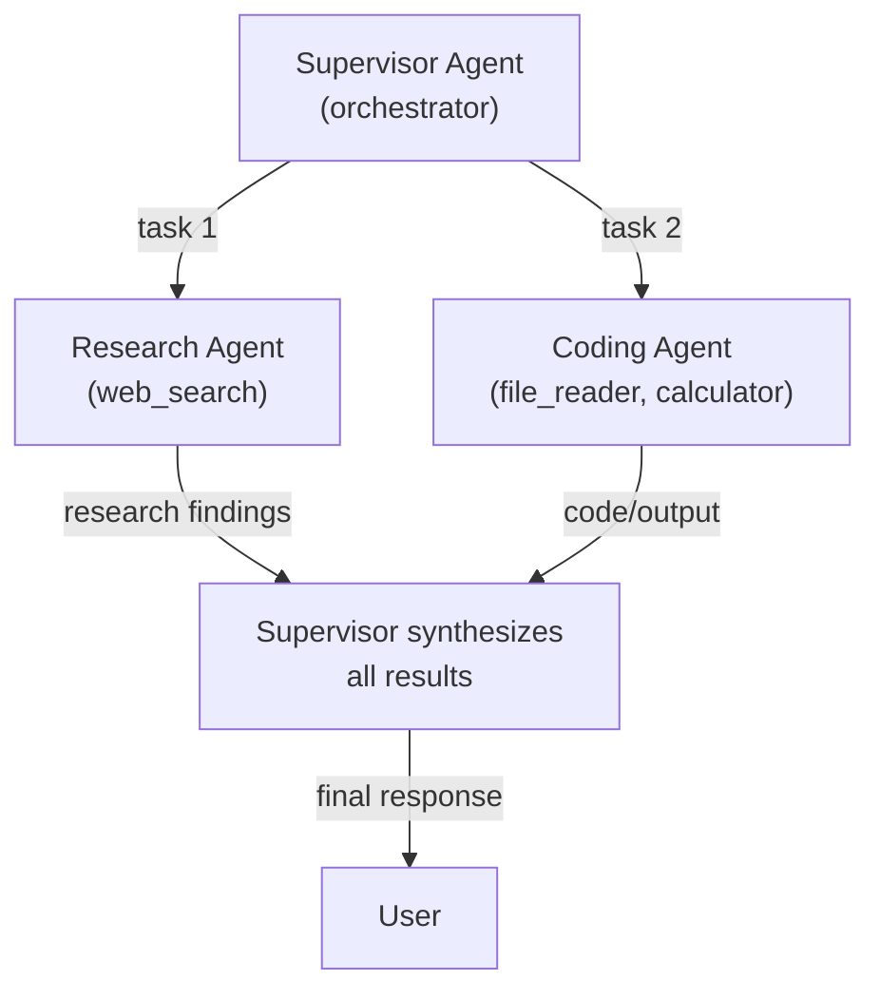

# Interview Preparation — Advanced: Memory, RAG, Multi-Agent

> **Progression:** [Beginner](beginner.md) → [Intermediate](intermediate.md) →
> Advanced → [System Design](system-design.md)

---

## Topic 5: Memory

### Q1: What is short-term memory?

**Short answer:** Short-term memory is the agent's immediate context — the
conversation history of the current task. All messages (user input, LLM
responses, tool results) are kept in a buffer and passed to the LLM as
context for each call.

**Implementation in this POC:** `ConversationBuffer`
(`app/memory/short_term.py`) — an in-memory list of `ConversationMessage`.

**Follow-up questions:**
- "How do you handle context window overflow?"
- "What's the difference between short-term memory and a conversation history?"

---

### Q2: What is long-term memory?

**Short answer:** Long-term memory persists across sessions. It stores
user preferences, facts learned from past interactions, and session
summaries. It's typically implemented as a database (SQLite, PostgreSQL)
or a key-value store, optionally with vector embeddings for semantic search.

**Implementation in this POC:** `PersistentMemory`
(`app/memory/long_term.py`) — a SQLite database with vector search support.

```python
await lt_memory.store("user_prefs", "units", "metric")
fact = await lt_memory.retrieve("user_prefs", "units")  # "metric"
results = await lt_memory.search("user_facts", "preferences")  # semantic
```

**Follow-up questions:**
- "How would you implement semantic search in long-term memory?"
- "How do you handle conflicting facts in memory?"
- "Should memory be encrypted?"

---

### Q3: What is working memory?

**Short answer:** Working memory is a temporary, task-scoped scratchpad.
The agent uses it to store intermediate results, notes, and flags during a
single task execution. It's separate from the conversation history (which
goes to the LLM) and from long-term memory (which persists).

**Implementation in this POC:** `InMemoryWorkingMemory`
(`app/memory/working.py`).

```python
self.working_memory.set("budget_total", "1096")
self.working_memory.set("step", 2)
value = self.working_memory.get("budget_total")
```

**Follow-up questions:**
- "Why not just use the conversation history for everything?"
- "Should working memory be persisted?"

---

### Q4: How would you implement persistent agent memory?

**Short answer:** Use a database (SQLite for simplicity, PostgreSQL for
production) with tables for facts, conversations, and preferences.
Optionally store embeddings alongside facts for semantic search. Use
namespaces to isolate users. Upsert by key to handle updates.

```sql
CREATE TABLE agent_memory (
    namespace TEXT NOT NULL,
    key TEXT NOT NULL,
    value TEXT NOT NULL,
    embedding BLOB,  -- for semantic search
    created_at TEXT,
    updated_at TEXT,
    UNIQUE(namespace, key)
);
```

**Follow-up questions:**
- "How do you handle memory consistency?"
- "How do you prevent memory from growing unbounded?"
- "How do you make memory updates atomic?"

---

### Q5: How does RAG differ from agent memory?

| Aspect | RAG | Agent Memory |
|--------|-----|-------------|
| **Purpose** | Ground responses in document knowledge | Maintain conversation/task context |
| **Scope** | Document corpus | User session + user profile |
| **Lifecycle** | Ingest → Query | Store → Retrieve → Update |
| **Access** | Fixed (query → context) | Dynamic (LLM decides when) |
| **Example** | "What does the manual say about X?" | "The user prefers metric." |

**Key insight:** Vector databases are a *mechanism* for both RAG and
long-term memory, but they serve different purposes. RAG is about
external knowledge; memory is about internal state.

**Follow-up questions:**
- "Could you use RAG for memory?"
- "Is RAG a form of memory?"
- "How do you combine RAG and memory?"

---

### Q6: How would you prevent memory from becoming too large?

- **Truncate short-term memory** — keep only the last N messages or N
  characters (context window limit).
- **Summarize** — replace old messages with a summary (costs an LLM call).
- **TTL for long-term memory** — expire facts after a time-to-live.
- **Archiving** — move old conversations to cold storage.
- **Selective retention** — only keep "important" facts (rated by the agent).

**Follow-up questions:**
- "How do you decide what to summarize?"
- "What's the trade-off of summarization?"

---

### Q7: How would you handle stale memory?

- **TTL (time-to-live)** — facts expire after N days.
- **Recency weighting** — recent facts are scored higher in retrieval.
- **Self-critique** — the agent reviews memory and flags outdated entries.
- **Explicit invalidation** — provide an "update memory" tool.
- **Source timestamps** — store when facts were learned; re-verify old ones.

**Follow-up questions:**
- "How do you detect that a fact is stale?"
- "Should the agent proactively refresh memory?"

---

## Topic 6: RAG + Agents

### Q1: How does an agent use RAG?

**Short answer:** The agent receives a RAG tool in its tool registry. When
the LLM decides it needs external knowledge, it calls the RAG tool
(embeds the query, searches the vector DB, retrieves context, generates a
grounded answer). The result is fed back as an observation, and the agent
continues.



**Implementation in this POC:** `RAGRetrieverTool` in
`app/rag/retriever.py`. The agent registers it as a tool:

```python
tools.register(RAGRetrieverTool(llm_service=llm, embedding_service=emb, vector_db=vdb))
```

**Follow-up questions:**
- "How does the agent decide whether to retrieve?"
- "Can the agent retrieve multiple times?"

---

### Q2: What is the difference between RAG and agent memory?

See [Q5 in Memory](#q5-how-does-rag-differ-from-agent-memory). RAG retrieves
from a document corpus; agent memory stores conversational state and user
preferences.

---

### Q3: When should an agent invoke a retrieval tool?

- When the question requires specific knowledge not in the LLM's training data
- When the answer should be **grounded in sources** (citations matter)
- When the LLM is uncertain and wants to verify information
- When the question is about domain-specific documents

The LLM makes this decision dynamically — unlike a fixed RAG pipeline that
always retrieves.

**Follow-up questions:**
- "What if the retrieval returns nothing useful?"
- "Should the agent always cite its sources?"

---

### Q4: How would you improve poor retrieval?

- **Re-formulate the query** — the LLM can rephrase the user's question
  for better matching.
- **Increase top_k** — retrieve more documents.
- **Hybrid search** — combine vector + keyword (BM25) search.
- **Metadata filtering** — filter by document type, date, source.
- **Re-ranking** — use a cross-encoder to rank results.
- **HyDE** — Hypothetical Document Embeddings: generate a hypothetical
  answer first, then embed it for better retrieval.

**Follow-up questions:**
- "How do you measure retrieval quality?"
- "What's the trade-off of retrieving more documents?"

---

### Q5: How does an agent decide whether to retrieve?

The LLM reasons about the question:

- "Do I know this?" → if yes, answer directly
- "Do I need external sources?" → if yes, call retrieval
- "Am I uncertain?" → retrieve to verify

The system prompt encourages retrieval when appropriate (e.g., "If you need
to reference specific documents or sources, use the rag_query tool").

---

## Topic 7: Multi-Agent Systems

### Q1: Why use multiple agents?

**Short answer:** For specialization, parallelism, modularity, and
robustness. Each agent can have its own tools, prompts, and memory
specialized to its domain.

| Reason | Explanation |
|--------|-------------|
| **Specialization** | Research agent, coding agent, reviewer |
| **Parallelism** | Multiple agents work simultaneously |
| **Modularity** | Easier to develop, test, swap |
| **Robustness** | If one fails, others compensate |

**Follow-up questions:**
- "When is multi-agent overkill?"
- "How do you assign tasks to agents?"

---

### Q2: When should you use a multi-agent architecture?

- **Multi-domain tasks** (research + analysis + writing)
- **High reliability** requirements (debate/critique pattern)
- **Complex reasoning** that benefits from different perspectives
- **Specialized expertise** needed (legal agent + finance agent)

**Avoid when:**
- The task is simple (single agent suffices)
- Latency/cost is critical (multi-agent is expensive)
- The task is deterministic (a workflow is better)

**Follow-up questions:**
- "How many agents is too many?"
- "What's the communication overhead?"

---

### Q3: What is a supervisor agent?

**Short answer:** An orchestrator agent that delegates work to worker
agents, monitors progress, and aggregates results. Workers have specialized
tools or prompts. The supervisor decides which worker to call and when.



**Implementation in this POC:** Described in
[Multi-Agent Experiment](../experiments/multi-agent.md). A worker agent is
wrapped as a `Tool` from the supervisor's perspective.

**Follow-up questions:**
- "How does the supervisor know which worker to call?"
- "What if a worker fails?"

---

### Q4: What is agent delegation?

**Short answer:** The supervisor agent assigns a sub-task to a worker
agent. From the supervisor's perspective, the worker is just another tool.
The supervisor calls the worker's tool interface, gets the result, and
continues.

**Follow-up questions:**
- "How do you pass context between delegated agents?"
- "Can delegation be recursive?"

---

### Q5: How do agents communicate?

| Mechanism | Description |
|-----------|-------------|
| **Direct handoff** | Supervisor sends task, receives result |
| **Shared memory** | Agents write to/read from shared state |
| **Message passing** | Structured messages between agents |
| **Tool delegation** | One agent's tool is another agent |

**Follow-up questions:**
- "Which is most efficient?"
- "How do you handle message formats?"

---

### Q6: How do you handle failures between agents?

- **Retry** — the supervisor retries the failed agent
- **Fallback** — the supervisor tries a different worker
- **Escalation** — the supervisor asks a human for help
- **Degradation** — the supervisor produces a partial answer with caveats

**Follow-up questions:**
- "Should failures propagate or be contained?"
- "How do you log cross-agent failures?"

---

### Q7: What are the disadvantages of multi-agent systems?

- **Higher cost** — more LLM calls (multiple agents)
- **Higher latency** — coordination overhead
- **Complexity** — harder to debug and orchestrate
- **Failure propagation** — one agent's error can cascade
- **Communication overhead** — agents need to exchange information
- **Non-determinism** — harder to reproduce results
