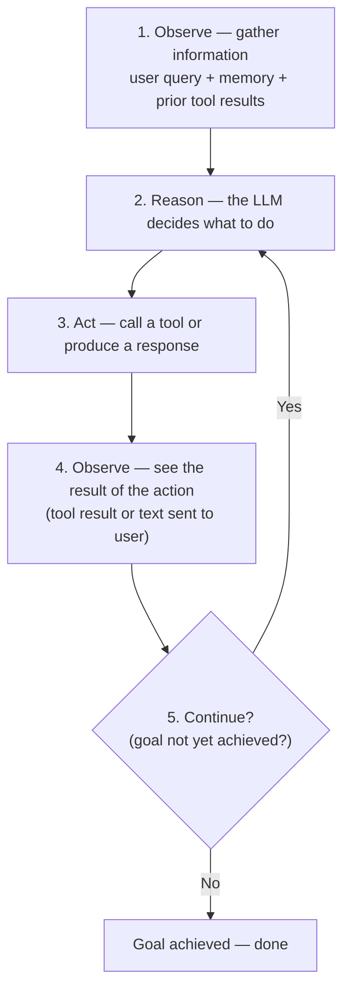
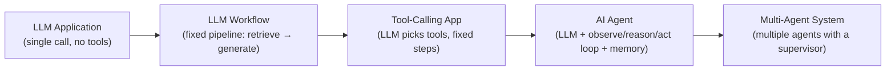
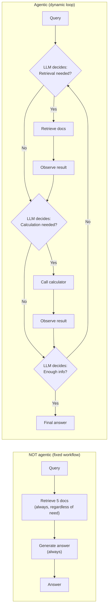

# Interview Preparation — Beginner: AI Agent Fundamentals

> **Progression:** Beginner → [Intermediate](intermediate.md) →
> [Advanced](advanced.md) → [System Design](system-design.md)

---

## Topic 1: AI Agent Fundamentals

---

### Q1: What is an AI agent?

**Short answer:**
An AI agent is a system that perceives its environment, reasons about
goals, takes actions (typically via tools), observes the results, and
repeats this cycle until the goal is achieved. The key differentiator from
a simple LLM application is the **iterative loop** with dynamic tool use.

**Detailed explanation:**

Drawing from Russell & Norvig's definition, an agent is "anything that can
be viewed as perceiving its environment through sensors and acting upon that
environment through actuators."

In software:

| Component | Role in an AI agent |
|----------|---------------------|
| **Sensors** | Inputs: user messages, tool results, memory, API responses |
| **Agent program** | The decision logic: LLM + loop + tool selection |
| **Actuators** | Outputs: tool calls, API requests, text responses |
| **Environment** | Everything external: tools, APIs, databases, the user |

The agent's life cycle:



**Example:**
> User asks: "What's the weather today, and should I bring an umbrella?"
>
> A simple LLM app: generates a response based on training data.
> An agent:
> 1. Calls `datetime_now` to confirm "today"
> 2. Calls `web_search("weather New York today")`
> 3. Observes the forecast
> 4. Decides whether an umbrella is needed
> 5. Returns a grounded, actionable answer

**Follow-up questions:**
- "What's the minimum set of components for an agent?"
- "Can an agent work without memory?"
- "What's the role of the LLM in an agent?"

**Common mistakes:**
- Calling any LLM+tool system an "agent" (the loop must be dynamic)
- Ignoring the perception-action-observation cycle
- Assuming more tools = more agent-like

---

### Q2: What is Agentic AI?

**Short answer:**
Agentic AI refers to AI systems that exhibit **agency** — the ability to
act autonomously toward a goal. It's characterized by an agent loop (observe,
reason, act, observe), dynamic tool selection, and memory.

**Detailed explanation:**

"Agentic" is the adjective form of "agent." It describes systems that have
**agency** — the capacity to make decisions and act on them independently.

The three defining characteristics:

1. **Autonomy** — the system doesn't need step-by-step human instructions
2. **Goal-directedness** — it works toward a specific objective
3. **Adaptability** — it adjusts its approach based on feedback

Agentic AI sits at the top of a spectrum:



**Example:**
A chatbot that answers FAQs is an LLM application.
A chatbot that can search the web, check your calendar, and book a flight
based on your instructions is an AI agent.

**Follow-up questions:**
- "What's the difference between 'agentic' and 'autonomous'?"
- "Is a thermostat an 'agent'?"
- "What makes the difference between a tool-calling app and an agent?"

**Common mistakes:**
- Using "agentic" as a marketing buzzword (everything is "agentic")
- Confusing "agentic" with "conversational"
- Assuming "agentic" means "general artificial intelligence (AGI)"

---

### Q3: What makes an application "agentic"?

**Short answer:**
Seven characteristics: (1) iterative loop, (2) LLM-directed tool
selection, (3) LLM-directed tool arguments, (4) observation feedback,
(5) dynamic planning, (6) memory, (7) LLM-driven termination.

**Detailed explanation:**

A system is agentic if it has **all** of these characteristics:

| # | Characteristic | What it means |
|---|----------------|---------------|
| 1 | **Iterative loop** | The system can take multiple steps, observing results |
| 2 | **LLM chooses tools** | The LLM decides which tool to call (not hardcoded) |
| 3 | **LLM generates arguments** | The LLM decides the arguments, based on context |
| 4 | **Observation feedback** | Tool results feed back to the LLM for the next decision |
| 5 | **Dynamic planning** | The plan can change based on intermediate results |
| 6 | **Memory** | Context is retained across steps |
| 7 | **Termination decision** | The LLM/agent decides when the goal is met |

**The test:** Does the LLM have agency over the *flow* of execution,
or just over the *content* of a single response?

- If the LLM only decides what to say → LLM application.
- If the LLM decides what to *do* next → agent.

**Example:**


**Follow-up questions:**
- "Can a system with 6 of 7 characteristics still be non-agentic?"
- "What if the loop is hardcoded but the LLM chooses tools?"
- "Is a todo list app with LLM-generated tasks agentic?"

**Common mistakes:**
- Counting any LLM+tool system as an agent
- Confusing "the user configured tools" with "the LLM chose tools"
- Ignoring the feedback/observation step
- Calling a fixed retrieve-then-generate pipeline "agentic"

---

### Q4: What is the difference between an LLM application and an AI agent?

| Aspect | LLM Application | AI Agent |
|--------|----------------|----------|
| **Flow** | Single prompt → LLM → response | Observe → reason → act → observe → loop |
| **Tools** | None (or fixed pipeline) | Dynamically selected by the LLM |
| **Planning** | None — the prompt is the plan | Implicit or explicit, can be revised |
| **Memory** | None — each request is fresh | Retains context across steps |
| **Adaptability** | Fixed behavior | Adapts based on tool results |
| **Failure recovery** | None — if wrong, start over | Can retry, change tools, self-correct |
| **Latency** | One LLM call | Multiple LLM calls |
| **Use when** | Simple Q&A, summarization | Multi-step, tool-using tasks |

**Example:**

LLM app: "Summarize this article" → LLM summarizes → done.
Agent: "Plan a 3-day trip to Tokyo" → research flights → check dates →
book hotel → summarize itinerary → done.

**Follow-up questions:**
- "When would you choose an LLM app over an agent?"
- "Can an agent be faster than an LLM app?"
- "What's the overhead of the agent loop?"

**Common mistakes:**
- Thinking agents are always better (higher cost, more complexity)
- Not considering the latency/cost trade-off
- Ignoring that simple tasks don't need agents

---

### Q5: What is the difference between an agent and a workflow?

**Short answer:**
A workflow has a pre-defined, deterministic sequence of steps decided by
the code. An agent uses an LLM to dynamically decide what to do at each
step. Workflows are predictable and cheap; agents are flexible but more
expensive and harder to debug.

**Detailed explanation:**

### Workflow (deterministic)

```python
def rag_workflow(query):
    # Step 1: Always retrieve
    docs = vector_search(query, k=5)
    # Step 2: Always generate
    prompt = build_prompt(docs, query)
    answer = llm.generate(prompt)
    # Step 3: Always return
    return answer
```

- The steps are fixed: retrieve → generate → return.
- No matter the query, the same steps run.
- Predictable, reproducible, cheap, easy to debug.

### Agent (autonomous)

```python
async def agent_loop(query):
    memory.add(query)
    while iteration < max:
        response = llm(messages, tools)   # LLM decides
        if response.tool_calls:
            execute_tools(response.tool_calls)  # observe
        else:
            return response.content       # done
```

- The LLM decides: retrieve? calculate? search? answer?
- Steps vary based on the query and intermediate results.
- Flexible, adaptive, more expensive, harder to debug.

### When to use each

| Scenario | Workflow or Agent? |
|----------|-------------------|
| "Summarize this document" | Workflow |
| "Answer a question from these docs" | Workflow (RAG) |
| "Plan a vacation" | Agent |
| "Analyze data and create a report" | Agent |
| "Classify this text" | Workflow |

**Follow-up questions:**
- "Can a workflow and agent be combined?"
- "What's a hybrid approach?"
- "When does the cost of an agent outweigh its benefits?"

**Common mistakes:**
- Using an agent for simple, fixed-step tasks
- Not realizing that RAG is typically a workflow, not an agent
- Assuming agents are always more capable (they're not always cost-effective)

---

### Q6: What is the difference between autonomous and deterministic systems?

| Characteristic | Autonomous | Deterministic |
|----------------|-----------|---------------|
| **Decision making** | LLM chooses actions | Rules/code decide |
| **Tool selection** | Dynamic | Static |
| **Execution path** | Emergent | Pre-determined |
| **Reproducibility** | Low (stochastic LLM) | High |
| **Debuggability** | Harder | Easier |

**Most real-world systems are hybrid:** deterministic guardrails
(max iterations, tool allow-list) + autonomous decision-making (LLM chooses
tools).

**Example:**
- Autonomous: "Decide which tool to call next"
- Deterministic: "Always enforce max_iterations=10"
- Hybrid: The LLM chooses tools, but the application enforces limits.

---

### Q7: Why do agents need tools?

**Short answer:**
LLMs have two fundamental limitations: (1) knowledge cutoff — they don't
know about recent events, and (2) no external interaction — they can't read
files, make API calls, or compute in real time. Tools solve both.

**Detailed explanation:**

| LLM limitation | Tool that solves it |
|----------------|-------------------|
| Knowledge cutoff | web_search, rag_query |
| No computation | calculator |
| No file access | file_reader, file_writer |
| No real-time data | API tools (weather, stock, etc.) |
| No memory across calls | memory read/write tools |

**Without tools**, the agent is limited to what the LLM knows from
training data. It can:
- Answer general knowledge questions
- Generate text (stories, code, summaries)
- Do simple math (often incorrectly)

**With tools**, the agent can:
- Access current information
- Perform precise calculations
- Read and write files
- Interact with external systems
- Make decisions based on real-world data

**Example:**
> "What's the total revenue from Q3 if the sales CSV shows..."
>
> Without a tool: the LLM guesses based on patterns.
> With tools: `file_reader("sales.csv")` → `calculator(sum)` → exact answer.

**Follow-up questions:**
- "Can an LLM do math without a calculator tool?"
- "What tools would a coding agent need?"
- "How do you decide which tools to give an agent?"

**Common mistakes:**
- Giving the agent too many tools (confusion, higher cost)
- Not validating tool results before presenting to the user
- Assuming tools always return correct data
