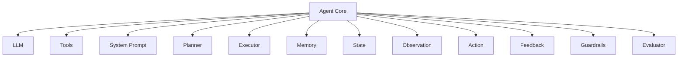
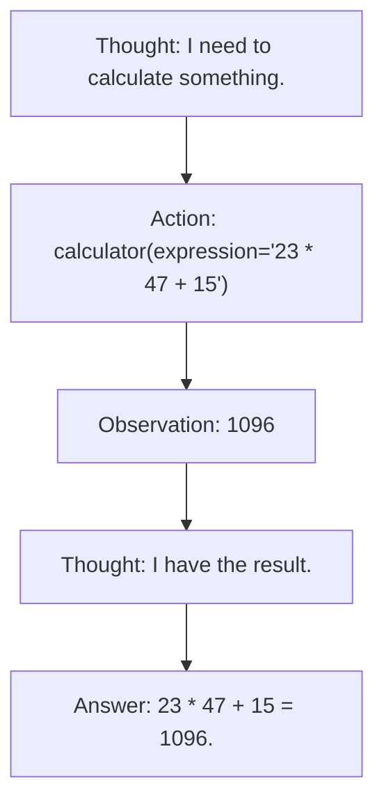

# Interview Preparation — Intermediate: Architecture, Tools, Planning

> **Progression:** [Beginner](beginner.md) → Intermediate →
> [Advanced](advanced.md) → [System Design](system-design.md)

---

## Topic 2: Agent Architecture

### Q1: What are the major components of an AI agent?

**Short answer:** The major components are: Agent (orchestrator), LLM (decision
maker), System prompt (constitution), Tools (actuators), Planner, Executor,
Memory, State, Observation, Action, Feedback, Guardrails, Evaluator.

**Detailed explanation:**



| Component | Role | In this POC |
|-----------|------|-------------|
| **Agent** | Orchestrator — runs the loop | `app/agents/react_agent.py` |
| **LLM** | Decision maker — chooses next action | `app/llm/service.py` |
| **System prompt** | Constitution — defines behavior | `DEFAULT_SYSTEM_PROMPT` |
| **Tools** | Actuators — interact with environment | `app/tools/` |
| **Tool registry** | Catalog of available tools | `app/tools/base.py` |
| **Planner** | Decides what to do | LLM reasoning step (implicit) |
| **Executor** | Runs tools safely | `BaseAgent._execute_tool` |
| **Memory** | Retains context | `app/memory/` |
| **State** | Lifecycle tracking | `AgentState` enum |
| **Observation** | What the agent sees (tool results) | Added to memory |
| **Action** | What the agent does (tool call or response) | LLM output |
| **Feedback** | Observation → next decision | Tool results → LLM |
| **Guardrails** | Safety boundaries | Allow-list, timeout, approvals |
| **Evaluator** | Judges output quality | Not yet implemented |

**Follow-up questions:**
- "Which component is the most critical?"
- "Can the executor be separated from the agent?"
- "What happens if the evaluator is part of the loop?"

**Common mistakes:**
- Forgetting the feedback loop (action → observation → next decision)
- Not including guardrails as a first-class component
- Confusing memory with state

---

### Q2: What is an agent loop?

**Short answer:** An agent loop is the iterative cycle of observe → reason →
plan → act → observe → reason → … until the goal is achieved. It's the
mechanism that gives an agent its autonomy.

**Implementation in this POC:**

```python
async def run(self, user_input: str) -> AgentResult:
    self.memory.add_user(user_input)
    iteration = 0
    while iteration < self.config.max_iterations:
        iteration += 1
        messages = self._build_messages()           # Observe
        response = await self.llm.generate(messages, tools)  # Reason + Plan + Act
        if response.has_tool_calls:                # Action
            for tc in response.tool_calls:
                result = await self._execute_tool(tc)  # Execute
                self.memory.add(result.to_message())    # Observe result
            continue
        if response.content:                       # Final answer
            return AgentResult(answer=response.content, ...)
    return AgentResult(error="Max iterations reached")
```

**Follow-up questions:**
- "How do you handle tool failures in the loop?"
- "What happens if the LLM returns neither tool calls nor text?"
- "How do you make the loop interruptible?"

---

### Q3: What is an observation?

**Short answer:** An observation is the data the agent receives after
taking an action — typically a tool result, but also user messages and
memory entries. Observations become part of the context for the next LLM
call.

**Detailed explanation:**

In the agent loop:

```mermaid
flowchart TB
    D1["LLM decides: \"Call calculator(23 * 47 + 15)\""] --> D2["[Action: tool call]"]
    D2 --> D3["calculator executes<br/>(evaluates the expression)"]
    D3 --> D4["Observation: \"1096\""]
    D4 --> D5["LLM sees: \"calculator returned 1096\"\n(observation added to context)"]
    D5 --> D6["LLM decides: \"I have the answer\""]
    D6 --> D7["[Action: text response]"]
    D7 --> D8["Observation: (user reads the answer)<br/>(turn ends — ready for next input)"]
```

**Follow-up questions:**
- "Should observations be sanitized before feeding to the LLM?"
- "How do you structure tool results as observations?"

---

### Q4: What is an action?

**Short answer:** An action is what the agent does at each step — either
a tool call or a final text response. Actions are produced by the LLM based
on the current observation/context.

---

### Q5: What is agent state?

**Short answer:** Agent state is the agent's current condition in its
lifecycle. It tracks where the agent is (thinking, tool calling, done,
failed) and accumulates task-relevant data (iteration count, tool call
history, results).

In this POC: the `AgentState` enum (`app/agents/types.py`).

**Follow-up questions:**
- "How does state differ from memory?"
- "Why is state important for long-running agents?"

---

### Q6: What is the role of the LLM in an agent?

**Short answer:** The LLM is the **decision-making brain** — it reads the
context (observations + memory), reasons about the goal, and decides the
next action (tool call or final response). The application provides the
mechanism (loop, tools, guardrails); the LLM provides the intelligence.

**Follow-up questions:**
- "Could you replace the LLM with rules?"
- "What are the failure modes of LLM-based decisions?"

---

### Q7: What is the role of the orchestrator?

**Short answer:** The orchestrator (or "agent core") manages the loop:
it collects observations, invokes the LLM, executes tools, enforces
guardrails, updates state, and logs traces. It's the glue that holds the
agent together.

---

## Topic 3: Tool Calling

### Q1: What is function calling?

**Short answer:** A protocol (supported by OpenAI and most LLM providers)
that lets an LLM request the invocation of a function defined by the
application. The LLM outputs the function name and arguments as structured
JSON; the application executes the function and returns the result.

**Detailed explanation:**

```json
{
  "tool_calls": [{
    "id": "call_abc123",
    "type": "function",
    "function": {
      "name": "calculator",
      "arguments": "{\"expression\": \"23 * 47 + 15\"}"
    }
  }]
}
```

The application:
1. Parses the tool call (name + arguments JSON)
2. Looks up the tool by name
3. Validates arguments against the schema
4. Executes the tool
5. Returns the result as an observation

**Follow-up questions:**
- "How do you handle multiple tool calls in one response?"
- "What if the LLM calls a tool that doesn't exist?"

---

### Q2: How does an LLM decide which tool to call?

**Short answer:** The LLM receives tool definitions (name, description,
parameter schema) in its context window. Based on the user's query and
the tool descriptions, it probabilistically selects the best-matching
tool and generates arguments.

**Follow-up questions:**
- "What makes a good tool description?"
- "How do you handle ambiguous tool names?"
- "Can the LLM refuse to call any tool?"

---

### Q3: How are tool arguments generated?

**Short answer:** The LLM generates arguments as a **JSON string** that
matches the parameter schema. The application parses this JSON and passes
the arguments to the actual function.

**Common issues:**
- Malformed JSON (missing closing brace)
- Missing required arguments
- Wrong type (string instead of number)
- Extra/unknown arguments

**In this POC:** `Tool._parse_arguments()` handles JSON parsing with
error recovery.

---

### Q4: How do you validate tool arguments?

**Short answer:** Validate on the application side — never trust the LLM.
Check required fields, types, and ranges. Reject or reject-and-ask-the-LLM-to-retry.

```python
def _validate_args(self, kwargs: dict) -> None:
    required = self.parameters.get("required", [])
    for req in required:
        if req not in kwargs:
            raise ValueError(f"Missing required argument: {req}")
```

**Follow-up questions:**
- "Should you validate types too?"
- "What's the best way to handle invalid arguments?"

---

### Q5: How do you handle tool failures?

**Short answer:** Catch the exception, return it as a tool result
(observation), and let the LLM decide how to recover — try a different
tool, fix the arguments, or inform the user.

**Follow-up questions:**
- "Should the agent retry automatically?"
- "How do you prevent infinite retry loops?"

---

### Q6: How do you prevent an agent from calling unauthorized tools?

**Short answer:** Maintain an **allow-list** of permitted tools. Before
executing any tool call, check if the tool name is in the allow-list.

```python
def is_allowed(self, tool_name: str) -> bool:
    if self._allow_list is None:
        return True  # all tools allowed
    return tool_name in self._allow_list
```

**Follow-up questions:**
- "How do you handle a tool the LLM wants but you haven't approved?"
- "Can the agent add tools to the allow-list?"

---

## Topic 4: Planning

### Q1: What is agent planning?

**Short answer:** Planning is the process by which an agent decides on a
sequence of actions to achieve its goal. In a ReAct agent, this is implicit
(in the reasoning step). In Plan-and-Execute, it's explicit (a separate
planning step).

**Follow-up questions:**
- "When is planning worth the extra cost?"
- "What's the difference between planning and reasoning?"

---

### Q2: What is ReAct?

**Short answer:** ReAct (Yao et al., 2022) is an agent framework that
interleaves **reasoning** (chain-of-thought thinking) with **acting**
(tool calls). At each step: Think → Act → Observe → Think → Act → …



**Follow-up questions:**
- "Is ReAct a framework or a technique?"
- "How does ReAct compare to Chain-of-Thought?"

---

### Q3: What is plan-and-execute?

**Short answer:** An agent architecture where the LLM first creates an
explicit plan (list of sub-tasks), then executes each sub-task in sequence,
using tools and observing results. The plan can be updated as new
information arrives.

```
Goal → Plan: ["search flights", "check dates", "book hotel"] → Execute each
```

**Follow-up questions:**
- "When would you choose plan-and-execute over ReAct?"
- "How do you handle plan failures?"

---

### Q4: What is task decomposition?

**Short answer:** Breaking a complex goal into smaller, manageable sub-tasks.
Each sub-task is simpler to execute and verify. In agentic systems, the LLM
performs decomposition during the planning or reasoning step.

**Follow-up questions:**
- "What makes a good sub-task?"
- "How do you decide when to decompose?"

---

### Q5: What is reflection?

**Short answer:** After completing a task, the agent reviews its performance
— what worked, what didn't — and uses this to improve future performance.
This is the basis of **Reflexion** (ICLR 2023), where the agent generates
a self-critique and revises its approach.

**Follow-up questions:**
- "Should reflection be automatic or user-triggered?"
- "How do you store reflection results?"

---

### Q6: What are the trade-offs of planning?

| More planning | → | Higher cost, more latency, better reliability (complex tasks) |
| Fewer planning steps | → | Lower cost, lower latency, risk of failure (complex tasks) |

**Key insight:** Don't plan for simple tasks. Planning overhead isn't
justified when the answer is one tool call.

**Follow-up questions:**
- "How do you decide how much to plan?"
- "Can you plan too much?"

---

### Q7: When would you avoid autonomous planning?

- Tasks with a **known, fixed structure** (use a workflow instead)
- **Low-latency** requirements (planning adds a round-trip)
- **Low-cost** constraints (each planning step costs money)
- **High reproducibility** requirements (LLM plans are non-deterministic)
- **Regulated environments** (planning decisions must be auditable)

**Follow-up questions:**
- "What's an example of a task where planning hurts?"
- "How do you make planning auditable?"
