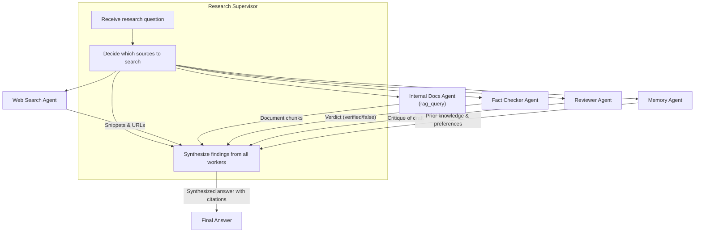
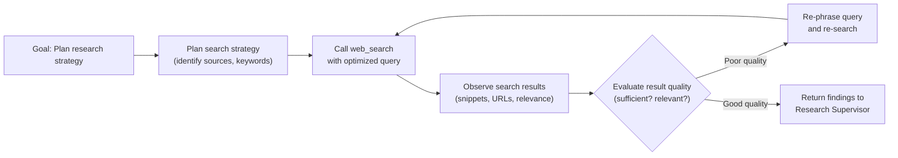
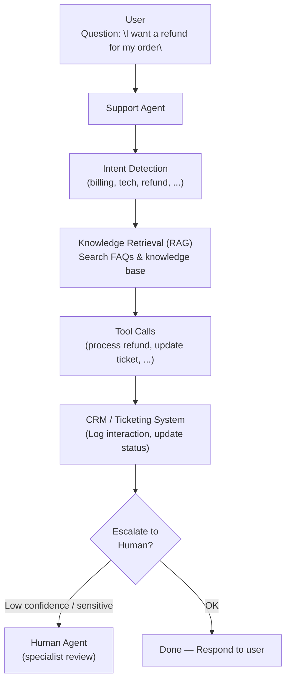
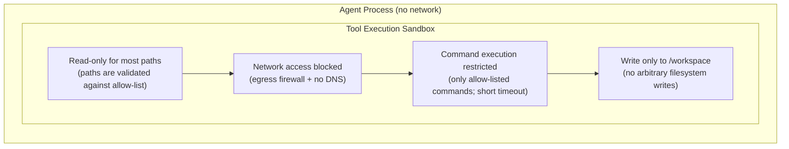
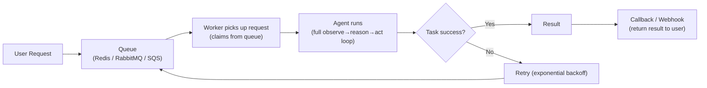

# Interview Preparation — System Design & Production

> **Progression:** [Beginner](beginner.md) → [Intermediate](intermediate.md) →
> [Advanced](advanced.md) → System Design

---

## System Design: Design an AI Research Agent

### Requirements

- User asks a research question
- Agent searches multiple sources (web, internal docs)
- Agent evaluates information quality
- Agent summarizes findings
- Agent produces citations

### Architecture

### Components

1. **Supervisor Agent** — decomposes the query, assigns sub-tasks, synthesizes
2. **Web Search Agent** — searches the web, extracts snippets
3. **Document Search Agent** — queries internal knowledge base (RAG)
4. **Fact Checker Agent** — verifies claims against sources
5. **Reviewer Agent** — critiques the draft summary
6. **Memory** — stores findings, sources, citations

### Agent loop for each worker

### Parallelization

- Web search and internal doc search can run **in parallel**
- Fact checking can run after summary generation
- Reviewer runs after the draft is complete

### State & persistence

- **Short-term memory**: each worker's conversation buffer
- **Working memory**: findings, intermediate results
- **Long-term memory**: user's research preferences, previously searched topics
- **Checkpoints**: save state after each phase (search → evaluate → summarize)

### Failure handling

| Failure | Strategy |
|---------|----------|
| Web search returns nothing | Try rephrased query, fall back to docs |
| Document search returns low-quality | Increase top_k, use hybrid search |
| Fact check fails | Flag uncertainty, try different source |
| Worker agent times out | Cancel, return partial results |

### Evaluation

- **Source quality**: Are the sources credible? (LLM judge)
- **Factual accuracy**: Are claims supported by sources? (fact checker)
- **Completeness**: Did the agent cover all aspects? (checklist)
- **Synthesis quality**: Is the summary clear and well-organized? (LLM judge)

### Observability

- Trace every search query and result
- Log which sources were used for each claim
- Track token usage per worker (cost attribution)
- Alert on high error rates or timeouts

### Cost control

- Cache search results (same query → cached response)
- Limit the number of searches per task
- Use cheaper models for fact-checking
- Cap total LLM calls per task

---

## System Design: Design a Customer Support Agent

### Key considerations

1. **Intent detection** — classify the request (billing, tech, refund, etc.)
2. **Knowledge base** — RAG against internal docs, FAQs
3. **Actions** — can update tickets, process refunds, create cases
4. **Escalation** — when confidence is low or the request is sensitive
5. **SLA tracking** — response time, resolution time, customer satisfaction

### Permission boundaries

- Can read tickets, can't close tickets (requires human)
- Can process refunds up to $50 (auto), beyond that → human approval
- Can't access customer PII without justification

### Multi-turn support

- The agent must maintain conversation context
- It should reference previous interactions
- Long-term memory stores customer preferences and history

---

## System Design: Design a Software Engineering Agent

### Tools needed

| Tool | Risk level | Approval needed? |
|------|-----------|-----------------|
| `search_code` | Low | No |
| `run_tests` | Low | No |
| `read_file` | Low | No |
| `write_file` | Medium | Yes (production paths) |
| `execute_command` | High | Yes (always) |
| `git_commit` | Medium | Yes |

### Sandboxing

### Key design decisions

1. **Repository access** — read-only except in `/workspace`
2. **Command execution** — restricted to allow-listed commands, short timeout
3. **Test execution** — run in a container with no network
4. **Code modification** — diff review before apply, human approval for destructive changes
5. **Idempotency** — each action should be safe to retry

### Safety mechanisms

- **Dry-run mode** — show the diff before applying
- **Revert on failure** — if tests fail, undo changes
- **File allow-list** — only modify files in designated directories
- **Command allow-list** — only allow `git`, `pytest`, `echo`, etc.
- **Network isolation** — block outbound connections

### Evaluation

- Does the fix resolve the issue? (test pass)
- Does the fix introduce regressions? (existing tests pass)
- Is the code change minimal and clean? (LLM judge or human review)
- Does the agent explain its reasoning?

---

## Production Agent Systems

### Scaling

| Concern | Strategy |
|---------|----------|
| **High QPS** | Pool agent instances, queue requests |
| **Long-running tasks** | Async execution with callbacks/webhooks |
| **Multiple LLM providers** | Load balancer, fallback chain |
| **Regional deployment** | Deploy agents closer to data sources |

### Concurrency

- Each agent instance has **isolated state** (no shared memory)
- Use a **queue** (Redis, SQS) for task distribution
- Rate-limit LLM calls per API key
- Parallelize agent instances across cores/servers

### State management

| State type | Storage |
|------------|---------|
| Agent loop state | In-memory (per instance) |
| Conversation memory | In-memory + checkpoint to DB |
| Long-term memory | SQLite / PostgreSQL |
| Persistent facts | Vector DB + scalar DB |
| Trace logs | Append-only log (S3, BigQuery) |

### Persistence & checkpoints

- Save agent state after each iteration
- On crash, resume from the last checkpoint
- Store in a durable store (PostgreSQL, Redis, S3)

### Queues

- Queue: Redis, RabbitMQ, SQS
- Allows horizontal scaling
- Decouples request from response
- Handles retries and backpressure

### Retries

- **Exponential backoff** for rate-limited APIs
- **Circuit breaker** for flaky services
- **Dead letter queue** for failed tasks
- **Max retry count** to prevent infinite loops

### Timeouts

| Component | Timeout |
|-----------|---------|
| LLM call | 30-60 seconds |
| Tool execution | 10-30 seconds |
| Agent loop | Configurable (e.g., 5 minutes) |
| Overall task | Hard limit (e.g., 10 minutes) |

### Idempotency

- Tools should be idempotent (calling twice = same result as once)
- Use idempotency keys for stateful operations
- Log all actions with unique IDs for deduplication

### Rate limiting

- **LLM API**: tokens per minute, requests per minute
- **External APIs**: requests per minute
- **Agent**: max iterations, max tool calls per task

### Cost control

- Track tokens per task (log + cost)
- Set spending limits per user/session
- Use cheaper models for non-critical steps
- Cache expensive results (embeddings, search)
- Alert on cost anomalies

### Failure recovery

- **Checkpoint and resume** — save state, restart from checkpoint
- **Graceful degradation** — degrade gracefully if a tool is down
- **Dead letter queue** — inspect failed tasks
- **Alerting** — notify on failures, high cost, slow responses

---

## Interview Questions (Production)

**Q: How do you scale an agent system?**
A: Use a queue to distribute tasks to a pool of agent worker instances.
Each instance is stateless (or has isolated state). Scale horizontally
by adding workers. Use connection pooling for LLM APIs and vector DBs.

**Q: How do you handle state and persistence in production?**
A: Keep per-agent loop state in memory. Persist conversation history and
long-term memory to a database. Use checkpoints to save state after each
iteration so agents can resume after crashes.

**Q: How do you handle timeouts and retries?**
A: Set timeouts for each component (LLM call, tool execution, overall task).
Use exponential backoff for retries. Implement a circuit breaker for
flaky services. Use a dead-letter queue for tasks that fail permanently.

**Q: How do you control costs?**
A: Track tokens per task. Set budget limits. Use cheaper models for
non-critical steps. Cache expensive results (embeddings, tool outputs).
Alert on cost anomalies.

**Q: What is idempotency in the context of agents?**
A: Operations should be safe to retry. Calling a tool twice should have
the same effect as calling it once. This is critical for recovery and
retries.

**Q: How do you handle the LLM API rate limits?**
A: Use a token bucket or leaky bucket rate limiter. Queue requests that
hit the limit. Use multiple API keys with a load balancer. Cache results.

### Follow-up questions
- "How do you handle multi-provider LLM routing?"
- "How do you version agent deployments?"
- "How do you handle A/B testing of system prompts?"
- "How do you monitor agent performance in production?"
- "What's your strategy for rolling back a bad deployment?"

### Common mistakes
- Not isolating agent state (cross-contamination between runs)
- No checkpointing (can't resume after crash)
- No cost tracking (unexpected bills)
- No rate limiting (throttled by API provider)
- Not handling partial failures gracefully
- Not versioning prompts or tools
