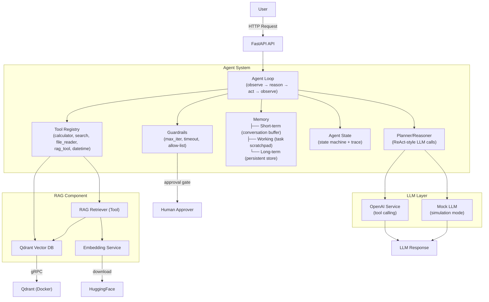

# Enhancement Plan — From RAG Pipeline to Agentic AI Learning Lab

> This plan transforms the existing RAG pipeline (an LLM workflow) into a complete
> **Agentic AI learning laboratory** with a working agent loop, tools, memory, planning,
> RAG-as-a-tool, multi-agent patterns, security, evaluation, observability, experiments,
> and interview preparation.

---

## Enhancement Priorities

| Enhancement | Why | Learning Objective | Impact | Priority |
|-------------|-----|--------------------|--------|----------|
| Agent loop (ReAct) | The core of what makes a system "agentic" — iterative observe→reason→act→loop | Understand how agents differ from fixed LLM apps | Foundation for everything | **High** |
| Explicit tool calling | Agents need tools to act on the world; LLM must choose tools, not app code | Learn tool schema, tool selection, argument generation, result handling | Enables all agentic behavior | **High** |
| Tool registry | Centralized, discoverable tool management with permission boundaries | Learn tool lifecycle, validation, sandboxing | Makes tools safe + composable | **High** |
| Core tools (calculator, datetime, file reader, web search mock) | Concrete tools the agent can call; safe for local experimentation | Understand tool implementation, result formatting, error handling | Makes the agent loop tangible | **High** |
| Mock LLM with tool-calling simulation | Enables testing the agent loop without API keys or network | Understand LLM-as-a-decision-maker; isolate agent logic from LLM quality | Makes learning/demo runnable offline | **High** |
| OpenAI tool-calling LLM service | Real LLM with native function calling; production path | Learn the OpenAI tool-calling protocol, JSON schema, delta parsing | Connects to real models | **High** |
| Planning / ReAct reasoning | Shows how agents plan and reason between tool calls | Learn chain-of-thought, ReAct pattern, scratchpad | Makes planning observable | **High** |
| Short-term memory (conversation buffer) | Agents need context across turns | Learn context window management, message history | Enables multi-turn agents | **High** |
| Working memory | Temporary state during task execution | Learn scratchpad, intermediate results | Core to task execution | **High** |
| Long-term memory (persistent) | Recall across conversations/sessions | Learn persistence, memory retrieval, staleness | Enables personalization | **Medium** |
| Agent state machine | Track agent lifecycle explicitly | Learn state transitions, termination conditions | Makes agent lifecycle visible | **High** |
| RAG as a tool | Agent decides whether/when to retrieve | Learn RAG vs. agent memory; retrieval-as-tool | Connects existing RAG to agents | **Medium** |
| Multi-agent (supervisor pattern) | Collaboration between specialized agents | Learn agent delegation, communication, orchestration | Scales complexity | **Medium** |
| Human-in-the-loop (approval) | Safe agent with human oversight | Learn approval gates, pausing, escalation | Safety + control | **Medium** |
| Guardrails & security | Prevent prompt injection, tool abuse, data leakage | Learn permission boundaries, input/output validation | Critical for safety | **High** |
| Evaluation harness | Measure agent success, tool accuracy, cost | Learn agent evaluation vs. LLM eval | Validates correctness | **Medium** |
| Observability / traces | Debug agent decisions, latency, token usage | Learn execution tracing, debugging | Essential for debugging | **Medium** |
| Experiments (10 hands-on) | Concrete learning through doing | Apply concepts in controlled scenarios | Deepens understanding | **High** |
| Interview preparation | 10 topics × beginner/intermediate/advanced | Prepare for technical interviews | Career readiness | **High** |
| System design material | 3 design exercises | Architectural thinking for production agents | Design skills | **Medium** |
| Comprehensive docs (16 phases) | Theory + implementation + examples | End-to-end knowledge | Learning foundation | **High** |
| Tests (unit + integration) | Validate agent behavior, tools, memory | Testing strategies for agents | Correctness | **Medium** |
| Code quality | Type hints, clean separation, error handling | Professional standards | Maintainability | **High** |

---

## Missing Agentic AI Concepts

| Concept | Current Gap | Planned Implementation |
|---------|-------------|----------------------|
| Agent loop | None — fixed RAG workflow | Explicit `while` loop with max iterations, observe/reason/act states |
| Tool calling | None — hardcoded workflow | OpenAI function-calling format + mock simulator |
| Tool registry | None — services are singletons | `ToolRegistry` with registration, lookup, permission checks |
| Planning | None | ReAct-style reasoning tokens + plan display |
| Memory | None — stateless | ConversationBuffer (short-term), dict-based working memory, JSON/SQLite long-term |
| State machine | None | `AgentState` enum (IDLE → THINKING → PLANNING → TOOL_CALL → OBSERVING → COMPLETED) |
| Multi-agent | None | Supervisor + worker agents, delegation pattern |
| Human-in-the-loop | None | Approval gate before tool execution |
| Guardrails | None | Max iterations, timeouts, allow-lists, input/output validation |
| Evaluation | None | Test harness with success metrics |
| Observability | None | Execution trace with timestamps, LLM calls, tool calls, tokens |
| Reflection | None | Self-critique step that re-examines output |

---

## Implementation Architecture (Target)

---

## Implementation Order (by phase)

### Phase 1: Foundation (High Priority)

1. Project scaffold: `pyproject.toml`, `Dockerfile`, `docker-compose.yml`, `mkdocs.yml`
2. Core config: LLM settings, agent settings, tool settings, memory settings
3. Pydantic schemas: agent state, tool definitions, conversation messages
4. LLM service: OpenAI tool-calling support + Mock LLM simulator

### Phase 2: Core Agent (High Priority)

5. Tool base class + ToolResult + ToolCall schema
6. ToolRegistry with registration + permission checks
7. Core tools: Calculator, DateTime, FileReader, Search (mock)
8. Agent base: AgentState enum, AgentConfig, AgentLoop
9. ReAct agent: explicit loop with reasoning

### Phase 3: Memory & State (High Priority)

10. Short-term memory (conversation buffer with truncation)
11. Working memory (task-scoped scratchpad)
12. Long-term memory (persistent JSON store)
13. Agent state machine with trace/logging

### Phase 4: RAG Integration (Medium Priority)

14. RAG as a tool (reusing existing embedding + vector DB patterns)
15. Agent decides when to retrieve

### Phase 5: Advanced Patterns (Medium Priority)

16. Multi-agent supervisor pattern
17. Human-in-the-loop approval
18. Reflection/self-critique

### Phase 6: Safety & Quality (High/Medium Priority)

19. Guardrails (max iterations, timeouts, allow-lists)
20. Evaluation harness
21. Observability (traces, metrics)

### Phase 7: Validation (Medium Priority)

22. Unit tests (tools, memory, agent loop with mock LLM)
23. Integration tests (API endpoints)

### Phase 8: Documentation (High Priority)

24. All documentation phases (3–19)
25. Experiments (Phase 17)
26. Interview preparation (Phase 18–19)

---

## What We Will NOT Do

- **No heavy frameworks** (LangChain, LangGraph, LlamaIndex) — the agent loop is
  implemented explicitly so learners can see every step. Frameworks hide too much.
- **No hidden chain-of-thought** — planning/reasoning is observable and documented.
- **No production-scale infrastructure** — this is a learning POC. Docker Compose
  with a single API + Qdrant is sufficient.
- **No vendor lock-in** — the LLM service supports OpenAI-compatible endpoints and
  a mock mode for offline use.
