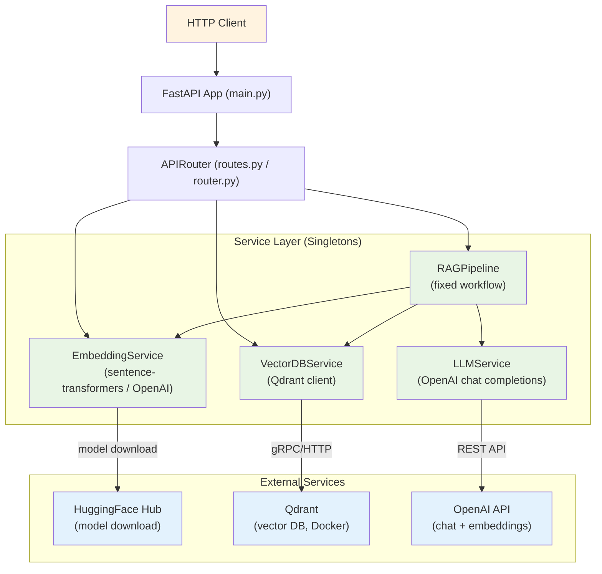
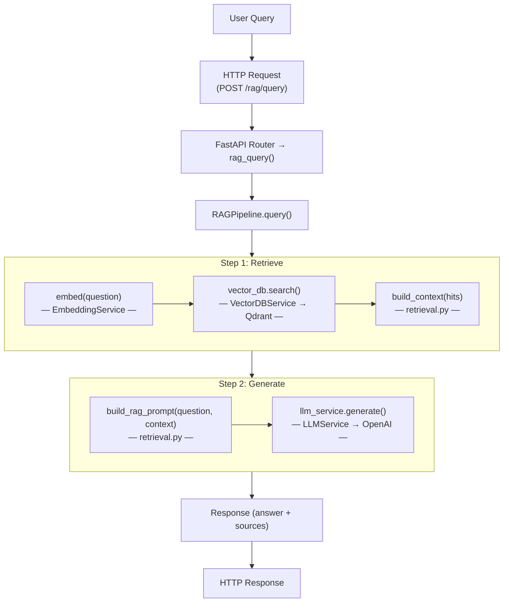
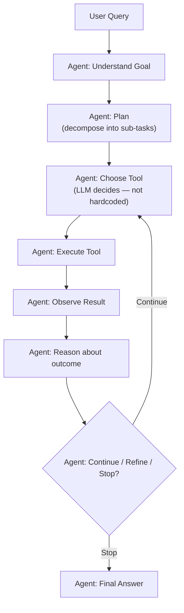
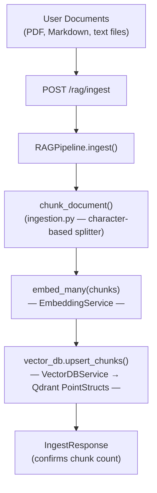
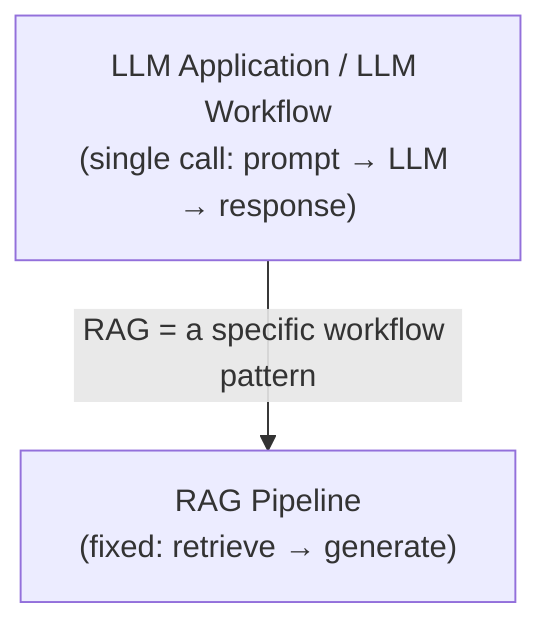

# Project Analysis — Existing State

> This document records the state of the **existing GenAI POC projects** before any
> agentic enhancements are made. The goal is to understand exactly what exists, how
> it works, and what is missing — so that the transformation into an Agentic AI
> learning laboratory is grounded in reality, not assumptions.

The existing code lives in two sibling projects under the `python-helper` monorepo:

- **`gen-ai-poc/`** — the more ambitious project (LLM service + embeddings + RAG pipeline)
- **`vector-db-poc/`** — the complete, working project (FastAPI + Qdrant + embeddings)

Both are **LLM applications / RAG pipelines**, not agents.

---

## 1. Current Project Overview

### What problem does the POC currently solve?

The existing projects demonstrate **semantic search and retrieval-augmented generation
(RAG)** using vector embeddings:

- **`vector-db-poc`**: Converts text into dense embedding vectors using
  `sentence-transformers` (`all-MiniLM-L6-v2`, 384 dimensions), stores them in the
  **Qdrant** vector database, and performs **similarity (k-NN) search** by meaning
  rather than keyword. Exposes this as a REST API via FastAPI.

- **`gen-ai-poc`**: Extends the above with an **LLM service** (OpenAI-compatible chat
  completions, with streaming), an **embedding service** (dual backend: local
  sentence-transformers + OpenAI), and a **RAG pipeline** that ingests documents,
  retrieves context, and generates grounded answers.

### What functionality already exists?

| Area | vector-db-poc | gen-ai-poc |
|------|--------------|------------|
| FastAPI web app | Complete (`main.py`, `routes.py`) | Incomplete — no `main.py` |
| Config (Pydantic Settings) | `qdrant_host`, `collection`, `embedding_model` | Richer — LLM params, embedding provider, RAG chunk settings |
| Embedding service | Single backend: sentence-transformers | Dual backend: local + OpenAI; similarity metrics |
| LLM service | None | OpenAI chat completions (streaming + non-streaming) |
| Vector DB service | Qdrant: create, upsert, search, delete | Qdrant: async create, upsert, search |
| RAG pipeline | None | Chunking, ingestion, retrieval, pipeline orchestration |
| API routes | 6 endpoints (health, embed, documents, search, delete) | 3 routers (llm, embeddings, rag) — 10 endpoints |
| Tests | 3 integration tests (health, embed, root) | Empty (no tests) |
| Docker | API + Qdrant + Docs (3 services) | None |
| Documentation | MkDocs (material theme, mkdocstrings) | Empty docs dirs |
| README | Complete | None |

### What AI/LLM capabilities are currently implemented?

- **Text embedding generation** (sentence-transformers, locally or via OpenAI API)
- **Cosine / Euclidean / Dot-product similarity computation**
- **Vector storage and k-NN search** in Qdrant (with UUID5 deterministic ID mapping)
- **Chat completion generation** (OpenAI-compatible, with streaming)
- **Retrieval-Augmented Generation (RAG)**: chunk → embed → store → retrieve → generate
- **Prompt building** for RAG (system prompt + context + question)

### Classification: LLM Application / LLM Workflow (NOT an agent)

**This is best classified as an LLM Workflow (specifically, a RAG pipeline).**

It is **not** an AI agent. Here is why:

- **No agent loop**: The RAG pipeline runs a fixed sequence (retrieve → generate) and
  terminates. There is no iterative loop where the system observes results and decides
  whether to continue, call another tool, or refine its approach.
- **No tool calling**: The LLM does not dynamically choose which tools to invoke. The
  "tools" (embedding, retrieval, generation) are orchestrated by application code, not
  by LLM decisions.
- **No planning**: There is no reasoning or planning step where the LLM decides on a
  sequence of actions. The workflow is hardcoded.
- **No memory**: Each request is stateless. There is no conversation history or
  persistent memory carried across turns.
- **No autonomous iteration**: The system cannot loop, self-correct, or retry. A single
  retrieval pass feeds directly into a single generation call.

The `gen-ai-poc` RAG pipeline is a **deterministic workflow**: `retrieve(k=5) → format_prompt → generate()`.
The LLM always receives the same prompt structure and always produces one final answer.
There is no feedback loop.

### What components are involved?

```mermaid
flowchart LR
    C["Client\n(HTTP)") --> FA["FastAPI App\n(main.py)"]
    FA --> AR["API Router\n(routes.py)"]
    AR --> SL["Service Layer\n(Singletons)"]
    SL -->|"embed query"| Emb["EmbeddingService\n(sentence-transformers/OpenAI)"]
    SL -->|"generate"| LLM["LLMService\n(OpenAI chat completions)"]
    SL -->|"search vectors"| VDB["VectorDBService\n(Qdrant client)"]
    SL -->|"RAG workflow"| RAG["RAGPipeline\n(ingest → retrieve → generate)"]
    VDB -->|"gRPC/HTTP"| Qdrant["Qdrant\n(vector DB, Docker)"]
    LLM -->|"REST API"| OpenAI["OpenAI API\n(chat + embeddings)"]
    RAG -->|/rag/ingest → upsert/| VDB
    RAG -->|embed → search → generate| VDB
    RAG -->|generate| LLM
```

- **FastAPI app** (`main.py` in vector-db-poc; missing in gen-ai-poc)
- **API router** (`routes.py` / `router.py`) — HTTP endpoints
- **Pydantic schemas** (`models/schemas.py`) — request/response contracts
- **Config** (`config.py` / `core/config.py`) — environment-based settings
- **Embedding service** — text → vector (sentence-transformers or OpenAI)
- **LLM service** — chat completion via OpenAI-compatible API
- **Vector DB service** — Qdrant client wrapper (store/search/delete)
- **RAG pipeline** — orchestrates ingestion, retrieval, and generation

### How the components communicate

1. **Client** sends an HTTP request (e.g., `POST /rag/query`).
2. **FastAPI** routes to the appropriate handler in the API router.
3. The router uses **FastAPI's `Depends()`** to lazily instantiate singleton service
   instances (`EmbeddingService`, `LLMService`, `VectorDBService`).
4. The **RAG pipeline** coordinates: it embeds the query → searches the vector DB →
   builds a prompt → calls the LLM → returns the response.
5. **Qdrant** (separate Docker container) stores and searches vectors over gRPC/HTTP.
6. **HuggingFace Hub** is contacted once to download the embedding model (cached locally).

---

## 2. Current Architecture



**Key observation**: The RAG pipeline is a **fixed, linear workflow**. The LLM is invoked
exactly once per query (after retrieval). There is no loop, no tool selection by the LLM,
and no iterative reasoning.

---

## 3. Current Execution Flow

### RAG Query Flow (the most "agentic-looking" path)



### What steps are MISSING from an agentic flow?

The current flow jumps directly from **retrieve** to **generate** in a single pass.
An agentic flow would add:



None of the **loop, planning, tool selection, or iterative reasoning** steps exist today.

### Ingestion Flow (document → vector store)



---

## 4. Existing Features

| Capability          | Exists | Implementation | Documentation | Tests | Improvement Needed |
| ------------------- | ------ | -------------- | ------------- | ----- | ------------------ |
| LLM integration     | Yes    | gen-ai: `LLMService` (OpenAI chat completions, streaming + non-streaming) | gen-ai: none; vector-db: none (no LLM) | No | Add tool-calling support, multiple providers, mock for testing |
| Prompt management   | Partial| gen-ai: `build_rag_prompt()` + inline system prompts in retrieval.py | No | No | Structured prompt templates, system prompt management |
| Tool calling        | No     | — | — | — | Implement tool registry, tool-calling in LLM service, agent loop |
| Agent loop          | No     | — | — | — | Implement ReAct loop with iterate/observe/reason/act |
| Planning            | No     | — | — | — | Implement ReAct-style reasoning, task decomposition |
| Memory             | No     | — | — | — | Implement conversation buffer, working memory, persistent memory |
| RAG                 | Yes    | gen-ai: `RAGPipeline` (ingest → retrieve → generate) | vector-db: docs/ | No | Integrate RAG as a tool within the agent, not a standalone workflow |
| Multi-agent         | No     | — | — | — | Implement supervisor pattern, agent delegation, collaboration |
| Evaluation          | No     | — | — | — | Implement evaluation harness, task success metrics |
| Observability       | No     | — | — | — | Implement execution traces, tool call logging, token usage tracking |
| Embeddings          | Yes    | gen-ai: `EmbeddingService` (dual backend); vector-db: `EmbeddingService` | vector-db: docs/concepts.md, docs/vector-databases.md | vector-db: test_embed | Unify, add to agent as a tool |
| Vector DB           | Yes    | Qdrant (both projects) | vector-db: docs/architecture/* | vector-db: 3 tests | Integrate as tool, persistent memory store |
| Tests               | Partial| vector-db: 3 integration tests | — | vector-db: yes | Add unit tests for all components, especially agent logic |
| Docker              | Yes    | vector-db: API + Qdrant + Docs | vector-db: docs/development.md | No | Extend with agent-specific services |
| Streaming           | Yes    | gen-ai: `generate_stream()` (SSE) | No | No | Integrate into agent responses |

---

## 5. Classification: What the Project Really Is

The existing project sits at this level:



### What makes a system "agentic"?

An **agent** is distinguished from an LLM application or workflow by these characteristics:

1. **Autonomous loop**: The system can iterate — observe, reason, act, and decide
   whether to continue or stop, without a pre-defined end point.
2. **LLM-directed tool selection**: The LLM dynamically chooses which tools to call
   (not application code calling a fixed sequence of functions).
3. **LLM-directed tool arguments**: The LLM generates the arguments for each tool call
   based on its reasoning.
4. **Observation feedback**: Tool results are fed back to the LLM, which then reasons
   about them and decides the next action.
5. **Dynamic planning**: The LLM can adapt its plan based on intermediate results.
6. **Memory**: The agent maintains state across turns (conversation history, task state).

The existing RAG pipeline has **none** of these. It is a deterministic function:
`query → retrieve(k=5) → prompt → generate → response`. The LLM never decides what to do
next — the application code always does the same thing.

### Strengths of the existing project

- Clean separation of concerns (config, models, services, API)
- Pydantic schemas with validation
- Lazy-loaded singletons (efficient model loading)
- Dockerized with a docs service
- Good educational documentation in vector-db-poc
- Qdrant integration with UUID5 deterministic ID mapping

### Weaknesses and gaps

- **gen-ai-poc is incomplete/broken**: missing `main.py`, missing `generation.py`
  (imported by `pipeline.py` and `rag.py`), broken singleton imports, empty tests
- **No tests in gen-ai-poc**: tests/ is empty
- **No agent loop**: the defining gap — no iterative reasoning
- **No tool calling**: LLM cannot select or invoke tools
- **No memory**: stateless per-request
- **No planning or reasoning**: fixed linear workflow
- **No evaluation framework**: no way to measure agent performance
- **No observability**: no traces or execution logs
- **No security/guardrails**: no tool permission boundaries, no input validation
- **No human-in-the-loop**: no approval mechanisms
- **No multi-agent**: single pipeline, no collaboration

---

## 6. Summary

The existing project is a **RAG pipeline (LLM workflow)** that demonstrates semantic
search and retrieval-augmented generation. It has a solid foundation — FastAPI,
Pydantic, Qdrant, embeddings, RAG — but it is **not an agent**. It lacks the core
agentic capabilities: an agent loop, tool calling, planning, memory, evaluation,
observability, and security boundaries.

The `agentic-ai-poc` will transform this foundation into a comprehensive learning
laboratory by adding each of these capabilities explicitly, with clear
documentation, experiments, and interview preparation materials.
