# GenAI Learning Lab

A hands-on **proof-of-concept** for learning Generative AI concepts with Python and FastAPI.

## What is this?

This project is a **learning laboratory** for understanding how modern GenAI
applications work. It implements a complete **RAG (Retrieval-Augmented Generation)**
pipeline that demonstrates:

- LLM basics — chat messages, parameters, streaming
- Embeddings — text-to-vector conversion, similarity metrics
- Vector databases — Qdrant for semantic search
- RAG — retrieval + generation pipeline

Every line of code is written for **clarity, not performance**. The goal is
for you to understand the complete flow from documents to answers.

## Quick Start

### With Docker (Recommended)

```bash
# Copy environment config and start
cp .env.example .env
docker compose up

# Access:
#   API:           http://localhost:8000
#   API docs:      http://localhost:8000 (Swagger) or /redoc (ReDoc)
#   Streamlit UI:  http://localhost:8501
#   Qdrant UI:     http://localhost:6333
#   Documentation: http://localhost:8001
```

### Local Development

```bash
# Install Poetry (if not already installed)
pip install poetry

# Install dependencies
poetry install

# Set up environment (see "Free / Local LLM Options" above for no-key setup)
cp .env.example .env

# Run the server (dev mode with auto-reload)
poetry run uvicorn app.main:app --reload

# Run tests
poetry run pytest
```

### Free / Local LLM Options

No OpenAI API key? No problem. The app supports any OpenAI-compatible API.
Configure `LLM_BASE_URL` and `LLM_API_KEY` in `.env`:

| Option | How to use |
|--------|-----------|
| **Ollama** | Install from [ollama.ai](https://ollama.ai), run `ollama run llama3`, set `LLM_BASE_URL=http://host.docker.internal:11434/v1` (or `http://localhost:11434/v1` for local), set `LLM_API_KEY=ollama` |
| **LM Studio** | Install from [lmstudio.ai](https://lmstudio.ai), enable Server mode, set `LLM_BASE_URL=http://host.docker.internal:1234/v1`, set `LLM_API_KEY=lmstudio` |
| **Hugging Face** | Use a free HF Inference API endpoint as `LLM_BASE_URL` |

Without an LLM API key, non-LLM endpoints still work: health check,
embeddings (local sentence-transformers), RAG ingest/search/demo.

## Streamlit UI

A minimal web frontend is included (`streamlit_app.py`) that talks to the
FastAPI backend via REST. It provides a chat interface, embedding tools,
RAG ingest/search/query, and a no-key demo tab.

### With Docker

```bash
# Starts the Streamlit UI (automatically talks to the FastAPI app service)
docker compose up streamlit
# Open http://localhost:8501
```

### Locally

```bash
poetry install
poetry run streamlit run streamlit_app.py
# Open http://localhost:8501
# Set API URL in the sidebar if the backend is on a different host/port
```

## Architecture

```mermaid
flowchart TD
    UQ[User Question] --> QE[Query Embedding<br/>sentence-transformers<br/>384-dimensional vector]
    QE --> VS[Vector Search<br/>Qdrant HNSW Index<br/>Cosine similarity]
    VS --> VC[Vector DB Storage<br/>(Qdrant collection: genai-documents)]
    VC --> HITS[Retrieved Context<br/>Top-K chunks + metadata<br/>+ similarity scores]
    HITS --> PC[Prompt Construction<br/>System message + Context + Question]
    PC --> LLM_CALL[LLM API Call<br/>OpenAI Chat Completions<br/>temperature, max_tokens]
    LLM_CALL --> ANSWER[Generated Answer<br/>+ cited sources<br/>+ context string]

    style UQ fill:#3498db,color:#fff
    style QE fill:#9b59b6,color:#fff
    style VS fill:#e74c3c,color:#fff
    style VC fill:#e74c3c,color:#fff
    style HITS fill:#f39c12,color:#fff
    style PC fill:#8e44ad,color:#fff
    style LLM_CALL fill:#27ae60,color:#fff
    style ANSWER fill:#27ae60,color:#fff
```

See the [Architecture Documentation](docs/architecture/high-level.md) for details.

## API Endpoints

| Method | Endpoint | Description |
|--------|----------|-------------|
| `POST` | `/api/v1/llm/generate` | Generate LLM chat completion |
| `POST` | `/api/v1/llm/generate-stream` | Stream LLM response |
| `POST` | `/api/v1/embeddings/generate` | Generate text embedding |
| `POST` | `/api/v1/embeddings/similarity` | Compute text similarity |
| `POST` | `/api/v1/rag/ingest` | Ingest documents into vector DB |
| `POST` | `/api/v1/rag/search` | Search documents (no LLM) |
| `POST` | `/api/v1/rag/query` | Full RAG: retrieve + generate |
| `GET` | `/api/v1/rag/demo` | RAG demo (shows prompt, no LLM call) |
| `GET` | `/health` | Health check |

## Usage Examples

### 1. Generate an LLM Response

```bash
curl -X POST http://localhost:8000/api/v1/llm/generate \
  -H "Content-Type: application/json" \
  -d '{
    "messages": [
      {"role": "system", "content": "You are a helpful assistant."},
      {"role": "user", "content": "Explain quantum computing."}
    ],
    "temperature": 0.7,
    "max_tokens": 256
  }'
```

### 2. Generate Embeddings

```bash
curl -X POST http://localhost:8000/api/v1/embeddings/generate \
  -H "Content-Type: application/json" \
  -d '{"text": "Machine learning is fascinating"}'
```

### 3. Compute Similarity

```bash
curl -X POST http://localhost:8000/api/v1/embeddings/similarity \
  -H "Content-Type: application/json" \
  -d '{
    "text_a": "The cat sat on the mat",
    "text_b": "A feline rested on a rug"
  }'
```

### 4. Ingest Documents

```bash
curl -X POST http://localhost:8000/api/v1/rag/ingest \
  -H "Content-Type: application/json" \
  -d '{
    "documents": [
      {
        "content": "RAG combines retrieval and generation to produce grounded answers.",
        "metadata": {"topic": "GenAI"}
      }
    ]
  }'
```

### 5. Ask a RAG Question

```bash
curl -X POST http://localhost:8000/api/v1/rag/query \
  -H "Content-Type: application/json" \
  -d '{"question": "What is RAG?"}'
```

## Project Structure

```mermaid
graph TD
    Root["genai-poc/"]

    subgraph "app/ — Application Code"
        AppMain["main.py — FastAPI app entrypoint"]
        AppAPI["api/v1/ — REST API endpoints (llm, embeddings, rag)"]
        AppCore["core/ — Configuration management"]
        AppEmb["embeddings/ — Text-to-vector conversion service"]
        AppLLM["llm/ — LLM API wrapper service"]
        AppModels["models/ — Pydantic schemas (DTOs)"]
        AppRAG["rag/ — RAG pipeline (ingest → retrieve → generate)"]
        AppServices["services/ — Vector DB service (Qdrant)"]
    end

    subgraph "docs/ — MkDocs Learning Documentation"
        DocsGenAI["genai/ — GenAI fundamentals"]
        DocsPrompt["prompting/ — Prompt engineering"]
        DocsLLM["llm/ — LLM APIs"]
        DocsEmb["embeddings/ — Embeddings theory & examples"]
        DocsVDB["vector-databases/ — Vector DB theory & comparison"]
        DocsRAG["rag/ — RAG theory & implementation"]
        DocsAdv["advanced/ — Agents, security, evaluation, etc."]
        DocsArch["architecture/ — System architecture & diagrams"]
    end

    Tests["tests/ — Test suite"]

    Root --> AppMain
    Root --> DocsGenAI
    Root --> Tests

    AppMain --> AppAPI
    AppMain --> AppCore
    AppMain --> AppEmb
    AppMain --> AppLLM
    AppMain --> AppModels
    AppMain --> AppRAG
    AppMain --> AppServices

    DocsGenAI --> DocsPrompt
    DocsGenAI --> DocsLLM
    DocsGenAI --> DocsEmb
    DocsGenAI --> DocsVDB
    DocsGenAI --> DocsRAG
    DocsGenAI --> DocsAdv
    DocsGenAI --> DocsArch

    style Root fill:#27ae60,color:#fff
    style AppMain fill:#3498db,color:#fff
    style DocsGenAI fill:#9b59b6,color:#fff
    style Tests fill:#f39c12,color:#fff
```



## Documentation

The full learning guide is available at [http://localhost:8001](http://localhost:8001)
when running with Docker Compose.

Key topics:
- [GenAI Fundamentals](docs/genai/fundamentals.md)
- [Prompt Engineering](docs/prompting/what-is-a-prompt.md)
- [LLM APIs](docs/llm/apis.md)
- [Embeddings](docs/embeddings/what-are-embeddings.md)
- [Vector Databases](docs/vector-databases/what-is-vdb.md)
- [RAG](docs/rag/what-is-rag.md)
- [Advanced Topics](docs/advanced/security.md)
- [Architecture](docs/architecture/high-level.md)

## Testing

```bash
# Run all tests
poetry run pytest

# Run a specific test
poetry run pytest tests/test_embeddings.py -v

# Run with coverage
poetry run pytest --cov=app tests/
```

## Configuration

All settings are configurable via environment variables (`.env`):

| Variable | Default | Description |
|----------|---------|-------------|
| `LLM_PROVIDER` | `openai` | LLM provider |
| `LLM_API_KEY` | (empty) | API key for LLM |
| `LLM_MODEL` | `gpt-3.5-turbo` | LLM model |
| `LLM_TEMPERATURE` | `0.7` | Default temperature |
| `EMBEDDING_PROVIDER` | `sentence-transformers` | Local or cloud |
| `EMBEDDING_MODEL` | `all-MiniLM-L6-v2` | Embedding model |
| `QDRANT_HOST` | `http://localhost:6333` | Qdrant URL |
| `RAG_CHUNK_SIZE` | `500` | Characters per chunk |
| `RAG_CHUNK_OVERLAP` | `100` | Overlap between chunks |
| `RAG_TOP_K` | `5` | Documents to retrieve |

## License

This is a learning project. Use it to understand GenAI concepts and build your own applications.

Co-authored-by: CommandCodeBot <noreply@commandcode.ai>
