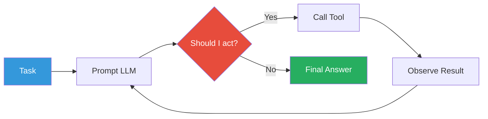
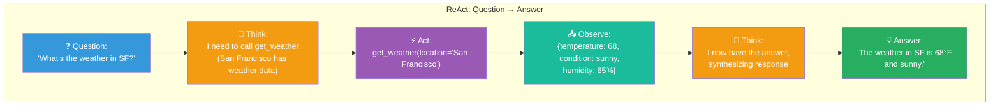
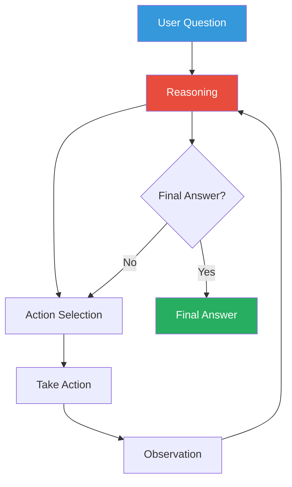
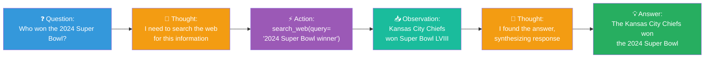

# Agents

## What is an AI Agent?

An **AI agent** is an LLM that can:
1. **Perceive** its environment (via tools, sensors, APIs)
2. **Reason** about what actions to take
3. **Act** (call tools, modify state)
4. **Observe** the results of its actions
5. **Repeat** until the task is complete

Unlike a simple chatbot that just responds, an agent can **act** in the world.

## Agent Loop



## Simple Agent Example

```python
import asyncio
import json

async def agent_loop(task: str, tools: dict):
    messages = [
        {"role": "system", "content": "You are a helpful agent with tools."},
        {"role": "user", "content": task},
    ]

    while True:
        response = await client.chat.completions.create(
            model="gpt-4o",
            messages=messages,
            tools=tools,
        )

        message = response.choices[0].message

        if message.tool_calls:
            # Execute the tool
            for call in message.tool_calls:
                func = tools[call.function.name]
                args = json.loads(call.function.arguments)
                result = await func(**args)

                # Append tool result
                messages.append(message)
                messages.append({
                    "role": "tool",
                    "content": json.dumps(result),
                    "tool_call_id": call.id,
                })
        else:
            # No more tools — final answer
            return message.content
```

## Agent Components

### 1. Planning

Before acting, a good agent **plans**:

```python
plan_prompt = f"""
Break down this task into steps:
Task: "{task}"

Steps:
"""
```

The LLM outputs a sequence like:
1. Search the web for current events
2. Summarize the top 3 results
3. Format as a newsletter

### 2. Memory

Agents maintain **context** across tool calls:

```python
# Short-term memory: recent messages
messages = [{"role": "system", "content": system_prompt}]

# Long-term memory: vector DB for past conversations
long_term = vector_db.search(user_id, "previous preferences")
```

### 3. Tool Use

```python
tools = [
    {"type": "function", "function": {
        "name": "search_web",
        "description": "Search the web for information",
        "parameters": {"type": "object", "properties": {
            "query": {"type": "string"}
        }}
    }},
    {"type": "function", "function": {
        "name": "read_file",
        "description": "Read a file from disk",
        "parameters": {"type": "object", "properties": {
            "path": {"type": "string"}
        }}
    }},
]
```

## Types of Agents

### React Agents

Alternates between **reasoning** and **acting**:



### Planning Agents

First **plans** the entire sequence, then executes:

```mermaid
flowchart TB
    subgraph "Planning Agent: Full Plan First"
        Q2["📋 Task:<br/>'Write a report on climate change'"]
        P1["📝 Plan Step 1:<br/>Research climate change causes"]
        P2["📝 Plan Step 2:<br/>Research climate change effects"]
        P3["📝 Plan Step 3:<br/>Research climate change solutions"]
        P4["📝 Plan Step 4:<br/>Synthesize into a coherent report"]
        EXEC["⚡ Execute Each Step<br/>(retrieve → think → act → observe)"]
        DONE["✅ Final Report<br/>Completed with all sections<br/>and source citations"]
        Q2 --> P1 --> P2 --> P3 --> P4
        P4 --> EXEC --> DONE
    end

    style Q2 fill:#3498db,color:#fff
    style P1 fill:#9b59b6,color:#fff
    style P2 fill:#9b59b6,color:#fff
    style P3 fill:#9b59b6,color:#fff
    style P4 fill:#9b59b6,color:#fff
    style EXEC fill:#f39c12,color:#fff
    style DONE fill:#27ae60,color:#fff
```



### Tool-Using Agents

Specialized for specific domains:

| Type | Tools | Use Case |
|------|-------|----------|
| **Research agent** | Web search, summarizer | Research topics |
| **Coding agent** | Code executor, file I/O | Write and test code |
| **Data analysis agent** | DB query, CSV tool | Analyze datasets |
| **Customer service agent** | KB lookup, email tool | Answer support tickets |

## Framework: ReAct



### ReAct Example



## In Our POC

Our POC is **not** an agent — it's a **retrieval pipeline**. The RAG flow
is:

```mermaid
flowchart LR
    Q["Question<br/>(user input)"] --> E["Embed<br/>(sentence-transformers)"]
    E --> S["Search<br/>(vector database)"]
    E --> DB["Vector DB<br/>(Qdrant)"]
    S --> DB
    DB --> RET["Retrieve context<br/>(top-K chunks with scores)"]
    RET --> P["Prompt LLM<br/>system + context + question"]
    P --> LLM["LLM Call<br/>(OpenAI API)"]
    LLM --> A["Answer<br/>(grounded in retrieved context)"]

    style Q fill:#3498db,color:#fff
    style E fill:#9b59b6,color:#fff
    style S fill:#e74c3c,color:#fff
    style DB fill:#e74c3c,color:#fff
    style RET fill:#f39c12,color:#fff
    style P fill:#8e44ad,color:#fff
    style LLM fill:#27ae60,color:#fff
    style A fill:#27ae60,color:#fff
```



An agent would add:
- Planning (decide what to retrieve)
- Iterative retrieval (refine query if results are poor)
- Multiple tools (search web + query DB)
- Self-critique (verify the answer)

## Agent Patterns

### 1. Toolformer Pattern

LLM learns to call tools during training (Google's approach).

### 2. ReAct Pattern

LLM reasons about actions at inference time (no special training needed).

### 3. Plan-and-Execute Pattern

LLM plans first, then executes each step.

### 4. AutoGPT-style

LLM has a goal and autonomously works toward it, using tools iteratively.

## Challenges with Agents

| Challenge | Description |
|-----------|-------------|
| **Infinite loops** | Agent keeps calling tools without converging |
| **Wrong tools** | Agent calls the wrong tool or uses it incorrectly |
| **Hallucinated observations** | Agent "hallucinates" tool results |
| **Prompt length** | Conversation history grows with each step |
| **Uncertainty** | Agent doesn't know when it's done |
| **Debugging** | Hard to trace multi-step decisions |

## Next Steps

- [Function Calling](function-calling.md) — The mechanism agents use to act
- [Memory](memory.md) — How agents maintain context over time
- [Evaluation](evaluation.md) — Measuring agent performance
