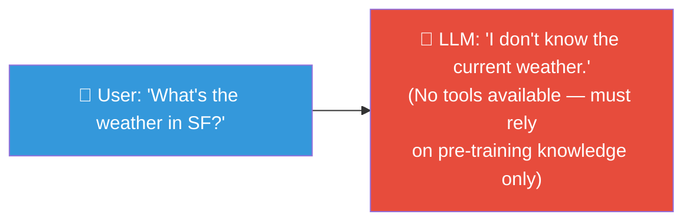
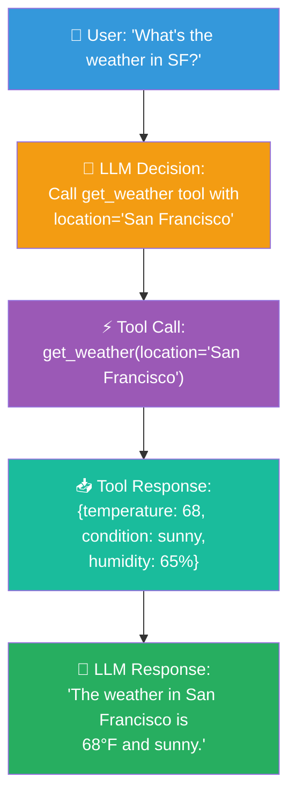

# Function Calling (Tool Calling)

## What is Function Calling?

**Function calling** lets an LLM decide to invoke **tools** (functions) during
a conversation, rather than generating a free-text response.

Instead of:



The LLM can call a weather API:



## How It Works

### 1. Define the Function Schema

```python
tools = [
    {
        "type": "function",
        "function": {
            "name": "get_weather",
            "description": "Get the current weather for a location",
            "parameters": {
                "type": "object",
                "properties": {
                    "location": {
                        "type": "string",
                        "description": "City name, e.g., San Francisco"
                    }
                },
                "required": ["location"]
            }
        }
    }
]
```

### 2. Send the Request

```python
response = await client.chat.completions.create(
    model="gpt-4o",
    messages=messages,
    tools=tools,
)
```

### 3. Handle the Response

```python
if response.choices[0].finish_reason == "tool_calls":
    # The LLM wants to call a tool
    for tool_call in response.choices[0].message.tool_calls:
        if tool_call.function.name == "get_weather":
            args = json.loads(tool_call.function.arguments)
            result = get_weather(args["location"])
            
            # Send the tool result back to the LLM
            messages.append(response.choices[0].message)
            messages.append({
                "role": "tool",
                "content": json.dumps(result),
                "tool_call_id": tool_call.id,
            })
            
            # Get the final response
            final = await client.chat.completions.create(
                model="gpt-4o", messages=messages
            )
```

## Why Function Calling Matters

### 1. Access to External Data

LLMs only know what was in their training data. Function calling lets them
access real-time information.

### 2. Reliable Structured Output

Instead of hoping the LLM formats output correctly, you force it to call a
function with exact parameters.

### 3. Action-Oriented AI

Transform chatbots into agents that can:
- Query databases
- Send emails
- Update records
- Control IoT devices
- Make API calls

## Common Use Cases

| Use Case | Function |
|----------|----------|
| **Weather query** | `get_weather(location)` |
| **Calendar management** | `create_event(title, date)` |
| **Database lookup** | `query_db(table, conditions)` |
| **Code execution** | `run_python(code)` |
| **Web search** | `search_web(query)` |
| **File operations** | `read_file(path)` |
| **Payment processing** | `charge_card(amount, card_id)` |

## In Our POC

Our POC doesn't use function calling directly — the RAG pipeline retrieves
context and passes it to the LLM as part of the prompt. However, the LLM
service is structured to support it:

```python
# app/llm/service.py — the client is ready for tool calls
self._client = AsyncOpenAI(...)
# The OpenAI client supports tools parameter natively
```

## Comparison: Function Calling vs. Prompting

| Aspect | Function Calling | Prompting |
|--------|-----------------|-----------|
| **Reliability** | Guaranteed parameter types | Relies on LLM to format correctly |
| **Parsing** | Structured JSON output | Requires string parsing |
| **Guardrails** | Can validate before execution | Must validate after |
| **Debugging** | Clear function call logs | Harder to trace |
| **Flexibility** | Limited to defined functions | Unlimited |
| **Cost** | One call per function + one for response | Single call |

## Next Steps

- [Agents](agents.md) — Building AI agents with function calling
- [Structured Outputs](structured-outputs.md) — Ensuring output format
- [Advanced RAG](../rag/improving-rag.md) — Using tools in retrieval
