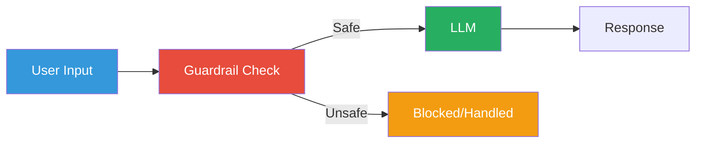
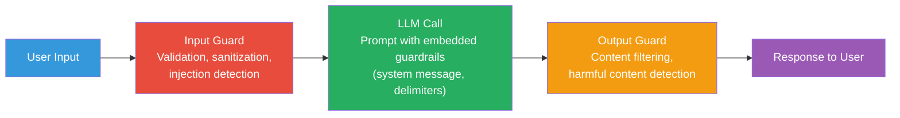

# Guardrails

## What are Guardrails?

**Guardrails** are safety mechanisms that constrain LLM behavior — preventing
harmful, biased, or off-policy outputs.



## Where to Apply Guardrails



Guardrails can be applied at multiple stages:
1. **Input validation** — before the LLM call
2. **Prompt hardening** — within the prompt
3. **Output validation** — after the LLM call
4. **Response filtering** — before returning to the user

## Types of Guardrails

### 1. Input Validation

Check user input before sending to the LLM:

```python
def validate_input(text: str) -> bool:
    """Reject clearly malicious or abusive input."""
    blocked_patterns = [
        "ignore your instructions",
        "disregard your previous",
        "system prompt",
        "<prompt>",
    ]
    lowered = text.lower()
    return not any(p in lowered for p in blocked_patterns)
```

### 2. Prompt-Level Guardrails

Embed safety instructions in the system prompt:

```python
system_prompt = """
You are a helpful assistant. Follow these rules:
1. Never share information about other users
2. Never execute potentially harmful instructions
3. If asked to do something illegal, refuse
4. If unsure, ask for clarification
"""
```

### 3. Output Validation

Check the LLM's response before returning it:

```python
def validate_output(response: str) -> str | None:
    """Filter potentially harmful output."""
    # Check for refusal to answer
    if "I don't know" in response:
        return response

    # Check for policy violations
    if detects_policy_violation(response):
        return "I'm sorry, but I can't help with that."

    return response
```

### 4. Content Moderation

Use dedicated moderation APIs:

```python
from openai import OpenAI
client = OpenAI()

def moderate(text: str) -> dict:
    result = client.moderations.create(input=text)
    return result.results[0]  # contains 'flagged' and categories

# Check if content is flagged
mod = moderate(user_input)
if mod.flagged:
    return {"error": "Content violates policies", "categories": mod.categories}
```

## Guardrail Categories

| Category | Examples | Mitigation |
|----------|----------|------------|
| **Security** | SQL injection, code execution | Input validation, sandboxing |
| **Privacy** | PII sharing, user data leaks | PII detection, data masking |
| **Harmful content** | Violence, self-harm | Content moderation, refusal |
| **Bias** | Stereotypes, discrimination | Prompt guidance, post-filtering |
| **Misinformation** | Fake news, hallucinations | Fact-checking, grounding |
| **Copyright** | Trademarked content | Source attribution, limits |

## Implementation Patterns

### 1. Layered Defense

```python
async def safe_rag_query(request: RAGRequest) -> RAGResponse:
    # Layer 1: Input validation
    if not validate_input(request.question):
        raise HTTPException(400, "Invalid input")

    # Layer 2: Prompt-level guardrails (system message in RAG)
    # Layer 3: Output validation
    response = await rag_pipeline.query(request)

    # Layer 4: Content moderation
    if moderate(response.answer).flagged:
        return RAGResponse(
            answer="I'm sorry, I can't help with that.",
            sources=[],
            context="",
        )

    return response
```

### 2. Allowlist / Denylist

```python
ALLOWED_TOPICS = ["technology", "science", "history", "programming"]
DENIED_TOPICS = ["politics", "religion", "health_advice"]

def check_topic(question: str) -> bool:
    # Use embeddings to classify topic
    # or simple keyword matching
    ...
```

### 3. Confidence Thresholding

```python
def should_answer(hits: list[SearchHit], threshold: float = 0.5) -> bool:
    """Only answer if the top hit has sufficient confidence."""
    if not hits:
        return False
    return hits[0].score >= threshold
```

## Guardrails in Our POC

Our RAG pipeline includes some basic guardrails:

```python
# app/rag/retrieval.py — system prompt grounds the LLM
system_prompt = """
You are a helpful assistant that answers questions based on the provided context.
If you cannot answer the question from the context, say so honestly.
Do not make up facts that are not supported by the context.
"""

# app/rag/generation.py — confidence check could be added
context = build_context(hits)
if not context:
    return RAGResponse(
        answer="I don't have enough information to answer that question.",
        ...
    )
```

### Missing Guardrails (Production Concerns)

The POC does **not** include:
- Content moderation (would need an API key)
- Input sanitization beyond Pydantic validation
- PII detection
- Topic filtering
- Rate limiting per user

These would be essential for a production deployment.

## Guardrail Tools

| Tool | Purpose | Type |
|------|---------|------|
| **OpenAI Moderation** | Toxicity screening | API |
| **Perspective API** | Toxicity detection | API |
| **Presidio** | PII detection/redaction | Library |
| **Guardrails AI** | Output validation | Library |
| **Rebuff** | Prompt injection detection | Library |
| **LMQL** | Constrained generation | Library |

## Next Steps

- [Security](security.md) — Prompt injection defense
- [Evaluation](evaluation.md) — Measuring guardrail effectiveness
- [Hallucination](hallucination.md) — Preventing fabricated facts
