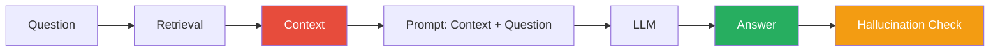
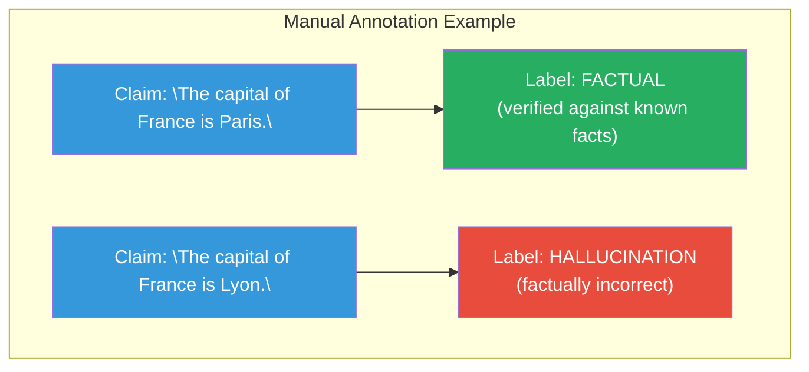

# Hallucination

## What is Hallucination?

**Hallucination** in LLMs occurs when the model generates text that is:
- **Not grounded** in the provided context or training data
- **Factually incorrect** but stated confidently
- **Plausible-sounding** but false

```mermaid
graph TD
    subgraph "Hallucination Example"
        CTX["Context: \"The meeting is scheduled for 3 PM.\""]
        LLM1["LLM Response: \"The meeting is at 2 PM tomorrow.\" ← HALLUCINATION"]
        PROBLEM["Problem: LLM contradicts the provided context<br/>Generates information not supported by the source<br/>States a different time (2 PM vs 3 PM) and date (tomorrow)"]
        CTX --> LLM1
        LLM1 --> PROBLEM
    end

    style CTX fill:#3498db,color:#fff
    style LLM1 fill:#e74c3c,color:#fff
    style PROBLEM fill:#f39c12,color:#fff
```

## Why LLMs Hallucinate

### 1. Training Objective Mismatch

LLMs are trained to **predict the next token** — not to be factual. They learn
to produce plausible-sounding text, even if it's wrong.

### 2. Overgeneralization

```mermaid
graph TD
    subgraph "Overgeneralization Example"
        TD1["Training data:<br/>\"The Eiffel Tower is in Paris\" (true)"]
        TD2["Training data:<br/>\"The Statue of Liberty is in Paris\" (false, but seen)"]
        LEARN["Model learns:<br/>\"Famous landmarks are often in Paris\""]
        HALL["→ Hallucinates:<br/>\"The Colosseum is in Paris\""]
        TD1 --> LEARN
        TD2 --> LEARN
        LEARN --> HALL
    end

    style TD1 fill:#3498db,color:#fff
    style TD2 fill:#e74c3c,color:#fff
    style LEARN fill:#f39c12,color:#fff
    style HALL fill:#e74c3c,color:#fff
```

### 3. Confidence Without Grounding

The model can't distinguish between "I remember this from training" and
"I'm making this up."

### 4. No Access to Source

When an LLM answers from its training data (not external knowledge), it
doesn't know what it knows versus what it guesses.

## Types of Hallucination

| Type | Description | Example |
|------|-------------|---------|
| **Factual** | Wrong facts about the world | "Water boils at 90°C" |
| **Contextual** | Contradicts the provided context | Answer conflicts with context |
| **Semantic** | Wrong categorization | "A cat is a dog" |
| **Commonsense** | Violates common sense | "People can fly without assistance" |

## Hallucination Detection

### 1. Groundedness Checking

Check if the answer is supported by the context:

```python
def check_groundedness(answer: str, context: str) -> bool:
    prompt = f"""
    Is the following answer supported by the context?
    
    Context: {context}
    Answer: {answer}
    
    Respond with "Yes" or "No":
    """
    response = await llm.generate(prompt)
    return response.content.strip().lower() == "yes"
```

### 2. Claim Extraction and Verification

```python
def extract_claims(text: str) -> list[str]:
    """Extract factual claims from the response."""
    # Use LLM to extract claims
    prompt = f"Extract factual claims from this text:\n{text}"
    # Check each claim against the context
    ...
```

### 3. Citation Checking

In RAG systems, check that every claim has a cited source:

```python
def check_citations(answer: str, sources: list[str]) -> bool:
    # Verify each claim in the answer can be traced to a source
    ...
```

## How RAG Reduces Hallucination



RAG grounds responses by:
1. **Providing context** the LLM must use
2. **System message** instructing it to only use the context
3. **Source citation** requirements for verification

### RAG Hallucination Rate

| Approach | Hallucination Rate |
|----------|-------------------|
| Vanilla LLM | ~20-30% |
| With system prompt | ~15-25% |
| RAG (no guardrails) | ~10-15% |
| RAG + groundedness check | ~3-7% |
| RAG + fact-checking | <5% |

## Mitigation Strategies

### 1. Strong System Prompts

```python
system = """
You are a helpful assistant. Answer questions using ONLY the provided context.
If you cannot answer from the context, say "I don't have enough information."
Do not make up facts. Cite your sources.
"""
```

### 2. Lower Temperature

```python
# Use low temperature for factual tasks
request = LLMRequest(
    messages=messages,
    temperature=0.2,  # More deterministic
    max_tokens=256,
)
```

### 3. Confidence Thresholding

```python
# Only answer if retrieval confidence is high enough
if not hits or hits[0].score < 0.5:
    return "I don't have enough information to answer that."
```

### 4. Post-Hoc Verification

```python
# After generating, verify with the LLM
verify_prompt = f"""
Answer ONLY using information from the context. 
If you cannot answer, say "Insufficient context."

Context: {context}
Question: {question}
"""

original_answer = await llm.generate(messages)
verified_answer = await llm.generate(verified_messages)

if verified_answer != original_answer:
    logger.warning("Potential hallucination detected")
```

### 5. Multiple Retrievals

Generate multiple query embeddings and merge results:

```python
queries = [
    original_question,
    llm_rewrite("Make this more specific: {question}"),
    llm_rewrite("Rewrite as a keyword query: {question}"),
]
all_hits = []
for q in queries:
    hits = await retrieve(q)
    all_hits.extend(hits)
# Deduplicate and re-rank
```

## In Our POC

Our RAG pipeline includes basic hallucination prevention:

```python
# System message grounds responses to context
system_prompt = "You are a helpful assistant that answers questions based 
on the provided context. Do not make up facts."

# Context is injected into the prompt
user_message = f"Context:\n{context}\n\nQuestion: {question}"

# Confidence threshold concept (not yet implemented in POC)
# Could check hits[0].score before answering
```

### The Demo Endpoint

```bash
# See exactly what context is retrieved
GET /api/v1/rag/demo?question=...
```

This is a debugging tool — by inspecting the retrieved context, you can
understand whether the model had enough information or was hallucinating.

## Measuring Hallucination

### Manual Annotation

Have humans label which claims are factual vs. hallucinated:



### Automated Detection

Use NLI (Natural Language Inference) models:

```python
from transformers import pipeline

nli = pipeline("text2text-generation", model="ietz/mT5_small_nli")

result = nli(f"Context: {context} Claim: {claim}")
# "entailment" = supported by context
# "contradiction" = contradicts context  
# "neutral" = cannot determine
```

## Next Steps

- [RAG Failure Modes](../rag/failure-modes.md) — When retrieval goes wrong
- [Guardrails](guardrails.md) — Preventing unsafe outputs
- [Evaluation](evaluation.md) — Measuring hallucination rates
