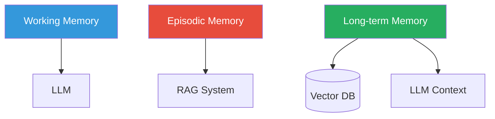

# Memory & Conversation History

## What is Memory in AI Agents?

**Memory** refers to how AI systems retain and use information across
interactions. For conversational AI, this means remembering past conversations
to provide coherent, contextual responses.

## Types of Memory



### 1. Working Memory (Short-term)

The current conversation context — everything within the LLM's context window.

```python
messages = [
    {"role": "system", "content": "You are a helpful assistant."},
    {"role": "user", "content": "My name is Alice."},
    {"role": "assistant", "content": "Hello Alice!"},
    {"role": "user", "content": "What did I just tell you?"},
]
```

**Limitations**:
- Context window limits (e.g., 8K-128K tokens)
- Forgotten once the conversation ends
- Expensive (every token costs)

### 2. Episodic Memory (Session)

Conversation history persisted between messages within a session.

```python
# Store in Redis or a database
session_history[session_id] = [
    {"user": "What's the weather?", "assistant": "It's sunny."},
    {"user": "What about tomorrow?", "assistant": "Check forecast..."},
]
```

### 3. Long-term Memory (Persistent)

Information stored in external systems (vector databases, databases) that
persists across sessions.

```python
# Store user preferences in a vector DB
user_pref_embedding = embed("I prefer dark mode and short responses")
vector_db.upsert(user_id=123, vector=user_pref_embedding, payload={
    "preference": "dark_mode",
    "response_length": "short"
})
```

## Conversation History Strategies

### 1. Full History

```python
# Send ALL messages to the LLM
response = await client.chat.completions.create(
    messages=entire_conversation_history,
)
```

**Pros**: Perfect context
**Cons**: Expensive, hits token limits

### 2. Sliding Window

```python
# Keep only the last N messages
recent = conversation_history[-20:]
```

**Pros**: Simple, bounded cost
**Cons**: Important early context may be lost

### 3. Summarization

```python
# Summarize old messages into a summary
summary = await summarize(
    conversation_history[:-5]  # Everything except last 5 messages
)
messages = [
    {"role": "system", "content": f"Summary of earlier conversation: {summary}"},
    *conversation_history[-5:],  # Last 5 messages in full
]
```

### 4. Selective Retrieval

```python
# Use an embedding to find relevant past messages
relevant_messages = vector_db.search(
    query=embedding(current_question),
    filter={"session_id": session_id},
)
```

## Memory in RAG Systems

### The Challenge

Traditional LLMs only have their context window for memory. RAG extends this
by providing **retrieved documents** as additional context.

### Memory Hierarchy in RAG

| Layer | Description | Storage |
|-------|-------------|---------|
| **Prompt context** | Current retrieved docs | LLM context window |
| **Document store** | All ingested documents | Vector database |
| **User history** | Past interactions | Database / Redis |
| **Model weights** | Training knowledge | Model parameters |

### Personalizing with Memory

```python
# Retrieve user's past preferences
user_history = await vector_db.search(
    query_vector=embed(f"preferences of user {user_id}"),
    top_k=5,
)

# Include in prompt
messages = [
    {"role": "system", "content": system_prompt},
    {"role": "user", "content": f"User preferences: {format_history(user_history)}"},
    {"role": "user", "content": current_question},
]
```

## In Our POC

Our RAG pipeline retrieves from documents, but doesn't persist conversation
history. To add memory:

```python
# Extend the RAG pipeline
class RAGPipeline:
    async def query_with_history(self, session_id, question):
        # 1. Retrieve user's past questions
        past_qs = await self.get_session_history(session_id)

        # 2. Include relevant context
        combined_query = f"History: {past_qs}\nQuestion: {question}"

        # 3. Retrieve and generate as usual
        hits = await self.retrieve(combined_query)
        ...
```

## Memory Management Challenges

### Token Budgeting

```python
MAX_TOKENS = 4096
question_tokens = count_tokens(question)
retrieved_tokens = count_tokens(context)
available = MAX_TOKENS - question_tokens - retrieved_tokens - 512  # buffer

# If available is too small:
# - Summarize old history
# - Reduce top_k
# - Summarize retrieved context
```

### Privacy & Data Retention

- **PII handling**: Don't store sensitive user data
- **GDPR/CCPA compliance**: Allow deletion of user data
- **Data retention policies**: Auto-delete old conversations
- **Encryption**: Encrypt memory at rest

## Advanced Memory Patterns

### 1. Memory Networks

The LLM can write to and read from an external memory matrix:

```python
# Write: store important facts
await vector_db.upsert(embed("User's name is Alice"), payload={"type": "fact"})

# Read: query memory
facts = await vector_db.search(
    query=embed(current_question),
    filter={"type": "fact"},
)
```

### 2. Entity-Aware Memory

Track entities (people, places, topics) and their attributes separately:

```python
# Entity store
entities = {
    "Alice": {"age": 30, "preferences": ["dark mode", "short responses"]},
    "Project X": {"status": "in progress", "deadline": "2025-01-01"},
}
```

### 3. Conversation Summaries

Generate summaries of conversations for long-term storage:

```python
summary_prompt = f"""
Summarize this conversation in 3 sentences:
{conversation_history}
Summary:"""
```

## Next Steps

- [Agents](agents.md) — Combining memory with action-taking
- [Guardrails](guardrails.md) — Controlling what agents remember and share
