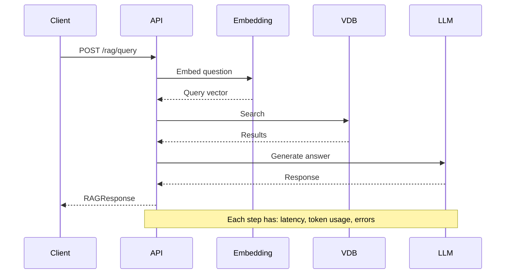

# Observability

## What is Observability?

**Observability** in GenAI applications means understanding what's happening
inside your LLM-powered systems — tracking inputs, outputs, retrieval quality,
costs, and performance.

Unlike traditional software (where you can set breakpoints and inspect state),
LLM applications are probabilistic and hard to debug. Observability provides
visibility.

## What to Observe

### 1. Input/Output Logging

```python
# Log every request and response
logger.info({
    "event": "llm_call",
    "model": request.model,
    "messages": request.messages,  # Be careful with PII!
    "response": response.content,
    "usage": response.usage,
    "timestamp": datetime.utcnow().isoformat(),
})
```

### 2. Token Usage

```python
# Track cost per request
input_cost = response.usage.prompt_tokens * 0.0015 / 1000   # $ per 1K tokens
output_cost = response.usage.completion_tokens * 0.002 / 1000
total_cost = input_cost + output_cost
```

### 3. Latency

```python
import time

start = time.perf_counter()
response = await llm_service.generate(request)
latency = time.perf_counter() - start
logger.info(f"LLM latency: {latency:.3f}s")
```

### 4. Retrieval Quality

```python
# Log what was retrieved for each query
logger.info({
    "query": question,
    "retrieved_scores": [h.score for h in hits],
    "retrieved_texts": [h.text[:100] for h in hits],
    "context_length": len(context),
})
```

## Monitoring Metrics

### Dashboard Example

```mermaid
graph TD
    subgraph "LLM Metrics"
        Latency["Latency (ms)"]
        Tokens["Tokens Used"]
        Cost["Cost ($)"]
        Errors["Error Rate"]
    end
    subgraph "RAG Metrics"
        Recall["Context Recall"]
        Scores["Retrieval Scores"]
        Length["Context Length"]
        Citations["Citations"]
    end
    subgraph "Quality Metrics"
        Halluc["Hallucination Rate"]
        Satisf["User Satisfaction"]
        Relevance["Answer Relevancy"]
    end

    style Latency fill:#3498db
    style Tokens fill:#9b59b6
    style Cost fill:#e74c3c
    style Errors fill:#f39c12
    style Recall fill:#27ae60
    style Scores fill:#8e44ad
    style Length fill:#1abc9c
    style Citations fill:#34495e
    style Halluc fill:#2980b9
    style Satisf fill:#c0392b
    style Relevance fill:#7f8c8d
```



## Logging Structure

Use structured logging for better analysis:

```python
import json
import logging

logger = logging.getLogger(__name__)

def log_rag_interaction(
    question: str,
    retrieved: list[SearchHit],
    answer: str,
    latency: float,
    cost: float,
):
    logger.info(json.dumps({
        "event_type": "rag_query",
        "question": question,
        "retrieved_count": len(retrieved),
        "top_score": retrieved[0].score if retrieved else None,
        "answer_length": len(answer),
        "latency_ms": latency * 1000,
        "estimated_cost": cost,
    }))
```

## Tracing

Trace the full path of a request through the system:



### OpenTelemetry Integration

```python
from opentelemetry import trace

tracer = trace.get_tracer(__name__)

with tracer.start_as_current_span("rag_query") as span:
    span.set_attribute("question", question)
    
    with tracer.start_as_current_span("embedding"):
        embedding = await embed(question)
    
    with tracer.start_as_current_span("search"):
        results = await search(embedding)
        span.set_attribute("num_results", len(results))
    
    with tracer.start_as_current_span("generation"):
        answer = await llm.generate(...)
        span.set_attribute("answer_length", len(answer))
```

## Error Tracking

Capture and categorize errors:

```python
try:
    response = await llm_service.generate(request)
except RateLimitError:
    logger.error("rate_limit_exceeded", extra={
        "model": request.model,
        "retry_after": e.retry_after if hasattr(e, 'retry_after') else None
    })
except APITimeoutError:
    logger.error("timeout", extra={"timeout_seconds": settings.llm_timeout})
except AuthenticationError:
    logger.critical("invalid_api_key")
    # Alert immediately
```

## Alerting

Set up alerts for critical issues:

| Alert | Threshold | Action |
|-------|-----------|--------|
| High error rate | >5% of requests fail | Page on-call |
| High latency | >5s average | Check API status |
| Rate limit errors | >100/min | Scale up or add delays |
| High cost | >$100/day | Review usage |
| Low retrieval quality | <50% recall | Retrain embeddings |

## In Our POC

The POC has basic logging:

```python
# app/main.py
logging.basicConfig(
    level=logging.DEBUG if settings.debug else logging.INFO,
    format="%(asctime)s [%(levelname)s] %(name)s: %(message)s",
)

# app/rag/pipeline.py
logger.info("RAG query: %s", request.question[:80])
logger.info("Retrieved %d hits for query (k=%d)", len(hits), k)
```

### Missing Observability (Production Concerns)

The POC does **not** include:
- Token cost tracking
- Structured JSON logging
- Distributed tracing
- Metrics collection (Prometheus, etc.)
- Alerting rules
- User-level tracking (anonymized)

## Next Steps

- Set up structured logging in your own RAG application
- Add token counting and cost estimation
- Consider OpenTelemetry for tracing
- Review [Evaluation](evaluation.md) for quality metrics
