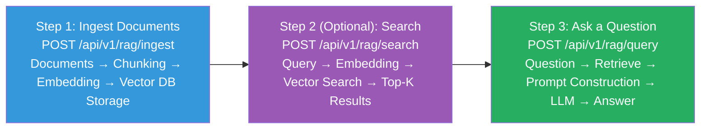
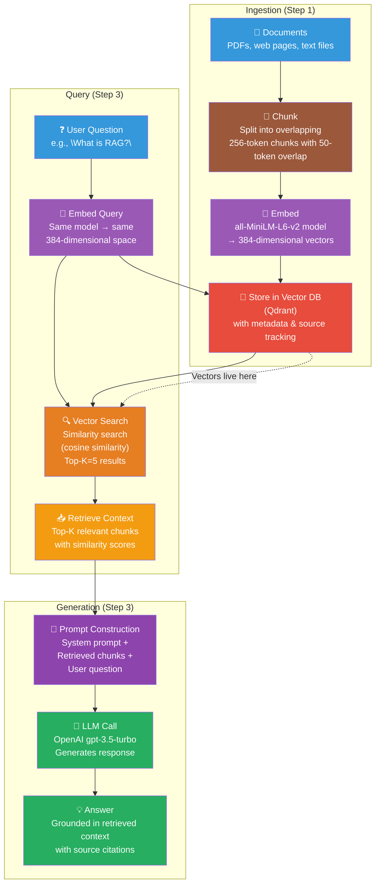

# API Usage Guide

A complete reference for all API endpoints — what they do, why they exist,
and how they fit into the GenAI workflow.

## Overview

The GenAI POC exposes a REST API that demonstrates the complete
Retrieval-Augmented Generation (RAG) pipeline. The endpoints fall into
three categories:

| Category | Purpose | Endpoints |
|----------|---------|-----------|
| **LLM** | Generate text with a language model | `generate`, `generate-stream`, `models` |
| **Embeddings** | Convert text to vectors & measure similarity | `generate`, `similarity` |
| **RAG** | End-to-end document Q&A pipeline | `ingest`, `search`, `query`, `demo` |

You can think of the typical workflow as:



Each step builds on the previous one. You can also use individual
endpoints for learning — e.g., experiment with embeddings on their own,
or test the LLM directly.

## Base URL & Access

```
http://localhost:8000
```

- **Swagger UI**: visit `/` (interactive, try-out enabled)
- **ReDoc**: visit `/redoc` (alternative interactive docs)
- The API does not require authentication. For production, add API keys
  or OAuth tokens.

All endpoints are versioned under `/api/v1/`.

## Health Check

### `GET /health`

Returns the service status. Useful for liveness/readiness probes and
confirming the server started correctly.

**Example Request:**
```bash
curl http://localhost:8000/health
```

**Example Response:**
```json
{"status": "healthy"}
```

---

## LLM Endpoints

### Why LLM endpoints exist

These endpoints demonstrate the fundamental capability of a GenAI
application: sending a prompt to a language model and getting text back.
They show how **system**, **user**, and **assistant** messages form a
conversation, and how parameters like `temperature` and `max_tokens`
control the output.

---

### `POST /api/v1/llm/generate`

Generate a non-streaming chat completion. The entire response is returned
at once.

**Contextual meaning:** This is the "hello world" of LLM integration.
You send a conversation history (list of messages) and receive a single
response. The `system` message sets the assistant's personality/instructions,
`user` messages contain the actual question, and `assistant` messages hold
previous responses (enabling multi-turn conversation).

**Parameters (request body):**

| Field | Type | Required | Default | Description |
|-------|------|----------|---------|-------------|
| `messages` | array of `ChatMessage` | yes | — | Conversation history. Each message has `role` (`system`, `user`, `assistant`) and `content` (string). Minimum 1 message. |
| `model` | string | no | from config (`gpt-3.5-turbo`) | Model identifier. Omit to use the default configured model. |
| `temperature` | float (0–2) | no | `0.7` | Lower = deterministic, higher = creative. `0.0` = greedy (same output every time). |
| `top_p` | float (0–1) | no | `1.0` | Nucleus sampling: considers only tokens whose cumulative probability ≤ `top_p`. Alternative to temperature. |
| `max_tokens` | int (1–16384) | no | `1024` | Maximum tokens in the response. Acts as a budget/limit. |
| `stream` | boolean | no | `false` | Ignored here; use `generate-stream` for streaming. |

**Example Request:**
```bash
curl -X POST http://localhost:8000/api/v1/llm/generate \
  -H "Content-Type: application/json" \
  -d '{
    "messages": [
      {"role": "system", "content": "You are a helpful assistant."},
      {"role": "user", "content": "What is the capital of France?"}
    ],
    "temperature": 0.7,
    "max_tokens": 256
  }'
```

**Python example:**
```python
import requests

response = requests.post("http://localhost:8000/api/v1/llm/generate", json={
    "messages": [
        {"role": "system", "content": "You are a helpful assistant."},
        {"role": "user", "content": "What is the capital of France?"}
    ],
    "temperature": 0.7,
    "max_tokens": 256
})
print(response.json()["content"])
```

**Example Response:**
```json
{
  "id": "chatcmpl-abc123",
  "model": "gpt-3.5-turbo",
  "content": "The capital of France is Paris.",
  "usage": {
    "prompt_tokens": 20,
    "completion_tokens": 8,
    "total_tokens": 28
  },
  "finish_reason": "stop"
}
```

**Response fields:**

| Field | Type | Description |
|-------|------|-------------|
| `id` | string | Unique identifier for the completion request. |
| `model` | string | The model that generated the response. |
| `content` | string | The generated text. |
| `usage` | object | Token counts: `prompt_tokens`, `completion_tokens`, `total_tokens`. Useful for cost tracking. |
| `finish_reason` | string | Why generation stopped. `"stop"` = natural end, `"length"` = hit `max_tokens`. |

**Error Scenarios:**
- `400 Bad Request` — Invalid message format or empty messages list
- `502 Bad Gateway` — LLM API error (invalid key, model not available, rate limit)

---

### `POST /api/v1/llm/generate-stream`

Stream LLM tokens as they are generated, using Server-Sent Events (SSE).

**Contextual meaning:** Streaming provides a better user experience
(tokens appear as they're generated, like ChatGPT). Technically, each
chunk is a token or small group of tokens yielded by the model. The
client reconnects and appends tokens until `finish_reason` is set.

**Parameters:** Same as `generate` — `messages`, `model`, `temperature`,
`top_p`, `max_tokens`. The `stream` parameter is always set to `true`
internally, even if you pass `false`.

**Example Request:**
```bash
curl -N -X POST http://localhost:8000/api/v1/llm/generate-stream \
  -H "Content-Type: application/json" \
  -d '{
    "messages": [{"role": "user", "content": "Tell me a joke"}],
    "temperature": 0.8
  }'
```

**Response format (SSE):** Each line is a JSON object:
```
data: {"content":"Why","finish_reason":null}

data: {"content":" don't","finish_reason":null}

data: {"content":" scientists","finish_reason":null}

...

data: {"content":null,"finish_reason":"stop"}

data: [DONE]
```

Each `data:` line contains an `LLMStreamChunk`:
- `content` — the raw token text (or `null` on the final chunk)
- `finish_reason` — `null` while generating, `"stop"` or `"length"` on completion

---

### `GET /api/v1/llm/models`

Returns the configured model names (from `.env`).

**Example Response:**
```json
{
  "llm_model": "gpt-3.5-turbo",
  "embedding_model": "all-MiniLM-L6-v2",
  "embedding_dimensions": 384
}
```

---

## Embeddings Endpoints

### Why embeddings exist

Before a model can understand or search text semantically, the text
must be converted into a **vector** (a dense array of numbers). Two
texts with similar meaning will have similar vectors. These endpoints
expose the conversion (text → vector) and comparison (vector → similarity)
steps that power semantic search.

---

### `POST /api/v1/embeddings/generate`

Convert text into a vector embedding.

**Contextual meaning:** This is the bridge between human language and
machine understanding. The embedding vector captures the **semantic
meaning** of the input text — not just keywords, but the conceptual
content. Two sentences about the same topic will have similar vectors
even if they share no words.

**Parameters:**

| Field | Type | Required | Default | Description |
|-------|------|----------|---------|-------------|
| `text` | string | yes | — | Text to embed. Minimum 1 character. |
| `model` | string | no | from config (`all-MiniLM-L6-v2`) | Embedding model override. For local backend, this maps to a HuggingFace model name. For OpenAI backend, it's `text-embedding-3-small` etc. |

**Example Request:**
```bash
curl -X POST http://localhost:8000/api/v1/embeddings/generate \
  -H "Content-Type: application/json" \
  -d '{"text": "What is artificial intelligence?"}'
```

**Example Response:**
```json
{
  "embedding": [0.234, -0.876, 0.451, ...384 total floats...],
  "model": "all-MiniLM-L6-v2",
  "dimensions": 384
}
```

**Key insight:** The `dimensions` field (384 here) tells you the
**dimensionality** of the embedding space — the number of axes used to
represent meaning. Higher dimensions can capture finer semantic nuances,
but require more storage and compute.

**Error Scenarios:**
- `422 Unprocessable Entity` — Empty or invalid text

---

### `POST /api/v1/embeddings/similarity`

Compute semantic similarity between two texts using three distance
metrics.

**Contextual meaning:** This endpoint lets you explore *how* similarity
is measured — a core concept in vector search. Each metric captures
similarity differently:

- **Cosine similarity** — measures the angle between two vectors,
  ignoring magnitude. Best when vector length doesn't matter (most
  common for embeddings). Range: [-1, 1].
- **Euclidean distance** — the straight-line distance between two points
  in vector space. Good when magnitude matters. Lower = more similar.
- **Dot product** — the raw inner product. Higher = more similar. Often
  used in vector DBs (e.g., Qdrant) because it's faster to compute.

**Parameters:**

| Field | Type | Required | Default | Description |
|-------|------|----------|---------|-------------|
| `text_a` | string | yes | — | First text |
| `text_b` | string | yes | — | Second text |
| `metric` | string | no | `cosine` | Metric to use: `cosine`, `euclid`, or `dot` (the `metric` field is accepted but all three are always returned) |

**Example Request:**
```bash
curl -X POST http://localhost:8000/api/v1/embeddings/similarity \
  -H "Content-Type: application/json" \
  -d '{
    "text_a": "The cat sat on the mat.",
    "text_b": "A feline rested on a rug."
  }'
```

**Example Response:**
```json
{
  "cosine": 0.7821,
  "euclidean": 1.1234,
  "dot_product": 45.67
}
```

**Python example:**
```python
import requests

resp = requests.post("http://localhost:8000/api/v1/embeddings/similarity", json={
    "text_a": "The cat sat on the mat.",
    "text_b": "A feline rested on a rug."
})
print(resp.json())
# {'cosine': 0.78, 'euclidean': 1.12, 'dot_product': 45.67}
```

---

## RAG Endpoints

### Why RAG exists

RAG solves two problems with pure LLMs:

1. **Knowledge cutoff** — LLMs only know what they were trained on. They
   can't answer questions about recent events or domain-specific docs
   you have internally.

2. **Hallucination** — LLMs confidently make up facts. RAG grounds the
   response by fetching relevant documents and including them in the
   prompt, so the LLM answers based on your data.

The RAG workflow implemented by these endpoints:



---

### `POST /api/v1/rag/ingest`

**Step 1:** Add documents to the vector database so they can be searched
semantically.

**Contextual meaning:** This is the "indexing" phase of RAG. Each
document is:
1. **Chunked** — split into overlapping pieces (configurable size/overlap)
   to fit within embedding model context limits and improve retrieval
   granularity.
2. **Embedded** — each chunk is converted to a vector via the embedding
   model.
3. **Stored** — vectors are written to Qdrant (the vector database) with
   metadata for filtering.

After ingestion, the documents are searchable by semantic similarity.

**Parameters:**

| Field | Type | Required | Default | Description |
|-------|------|----------|---------|-------------|
| `documents` | array of `Document` | yes | — | Documents to index. Each has `content` (required), `id` (optional, auto-generated), and `metadata` (optional dict). |

**Document fields:**

| Field | Type | Required | Default | Description |
|-------|------|----------|---------|-------------|
| `id` | string | no | auto-generated | Unique identifier. Auto-generated as `doc_0`, `doc_1`, etc. |
| `content` | string | yes | — | Full text content (minimum 1 char). |
| `metadata` | object | no | `{}` | Arbitrary key-value pairs for filtering (e.g., `{"category": "AI", "source": "manual"}`). |

**Example Request:**
```bash
curl -X POST http://localhost:8000/api/v1/rag/ingest \
  -H "Content-Type: application/json" \
  -d '{
    "documents": [
      {
        "content": "RAG combines retrieval and generation to produce grounded answers.",
        "metadata": {"topic": "GenAI", "category": "RAG"}
      },
      {
        "content": "Embeddings are dense vector representations of text that capture semantic meaning.",
        "metadata": {"topic": "Embeddings", "category": "Vectors"}
      }
    ]
  }'
```

**Example Response:**
```json
{
  "documents_processed": 2,
  "chunks_created": 4,
  "collection": "genai-documents"
}
```

**Response fields:**

| Field | Type | Description |
|-------|------|-------------|
| `documents_processed` | int | Number of source documents received. |
| `chunks_created` | int | Total chunks created after splitting (≥ `documents_processed`). |
| `collection` | string | Qdrant collection name where vectors are stored. |

**Error Scenarios:**
- `400 Bad Request` — Empty documents list
- `503 Service Unavailable` — Qdrant not reachable

**Python example:**
```python
import requests

resp = requests.post("http://localhost:8000/api/v1/rag/ingest", json={
    "documents": [
        {"content": "RAG combines retrieval and generation.", "metadata": {"topic": "GenAI"}}
    ]
})
print(resp.json())
# {'documents_processed': 1, 'chunks_created': 2, 'collection': 'genai-documents'}
```

---

### `POST /api/v1/rag/search`

**Step 2 (optional):** Search for relevant documents. Returns similarity
results without calling an LLM.

**Contextual meaning:** This demonstrates the **retrieval** part of RAG.
The question is embedded to a vector, then matched against stored
vectors using **approximate nearest-neighbor (ANN) search**. Results are
ranked by similarity score.

You can use this endpoint independently to debug retrieval quality,
inspect what the vector DB finds, or build custom retrieval logic.

**Parameters:**

| Field | Type | Required | Default | Description |
|-------|------|----------|---------|-------------|
| `question` | string | yes (body) | — | Search query. |
| `top_k` | int (1–50) | no | config (`5`) | Number of results to return. Can be passed as query param `?top_k=3` or in the JSON body. |

**Example Request:**
```bash
# Via JSON body
curl -X POST http://localhost:8000/api/v1/rag/search \
  -H "Content-Type: application/json" \
  -d '{"question": "What is machine learning?", "top_k": 5}'

# Via query param
curl -X POST "http://localhost:8000/api/v1/rag/search?top_k=3" \
  -H "Content-Type: application/json" \
  -d '{"question": "What is machine learning?"}'
```

**Example Response:**
```json
{
  "query": "What is machine learning?",
  "hits": [
    {
      "id": "doc_0_chunk_0",
      "score": 0.8923,
      "text": "Machine learning is a method of data analysis...",
      "metadata": {"topic": "AI"}
    },
    {
      "id": "doc_1_chunk_1",
      "score": 0.7561,
      "text": "Supervised learning requires labeled training data...",
      "metadata": {"topic": "ML"}
    }
  ],
  "collection": "genai-documents"
}
```

**Response fields:**

| Field | Type | Description |
|-------|------|-------------|
| `query` | string | The original search query. |
| `hits` | array | Ranked search results. Each hit has `id`, `score` (0–1, higher = more similar), `text`, and `metadata`. |
| `collection` | string | The Qdrant collection searched. |

---

### `POST /api/v1/rag/query`

**Step 3:** Full RAG pipeline — retrieve context and generate an answer.

**Contextual meaning:** This combines Steps 1 and 2 with LLM generation.
The flow is:

1. **Embed** the user's question
2. **Search** the vector DB for the top-k most similar chunks
3. **Construct a prompt** that includes the retrieved chunks + the question
4. **Call the LLM** with the constructed prompt
5. **Return** the answer + the source documents used

The returned `sources` array lets you verify which documents influenced
the answer — this is how RAG reduces hallucination.

**Parameters:**

| Field | Type | Required | Default | Description |
|-------|------|----------|---------|-------------|
| `question` | string | yes | — | The question to answer. |
| `top_k` | int (1–50) | no | config (`5`) | Number of chunks to retrieve. |
| `model` | string | no | config | Override the LLM model. |
| `temperature` | float (0–2) | no | `0.7` | Override temperature for this request. |

**Example Request:**
```bash
curl -X POST http://localhost:8000/api/v1/rag/query \
  -H "Content-Type: application/json" \
  -d '{"question": "What is the difference between supervised and unsupervised learning?"}'
```

**Example Response:**
```json
{
  "answer": "Machine learning is a subset of AI where systems learn from data. Supervised learning uses labeled data (input-output pairs), while unsupervised learning finds patterns in unlabeled data.",
  "sources": [
    {
      "id": "doc_0_chunk_0",
      "score": 0.8923,
      "text": "Supervised learning uses labeled training data...",
      "metadata": {"topic": "ML"}
    }
  ],
  "context": "[Source 1] (score: 0.89)\nSupervised learning uses labeled training data..."
}
```

**Response fields:**

| Field | Type | Description |
|-------|------|-------------|
| `answer` | string | The LLM-generated answer, grounded in retrieved context. |
| `sources` | array | Source documents that influenced the answer (same schema as search `hits`). |
| `context` | string | The exact context string passed to the LLM. |

**Error Scenarios:**
- `502 Bad Gateway` — LLM API failure (invalid key, rate limit)
- `503 Service Unavailable` — Vector database not reachable

**Python example:**
```python
import requests

resp = requests.post("http://localhost:8000/api/v1/rag/query", json={
    "question": "What is RAG?"
})
data = resp.json()
print(data["answer"])
print(f"Sources: {len(data['sources'])} documents used")
```

---

### `GET /api/v1/rag/demo`

Demonstrate the RAG flow **without** calling an LLM — no API key needed.

**Contextual meaning:** This endpoint is designed for **learning**. It
shows you exactly what happens inside the RAG pipeline:

1. The question is embedded and searched in the vector DB
2. The retrieved chunks are assembled into a context string
3. The context is inserted into a prompt template
4. The resulting prompt is shown (but **not** sent to an LLM)

This lets you inspect the retrieval quality and prompt construction
without spending API credits. Use it to iterate on:
- Chunk size and overlap (`RAG_CHUNK_SIZE`, `RAG_CHUNK_OVERLAP`)
- Top-k retrieval (`RAG_TOP_K`)
- The prompt template (see `app/rag/generation.py`)

**Parameters:**

| Field | Type | Required | Default | Description |
|-------|------|----------|---------|-------------|
| `question` | string | yes | — | Question to demonstrate RAG with (query param). |
| `top_k` | int (1–20) | no | `5` | Number of chunks to retrieve (query param). |

**Example Request:**
```bash
curl "http://localhost:8000/api/v1/rag/demo?question=What+is+RAG?&top_k=5"
```

**Example Response:**
```json
{
  "question": "What is RAG?",
  "retrieved_chunks": [
    {
      "text": "RAG combines retrieval and generation to produce grounded answers...",
      "score": 0.8923,
      "metadata": {"topic": "GenAI"}
    }
  ],
  "context": "[Source 1] (score: 0.89)\nRAG combines retrieval...",
  "prompt": "You are a helpful assistant.\n\nContext:\n[Source 1] (score: 0.89)\nRAG combines...\n\nQuestion: What is RAG?\nAnswer:",
  "note": "The prompt above is what would be sent to the LLM. The LLM service is not called here so no API key is needed."
}
```

**When the vector DB is unavailable** (e.g., Qdrant container not started),
the endpoint still works — it returns an empty hits list and a prompt
with no context, demonstrating the full flow without a database.

---

## Workflow Guide

Here's the typical sequence for a complete RAG session:

### Step 1: Verify the service is healthy
```bash
curl http://localhost:8000/health
```

### Step 2: Ingest documents
```bash
curl -X POST http://localhost:8000/api/v1/rag/ingest \
  -H "Content-Type: application/json" \
  -d '{"documents": [{"content": "Your document text here", "metadata": {"source": "manual"}}]}'
```

### Step 3 (optional): Inspect retrieval
```bash
curl -X POST http://localhost:8000/api/v1/rag/search \
  -H "Content-Type: application/json" \
  -d '{"question": "Your question here"}'
```

### Step 4: Ask a question (full RAG)
```bash
curl -X POST http://localhost:8000/api/v1/rag/query \
  -H "Content-Type: application/json" \
  -d '{"question": "Your question here"}'
```

### Step 5 (learning): Inspect the prompt without calling the LLM
```bash
curl "http://localhost:8000/api/v1/rag/demo?question=Your question here"
```

### Alternative: Generate embeddings directly
```bash
curl -X POST http://localhost:8000/api/v1/embeddings/generate \
  -H "Content-Type: application/json" \
  -d '{"text": "Text to embed"}'
```

### Alternative: Compare texts for similarity
```bash
curl -X POST http://localhost:8000/api/v1/embeddings/similarity \
  -H "Content-Type: application/json" \
  -d '{"text_a": "The cat sat on the mat", "text_b": "A feline rested on a rug"}'
```

---

## Configuration Reference

All settings are configurable via environment variables (in `.env`):

| Variable | Default | Description |
|----------|---------|-------------|
| `LLM_API_KEY` | (empty) | OpenAI API key. Leave empty to use a local LLM (see Free LLM Options). |
| `LLM_BASE_URL` | `https://api.openai.com/v1` | API endpoint. Use Ollama/LM Studio URL for local LLMs. |
| `LLM_MODEL` | `gpt-3.5-turbo` | Default LLM model. |
| `LLM_TEMPERATURE` | `0.7` | Default temperature. |
| `LLM_MAX_TOKENS` | `1024` | Default max tokens. |
| `LLM_TOP_P` | `1.0` | Default top-p (nucleus sampling). |
| `EMBEDDING_PROVIDER` | `sentence-transformers` | `sentence-transformers` (local) or `openai` (cloud). |
| `EMBEDDING_MODEL` | `all-MiniLM-L6-v2` | Embedding model (HuggingFace model name). |
| `EMBEDDING_DIMENSIONS` | `384` | Expected embedding vector size. Must match the model. |
| `QDRANT_HOST` | `http://localhost:6333` | Qdrant vector DB URL. |
| `QDRANT_COLLECTION` | `genai-documents` | Default collection name. |
| `QDRANT_DISTANCE` | `cosine` | Distance metric: `cosine`, `euclidean`, or `dot`. |
| `RAG_CHUNK_SIZE` | `500` | Characters per chunk during ingestion. |
| `RAG_CHUNK_OVERLAP` | `100` | Overlap (chars) between consecutive chunks. |
| `RAG_TOP_K` | `5` | Default number of chunks to retrieve. |
| `LOG_LEVEL` | `INFO` | Log level (DEBUG, INFO, WARNING, ERROR, CRITICAL). |
| `LOG_FORMAT` | `standard` | Log format: `standard` (human-readable) or `json` (structured). |

## Next Steps

- [High-Level Architecture](high-level.md)
- [Component Responsibilities](components.md)
- [Data Flow](data-flow.md)
- [What is RAG?](../rag/what-is-rag.md)
- [Embeddings Explained](../embeddings/what-are-embeddings.md)
- [Vector Databases](../vector-databases/what-is-vdb.md)
