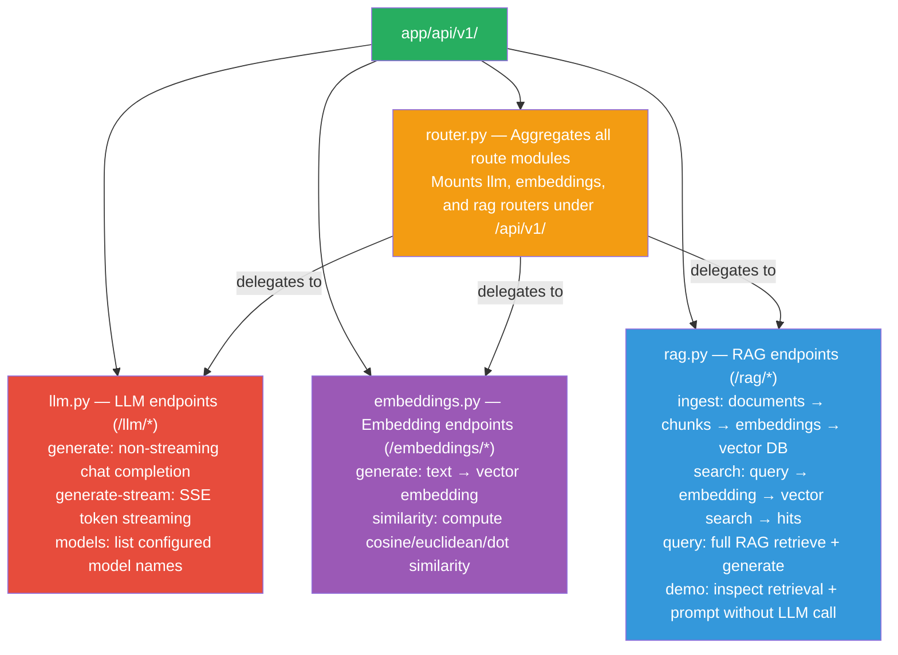
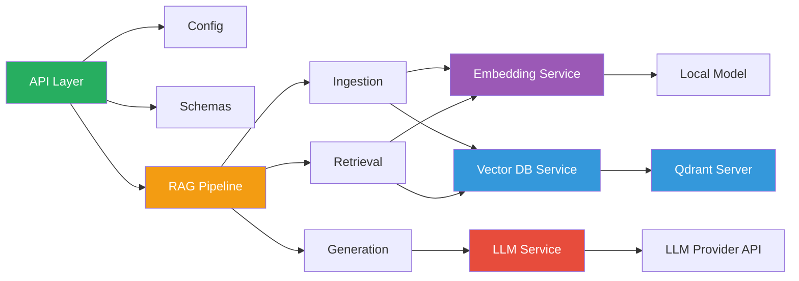

# Component Responsibilities

This page details what each component in the system does.

## 1. FastAPI Application (`app/main.py`)

**Responsibility**: HTTP request/response handling, API documentation, routing.

```python
# app/main.py
app = FastAPI(
    title="GenAI POC",
    docs_url="/",      # Swagger UI at root
    redoc_url="/redoc", # ReDoc documentation
)
app.include_router(api_router)  # Mounts /api/v1/*
```

**Key features**:
- Serves the API documentation (Swagger/ReDoc) at `/` and `/redoc`
- Handles CORS for frontend development
- Health check endpoint at `/health`

## 2. API Layer (`app/api/v1/`)

**Responsibility**: Defines REST endpoints and request/response schemas.

### Structure



### Key Endpoints

| Module | Endpoint | Method | Description |
|--------|----------|--------|-------------|
| `llm.py` | `/llm/generate` | POST | Generate LLM chat completion |
| `llm.py` | `/llm/generate-stream` | POST | Stream LLM response |
| `llm.py` | `/llm/models` | GET | List configured models |
| `embeddings.py` | `/embeddings/generate` | POST | Generate embedding for text |
| `embeddings.py` | `/embeddings/similarity` | POST | Compute similarity between texts |
| `rag.py` | `/rag/ingest` | POST | Ingest documents into vector DB |
| `rag.py` | `/rag/search` | POST | Search documents |
| `rag.py` | `/rag/query` | POST | Full RAG: retrieve + generate |
| `rag.py` | `/rag/demo` | GET | RAG demonstration without LLM calls |

## 3. Core Configuration (`app/core/config.py`)

**Responsibility**: Centralized configuration management.

```python
class Settings(BaseSettings):
    # LLM
    llm_api_key: str = ""
    llm_model: str = "gpt-3.5-turbo"
    llm_temperature: float = 0.7
    
    # Embeddings
    embedding_provider: str = "sentence-transformers"
    embedding_model: str = "all-MiniLM-L6-v2"
    embedding_dimensions: int = 384
    
    # Vector DB
    qdrant_host: str = "http://localhost:6333"
    qdrant_collection: str = "genai-documents"
    
    # RAG
    rag_chunk_size: int = 500
    rag_chunk_overlap: int = 100
    rag_top_k: int = 5
```

## 4. Models/Schemas (`app/models/schemas.py`)

**Responsibility**: Pydantic models defining data structures.

### Key Models

| Model | Purpose |
|-------|---------|
| `ChatMessage` | System/user/assistant message with role enum |
| `LLMRequest` | Chat completion request with parameters |
| `LLMResponse` | Chat completion response with usage |
| `EmbeddingRequest/Response` | Embed text in/out |
| `Document` | Input document for ingestion |
| `Chunk` | Document chunk after splitting |
| `SearchHit` | Search result with score and metadata |
| `RAGRequest/Response` | Full RAG query and answer |

## 5. LLM Service (`app/llm/service.py`)

**Responsibility**: Communicate with the LLM API.

```python
class LLMService:
    async def generate(self, request: LLMRequest) -> LLMResponse:
        """Non-streaming chat completion."""

    async def generate_stream(self, request: LLMRequest) -> AsyncIterator[str]:
        """Streaming chat completion (token by token)."""
```

**Capabilities**:
- Maps internal `ChatMessage` objects to OpenAI API format
- Resolves model parameters (temperature, top_p, max_tokens) with fallbacks
- Handles streaming via Server-Sent Events
- Reports token usage

## 6. Embedding Service (`app/embeddings/service.py`)

**Responsibility**: Convert text to vectors and compute similarity.

```python
class EmbeddingService:
    async def embed(self, text: str) -> list[float]:
        """Single text to vector."""

    async def embed_many(self, texts: list[str]) -> list[list[float]]:
        """Batch embedding for ingestion efficiency."""

    async def embed_query(self, text: str) -> EmbeddingResponse:
        """Generate embedding with metadata."""

    async def similarity(self, text_a: str, text_b: str) -> SimilarityResponse:
        """Compute cosine, euclidean, and dot product similarity."""
```

**Backends**:
- `_SentenceTransformersBackend` — local model (no API cost)
- `_OpenAIEmbeddingBackend` — cloud API (higher quality)

## 7. Vector DB Service (`app/services/vectordb.py`)

**Responsibility**: Store and search embeddings in Qdrant.

```python
class VectorDBService:
    async def create_collection(self) -> None:
        """Create the vector collection if it doesn't exist."""

    async def upsert_chunks(self, chunks, embeddings) -> int:
        """Store document chunks with their embeddings."""

    async def search(
        self, query_vector, top_k=5, filter_condition=None
    ) -> list[SearchHit]:
        """Similarity search with optional metadata filter."""
```

**Key features**:
- HNSW indexing (Qdrant default)
- Configurable distance metric (cosine, euclidean, dot)
- Metadata filtering (hybrid search)
- Payload storage (text + metadata alongside vectors)

## 8. RAG Pipeline (`app/rag/`)

**Responsibility**: Orchestrates the complete RAG flow.

### Submodules

| Module | File | Responsibility |
|--------|------|----------------|
| Ingestion | `ingestion.py` | Document parsing, chunking, embedding, storage |
| Retrieval | `retrieval.py` | Query embedding, vector search, context construction |
| Generation | `generation.py` | Prompt construction, LLM call, response assembly |
| Pipeline | `pipeline.py` | End-to-end orchestration |

```python
# app/rag/pipeline.py
class RAGPipeline:
    async def query(self, request: RAGRequest) -> RAGResponse:
        # 1. Retrieve relevant context
        hits = await self.retrieve(request.question, request.top_k)
        
        # 2. Generate grounded answer
        response = await generate_answer(
            question=request.question,
            hits=hits,
            llm_service=self.llm,
        )
        return response
```

## Component Interaction Map



## Next Steps

- [Data Flow](data-flow.md) — How data moves through the system
- [RAG Flow](rag-flow.md) — Detailed retrieval and generation
- [API Documentation](api.md) — Endpoint reference
