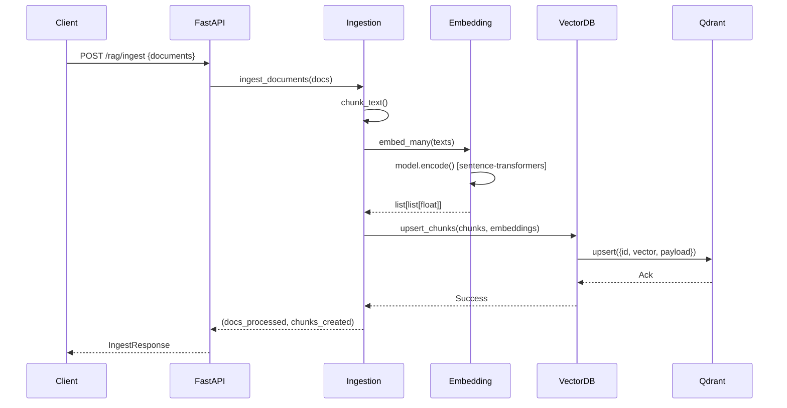
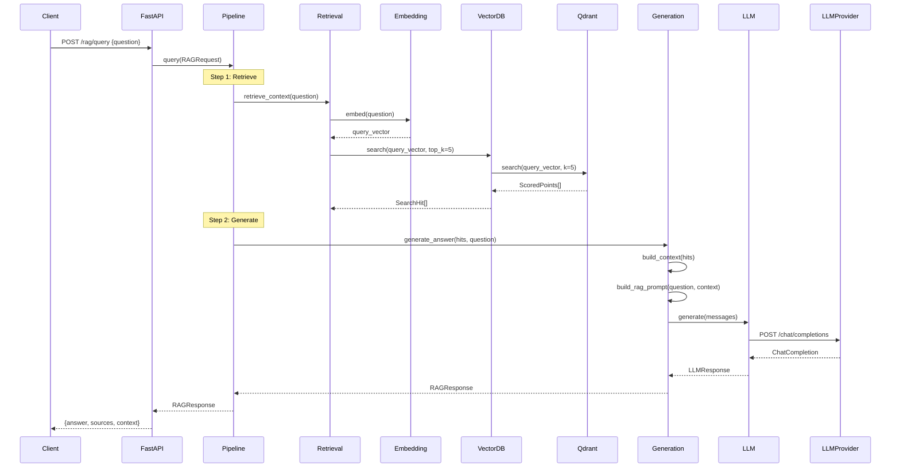
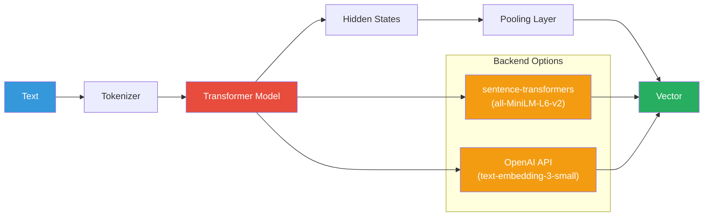
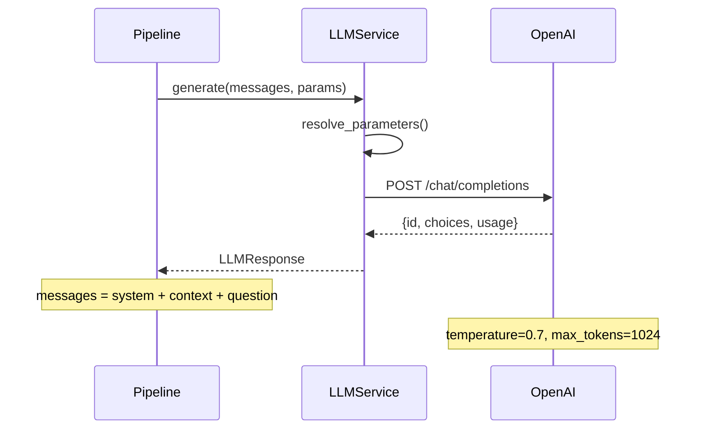
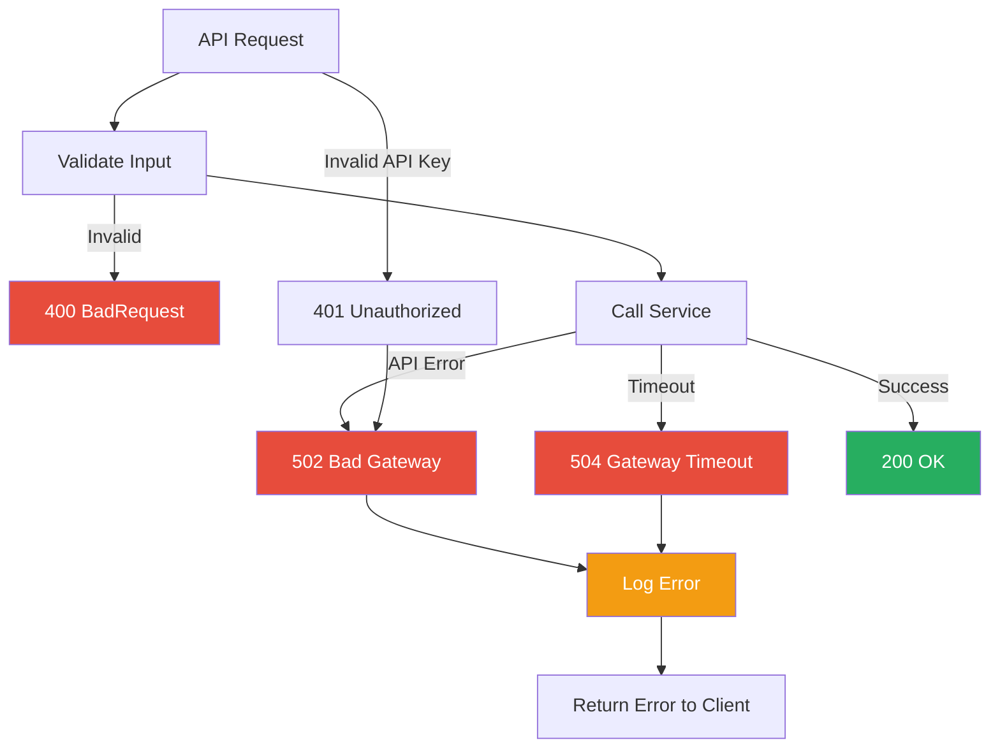

# Data Flow

This page documents how data moves through the system — both for
**ingestion** (loading documents) and **querying** (answering questions).

## Ingestion Flow



### Step-by-Step

1. **Client** sends documents to `/api/v1/rag/ingest`
2. **FastAPI** validates the request and passes documents to the RAG pipeline
3. **Ingestion** splits documents into chunks using `chunk_text()`
4. **Embedding** converts each chunk to a vector using sentence-transformers
5. **VectorDB** upserts chunks + vectors + metadata to Qdrant
6. **Qdrant** stores vectors in the HNSW index
7. **Response** returns count of documents processed and chunks created

## Query (RAG) Flow



### Step-by-Step

1. **Client** sends a question to `/api/v1/rag/query`
2. **Pipeline** orchestrates the RAG flow
3. **Retrieval** embeds the question and searches the vector DB
4. **VectorDB** sends the query vector to Qdrant's HNSW index
5. Qdrant returns ranked document chunks (SearchHits)
6. **Generation** builds a context string from the retrieved chunks
7. **Generation** constructs a prompt: system + context + question
8. **LLM** sends the prompt to the OpenAI API
9. **LLM Provider** generates a grounded answer
10. **Response** includes the answer, source chunks, and context

## Embedding Service Flow



## LLM Call Flow



## Error Handling



## Data Formats

### Document (Input)

```json
{
  "content": "Machine learning is a subset of AI...",
  "metadata": {
    "source": "lecture_notes",
    "category": "AI",
    "author": "Dr. Smith"
  }
}
```

### Chunk (Internal)

```json
{
  "id": "doc_001_chunk_0",
  "text": "Machine learning is a subset of AI...",
  "document_id": "doc_001",
  "chunk_index": 0,
  "metadata": {"source": "lecture_notes", "category": "AI"}
}
```

### SearchHit (Output)

```json
{
  "id": "doc_001_chunk_0",
  "score": 0.8923,
  "text": "Machine learning is a subset of AI...",
  "metadata": {"source": "lecture_notes", "document_id": "doc_001"}
}
```

### RAGResponse (Output)

```json
{
  "answer": "Machine learning is a subset of AI...",
  "sources": [
    {"id": "chunk_0", "score": 0.89, "text": "...", "metadata": {...}}
  ],
  "context": "[Source 1] (score: 0.89)\n..."
}
```

## Next Steps

- [API Documentation](api.md)
- [RAG Flow](rag-flow.md) — The core pipeline detail
- [Embedding Flow](embedding-flow.md)
