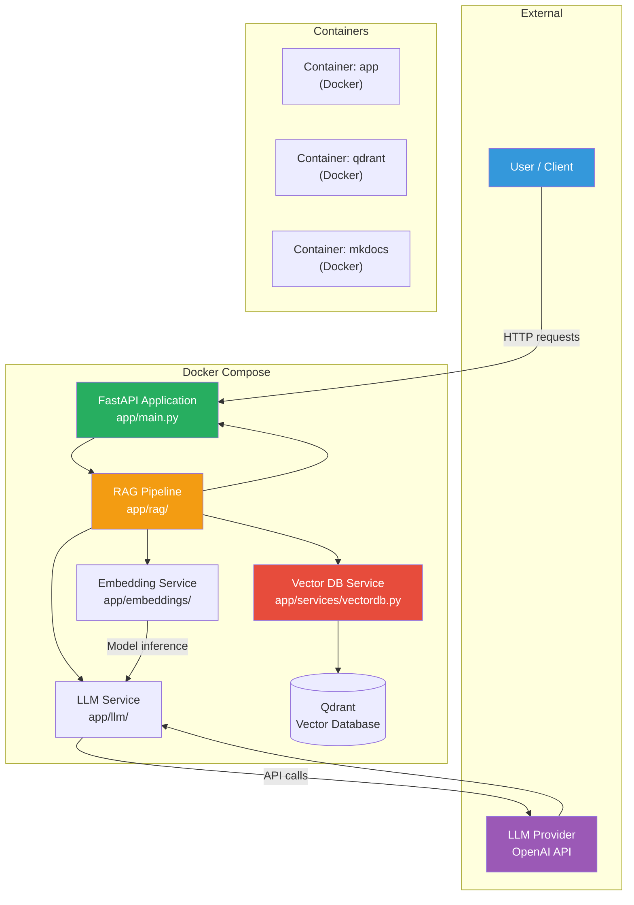
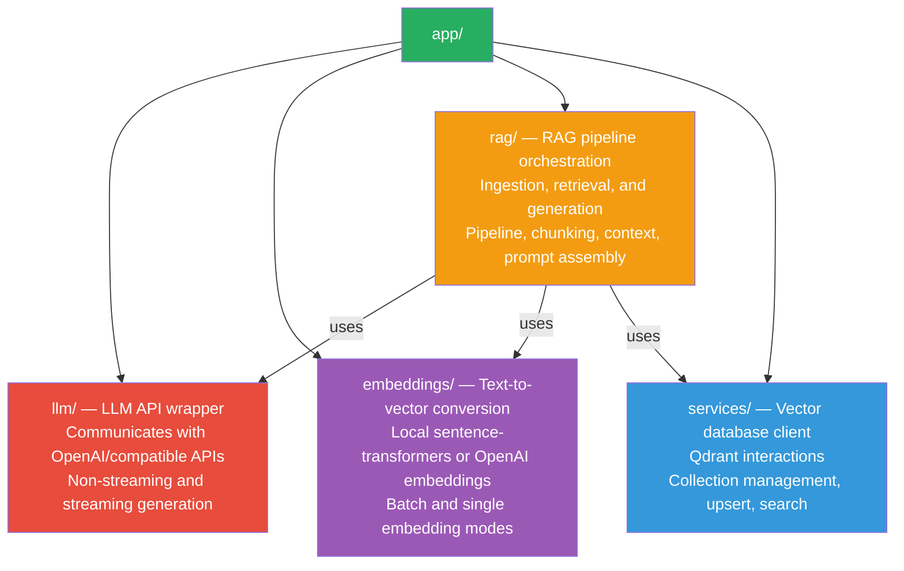
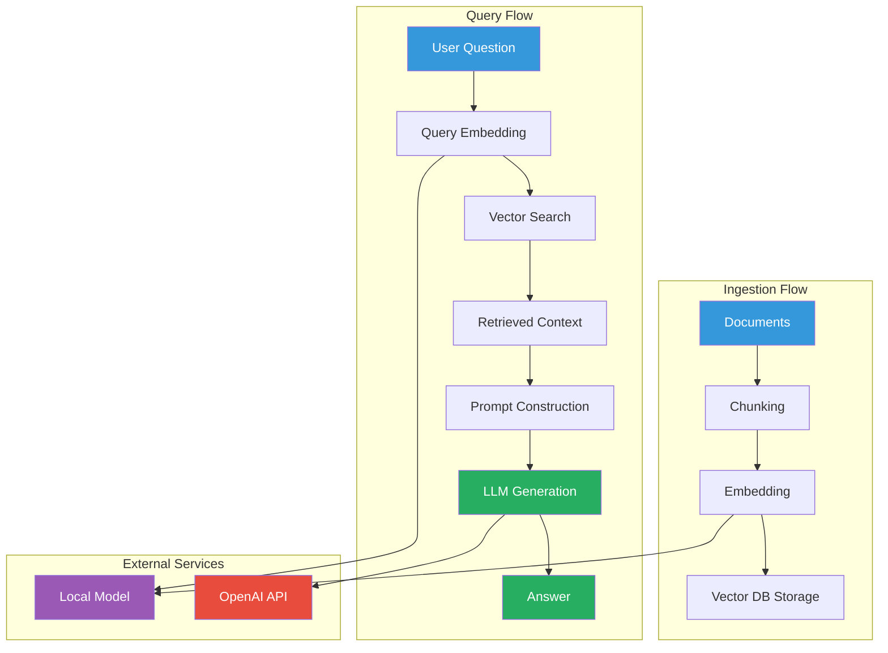

# High-Level Architecture

## System Overview



## Technology Stack

| Layer | Technology | Purpose |
|-------|-----------|---------|
| **Language** | Python 3.11 | Programming language |
| **Framework** | FastAPI | REST API server |
| **Dependency Mgmt** | Poetry | Package management |
| **LLM API** | OpenAI | Text generation |
| **Embeddings** | sentence-transformers | Local text-to-vector |
| **Vector DB** | Qdrant | Vector storage & search |
| **Documentation** | MkDocs + Material | Learning docs |
| **Containerization** | Docker | Deployment |
| **Orchestration** | Docker Compose | Multi-container setup |

## Architecture Patterns

### 1. Service Layer

Each major capability is a separate service:



### 2. Dependency Injection

Services are injected into the RAG pipeline:

```python
# app/rag/pipeline.py
class RAGPipeline:
    def __init__(self, llm_service, embedding_service, vector_db_service):
        self.llm = llm_service
        self.embedding_service = embedding_service
        self.vector_db = vector_db_service
```

### 3. API Layer Separation

API endpoints are thin — they delegate to services:

```python
# app/api/v1/rag.py
async def rag_query(request: RAGRequest) -> RAGResponse:
    return await rag_pipeline.query(request)  # Business logic in service layer
```

## Data Flow Overview



## Configuration Management

```python
# app/core/config.py
class Settings(BaseSettings):
    # All configuration comes from environment variables
    llm_model: str = "gpt-3.5-turbo"
    embedding_model: str = "all-MiniLM-L6-v2"
    qdrant_collection: str = "genai-documents"
    ...
```

The `.env` file provides environment-specific values:

```bash
# .env (copy from .env.example)
LLM_API_KEY=sk-...
LLM_MODEL=gpt-4
QDRANT_HOST=http://qdrant:6333
```

## Next Steps

- [Component Responsibilities](components.md)
- [Data Flow](data-flow.md)
- [API Documentation](api.md)
