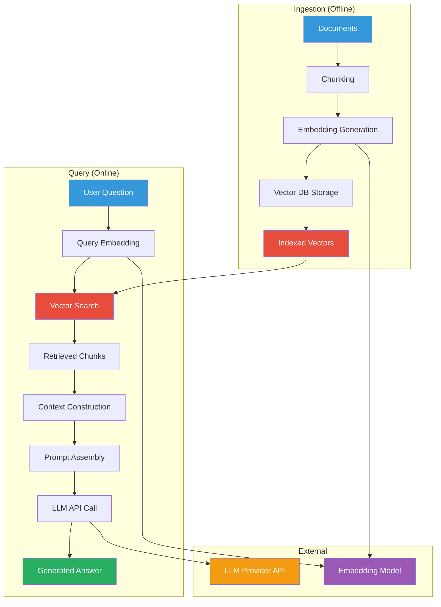
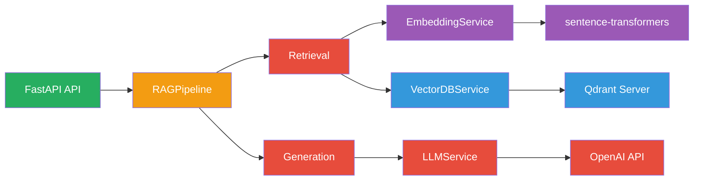
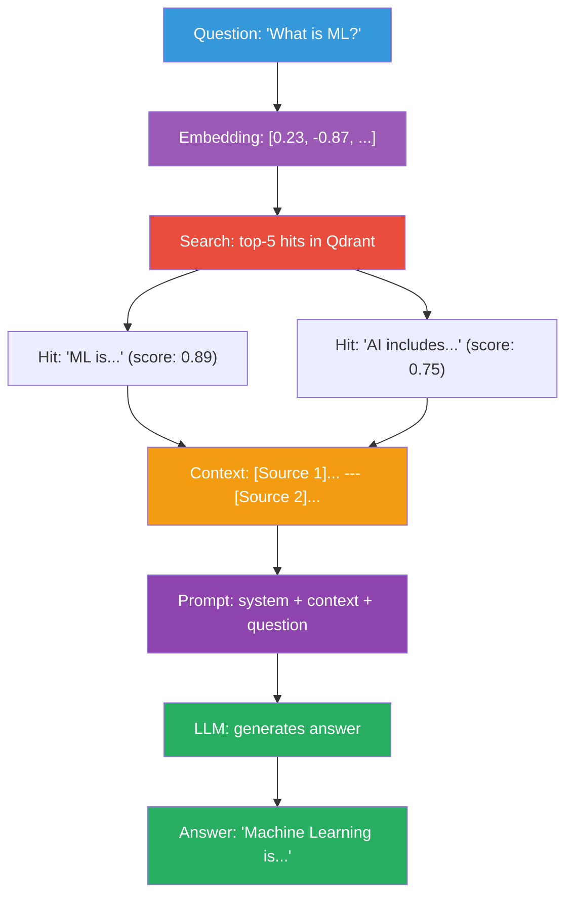
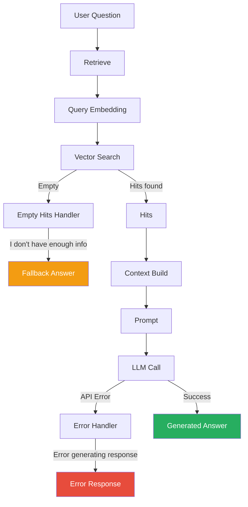

# RAG Flow: Retrieval and Generation

This page details the complete RAG pipeline as implemented in the codebase.

## Complete RAG Flow Diagram



## Code Walkthrough

### Entry Point: API Router

```python
# app/api/v1/rag.py
@router.post("/query", response_model=RAGResponse)
async def rag_query(request: RAGRequest) -> RAGResponse:
    """Full RAG pipeline: retrieve context + generate answer."""
    return await rag_pipeline.query(request)
```

### Step 1: Pipeline Orchestration

```python
# app/rag/pipeline.py
class RAGPipeline:
    async def query(self, request: RAGRequest) -> RAGResponse:
        # 1. Retrieve relevant context
        hits = await self.retrieve(
            question=request.question,
            top_k=request.top_k,
        )

        # 2. Generate answer using retrieved context
        response = await generate_answer(
            question=request.question,
            hits=hits,
            llm_service=self.llm,
            model=request.model,
            temperature=request.temperature,
        )

        return response
```

### Step 2: Retrieval

```python
# app/rag/retrieval.py
async def retrieve_context(
    question: str,
    vector_db_service,
    embedding_service,
    top_k: int | None = None,
) -> list[SearchHit]:
    # Embed the query
    query_embedding = await embedding_service.embed(question)

    # Search the vector database
    hits = await vector_db_service.search(
        query_vector=query_embedding,
        top_k=top_k or settings.rag_top_k,
    )

    return hits
```

### Step 3: Context Construction

```python
# app/rag/retrieval.py
def build_context(hits: list[SearchHit], max_chars: int = 3000) -> str:
    parts = []
    for i, hit in enumerate(hits):
        snippet = f"[Source {i + 1}] (score: {hit.score:.4f})\n{hit.text}"
        parts.append(snippet)
    return "\n---\n".join(parts)
```

### Step 4: Prompt Construction

```python
# app/rag/generation.py
messages = [
    ChatMessage(
        role=MessageRole.SYSTEM,
        content="You are a helpful assistant that answers questions "
                "based on the provided context. Do not make up facts."
    ),
    ChatMessage(
        role=MessageRole.USER,
        content=f"Context:\n{context}\n\nQuestion: {question}\n\nAnswer:"
    ),
]
```

### Step 5: LLM Generation

```python
# app/llm/service.py
response = await self.client.chat.completions.create(
    model=model,
    messages=messages,
    temperature=temperature,
    max_tokens=max_tokens,
)

return LLMResponse(
    id=response.id,
    model=response.model,
    content=response.choices[0].message.content,
    usage=response.usage.model_dump(),
)
```

## Component Interactions



## Data Structures

### Flow: Question to Answer



## Error Handling in the Flow



## Next Steps

- [Embedding Flow](embedding-flow.md)
- [Vector DB Interaction](vector-db-interaction.md)
- [Data Flow](data-flow.md)
