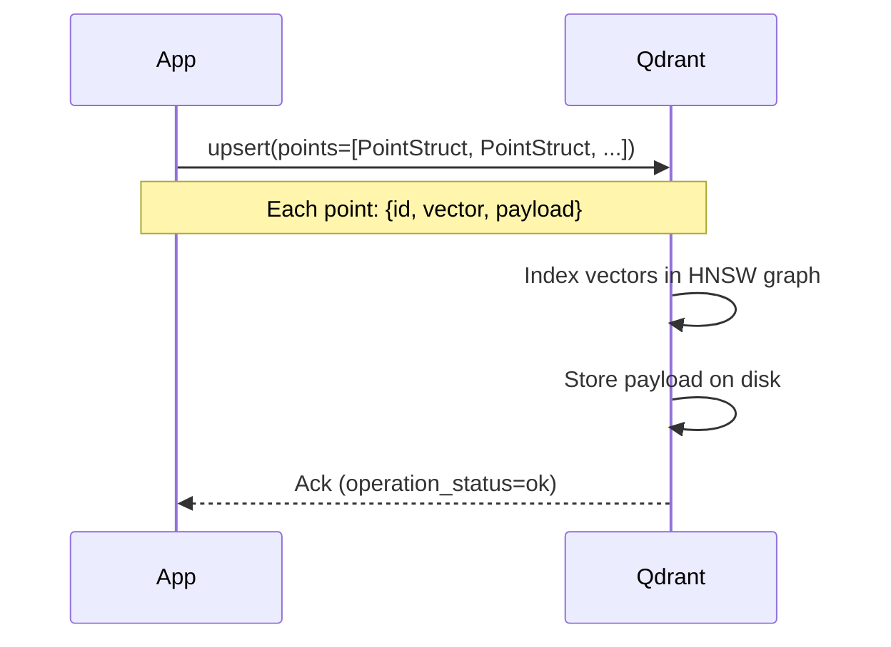

# Vector Database Interaction

This page details how the application interacts with Qdrant — the vector
database used in this POC.

## Connection

### Configuration

```python
# app/core/config.py
qdrant_host: str = "http://localhost:6333"
qdrant_collection: str = "genai-documents"
qdrant_distance: str = "cosine"
```

### Client Initialization

```python
# app/services/vectordb.py
class VectorDBService:
    @property
    def client(self) -> QdrantClient:
        if self._client is None:
            self._client = QdrantClient(url=settings.qdrant_host)
        return self._client
```

The client is lazily initialized — it connects on first use, not at startup.

## Collection Management

### Creating a Collection

```python
async def create_collection(self) -> None:
    try:
        # Check if collection exists
        self.client.get_collection(self._collection)
    except UnexpectedResponse:
        # Create with specified vector dimensions and distance metric
        self.client.recreate_collection(
            collection_name=self._collection,
            vectors_config=rest.VectorParams(
                size=settings.embedding_dimensions,  # 384 for all-MiniLM-L6-v2
                distance=self._distance(),  # Cosine in POC
            ),
        )
```

### What is a Collection?

A collection is like a table in a relational database — it holds vectors of
the same dimensionality and distance metric.

```mermaid
graph TD
    DB[Qdrant Server] --> C1[Collection: documents<br/>384-dim, cosine]
    DB --> C2[Collection: users<br/>768-dim, euclidean]
    DB --> C3[Collection: images<br/>512-dim, dot]

    C1 --> P1[Point: chunk_001]
    C1 --> P2[Point: chunk_002]
    C1 --> P3[Point: chunk_N...]
    C2 --> P4[Point: user_001]
    C3 --> P5[Point: img_001]

    style DB fill=#3498db,color=#fff
    style C1 fill=#e74c3c,color=#fff
    style C2 fill=#9b59b6,color=#fff
    style C3 fill=#27ae60,color=#fff
```

## Upserting Data

### The Upsert Operation

```python
async def upsert_chunks(self, chunks: list[Chunk], embeddings: list[list[float]]) -> int:
    points = []
    for chunk, vector in zip(chunks, embeddings):
        point_id = chunk.id if chunk.id else str(uuid.uuid4())
        payload = {
            "text": chunk.text,
            "document_id": chunk.document_id,
            "chunk_index": chunk.chunk_index,
            **chunk.metadata,
        }
        points.append(rest.PointStruct(
            id=point_id,
            vector=vector,
            payload=payload,
        ))

    self.client.upsert(
        collection_name=self._collection,
        points=points,
    )
```

### What Happens During Upsert



### Idempotent Updates

If a point with the same ID already exists, it's updated (hence "upsert").

## Search Operation

### The Search Call

```python
async def search(
    self,
    query_vector: list[float],
    top_k: int = 5,
    filter_condition: dict[str, Any] | None = None,
) -> list[SearchHit]:
    search_filter = None
    if filter_condition:
        search_filter = rest.Filter(
            must=[
                rest.FieldCondition(
                    key=key,
                    match=rest.MatchValue(any=[val] if isinstance(val, list) else [val]),
                )
                for key, val in filter_condition.items()
            ]
        )

    results = self.client.search(
        collection_name=self._collection,
        query_vector=query_vector,
        with_payload=True,
        with_vectors=False,
        limit=top_k,
        query_filter=search_filter,
    )

    hits = []
    for r in results:
        payload = r.payload or {}
        hits.append(SearchHit(
            id=r.id,
            score=r.score,
            text=payload.get("text", ""),
            metadata={k: v for k, v in payload.items() if k != "text"},
        ))
    return hits
```

### Search Flow

```mermaid
flowchart LR
    QV[Query Vector<br/>384-dim float] --> VDB[Vector DB]
    VDB --> Idx[HNSW Index]
    Idx --> NN[Nearest Neighbor Search]
    NN --> RS[Result Set]
    RS --> SC[Score + Sort]
    SC --> Filter[Metadata Filter]
    Filter --> TopK[Top-K Results]
    VDB --> Payload[Payload Lookup]
    Payload --> Final[SearchHit Objects]

    style QV fill=#3498db,color=#fff
    style Idx fill=#e74c3c,color=#fff
    style TopK fill=#27ae60,color=#fff
```

## HNSW Index Details

### What is HNSW?

Hierarchical Navigable Small World graph — Qdrant's default index type
for approximate nearest neighbor search.

### Index Construction

When vectors are upserted, Qdrant:

1. **Assigns layers**: Each vector is assigned random levels (like floors in a building)
2. **Connects neighbors**: At each layer, the vector is connected to its M nearest neighbors
3. **Higher layers = fewer connections**: Top layers have fewer vectors (sparse), bottom layer has all

### Search Process

1. **Enter at top layer**: Start at the entry point (a well-connected vector)
2. **Greedy descent**: At each layer, move to the neighbor closest to the query
3. **Descend**: Move to the next lower layer
4. **Bottom layer search**: At the bottom, do a more thorough local search
5. **Return results**: Top-K by distance

### HNSW Parameters

| Parameter | Default | Effect |
|-----------|---------|--------|
| `M` | 16 | Max connections per node. Higher = better recall, more memory |
| `ef_construct` | 100 | Build-time search scope. Higher = better graph, slower build |
| `ef` (search) | 100 | Query-time scope. Higher = better recall, slower search |

## Distance Metrics in Qdrant

### Configuration

```python
# app/services/vectordb.py
def _distance(self) -> rest.Distance:
    mapping = {
        "cosine": rest.Distance.COSINE,
        "euclid": rest.Distance.EUCLID,
        "dot": rest.Distance.DOT,
    }
    return mapping.get(settings.qdrant_distance, rest.Distance.COSINE)
```

### Metric Comparison

| Metric | Search Behavior | Use When |
|--------|----------------|----------|
| `COSINE` | Finds vectors pointing the same direction | Semantic search, text similarity |
| `EUCLID` | Finds vectors close in Euclidean space | Any, balanced |
| `DOT` | Finds vectors with high inner product | Speed-critical, unnormalized |

## Payload (Metadata) Storage

### Payload Structure

Each vector point can have an arbitrary JSON payload:

```python
payload = {
    "text": "The full text of the chunk",
    "document_id": "doc_001",
    "chunk_index": 0,
    "category": "AI",
    "source": "lecture_notes",
    "created_at": "2024-01-15T10:30:00Z",
}
```

### Indexing Payload Fields

Qdrant automatically indexes payload fields for filtering, but you can
optimize:

```python
# Create explicit indexes for frequently-filtered fields
client.create_payload_index(
    collection_name="my-docs",
    field_name="category",
    field_schema="keyword",  # Exact match for string filtering
)
```

## API Endpoints

### Ingest Endpoint

```bash
POST /api/v1/rag/ingest
```

Creates the collection (if needed), chunks documents, embeds, and stores.

### Search Endpoint

```bash
POST /api/v1/rag/search
```

Embeds the query, searches the vector DB, returns ranked results.

### Demo Endpoint

```bash
GET /api/v1/rag/demo?question=...
```

Shows retrieval results without calling the LLM.

## Next Steps

- [What is a Vector Database?](../vector-databases/what-is-vdb.md)
- [Vector Indexing](../vector-databases/indexing.md)
- [RAG Flow](rag-flow.md)
