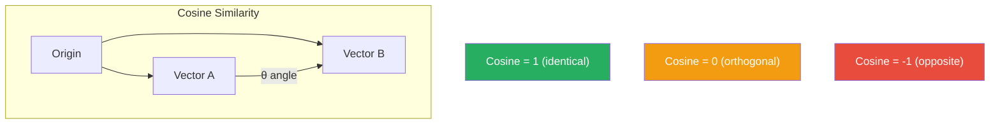
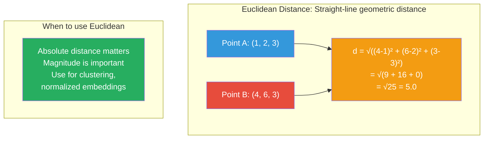
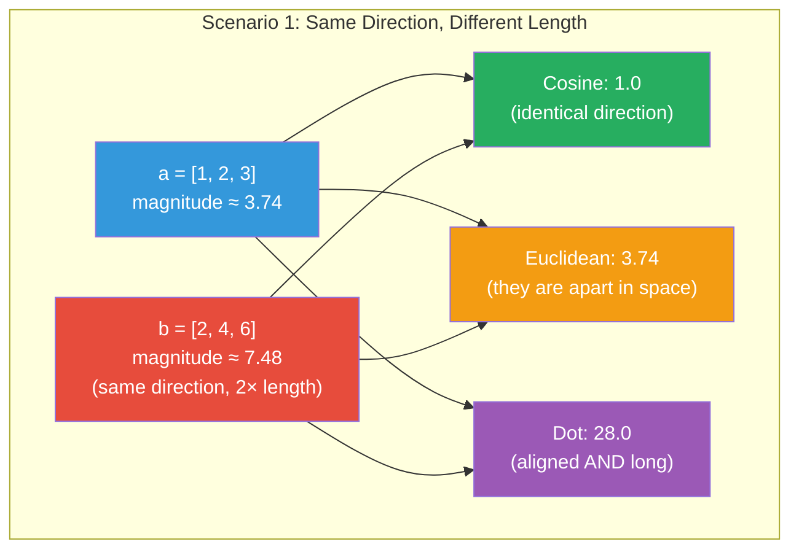
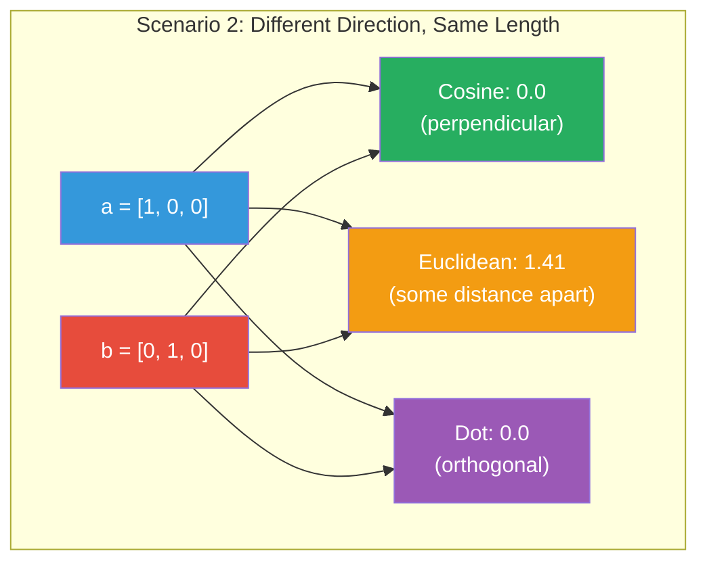

# Distance Metrics: Cosine, Euclidean, and Dot Product

When we represent text as vectors, we need a way to measure **how similar**
two vectors are. These measurements are called **distance metrics** or
**similarity metrics**.

## The Three Core Metrics

| Metric | What it measures | Range | Good for |
|--------|-----------------|-------|----------|
| **Cosine similarity** | Angle between vectors | [-1, 1] | Most embedding tasks |
| **Euclidean distance** | Straight-line distance | [0, ∞) | Clustering |
| **Dot product** | Inner product | (-∞, ∞) | Fast similarity search |

## Cosine Similarity

### What it measures

Cosine similarity measures the **angle** between two vectors, ignoring their magnitude.

```mermaid
graph TD
    subgraph "Cosine Similarity: Angle-based comparison"
        DOCA["Doc A: \"The cat sat on the mat.\"<br/>→ vector a"]
        DCB["Doc B: \"A feline sat on a mat by the door.\"<br/>→ vector b"]
        ANGLE["Angle θ between vectors a and b<br/>cos(θ) = (a · b) / (||a|| × ||b||)"]

        DOCA --> ANGLE
        DCB --> ANGLE
    end

    subgraph "Key Insight"
        NOSCALE["Magnitude doesn't matter<br/>Only direction (angle) is compared<br/>Two docs of different lengths<br/>can still be semantically identical"]
    end

    style DOCA fill:#3498db,color:#fff
    style DCB fill:#3498db,color:#fff
    style ANGLE fill:#e74c3c,color:#fff
    style NOSCALE fill:#27ae60,color:#fff
```

### Formula

```
cos(θ) = (a · b) / (||a|| × ||b||)
```

Where:
- `a · b` = dot product of a and b
- `||a||` = magnitude (length) of vector a

### Intuition



- **cos = 1.0**: Vectors point in the same direction (identical)
- **cos = 0.0**: Vectors are perpendicular (unrelated)
- **cos = -1.0**: Vectors point in opposite directions (opposite)

### Why Cosine is Default

Cosine similarity is the default for most vector databases because:

1. **Magnitude-invariant**: Two documents of different lengths can still be
   similar in meaning
   ```mermaid
   flowchart LR
       DA["Doc A (10 words): \"The cat sat.\"<br/>→ vector [0.5, 0.3, ...]"]
       DB["Doc B (100 words): \"The cat sat...\" × 10<br/>→ vector [5.0, 3.0, ...]"]
       COMP["Cosine similarity<br/>ignores magnitude difference<br/>compares only direction<br/>cos(θ) = same → similar"]
       DA --> COMP
       DB --> COMP

       style DA fill:#3498db,color:#fff
       style DB fill:#e74c3c,color:#fff
       style COMP fill:#27ae60,color:#fff
   ```

2. **Intuitive interpretation**: Scores between -1 and 1 are easy to understand
3. **Widely supported**: All vector databases support cosine search

### Example

```python
from sklearn.metrics.pairwise import cosine_similarity
import numpy as np

a = np.array([1, 2, 3])
b = np.array([2, 4, 6])  # Same direction, 2x magnitude

similarity = cosine_similarity([a], [b])[0][0]
print(f"Cosine similarity: {similarity:.4f}")  # ≈ 1.0 (same direction)
```

## Euclidean Distance (L2 Distance)

### What it measures

Euclidean distance is the **straight-line distance** between two points in space.

### Formula

```
d(a, b) = √(Σ(aᵢ - bᵢ)²)
```

### Intuition



### When to use Euclidean

- **Clustering**: Where absolute distance in space matters
- **Normalized embeddings**: If all vectors have the same magnitude, cosine
  and Euclidean give equivalent rankings
- **Geometric interpretation**: You care about actual distance, not direction

### Example

```python
from sklearn.metrics import euclidean_distances
import numpy as np

a = np.array([[1, 2, 3]])
b = np.array([[4, 6, 3]])

dist = euclidean_distances(a, b)[0][0]
print(f"Euclidean distance: {dist:.4f}")  # 5.0
```

## Dot Product

### What it measures

The dot product is the **inner product** of two vectors:

```
a · b = Σ(aᵢ × bᵢ)
```

### Intuition

Dot product combines **both magnitude and direction**:

- High dot product = vectors are aligned AND long
- Low dot product = vectors are orthogonal or short

### When to use Dot Product

- **Fast similarity search**: Dot product can be computed faster than cosine
  (no division by norms)
- **ANN search**: Many vector databases use dot product internally for
  approximate search efficiency
- **Normalized embeddings**: If vectors are pre-normalized (magnitude = 1),
  dot product equals cosine similarity

### Example

```python
import numpy as np

a = np.array([1, 2, 3])
b = np.array([4, 5, 6])

dot = np.dot(a, b)  # 1×4 + 2×5 + 3×6 = 32
print(f"Dot product: {dot}")
```

## Comparison

### Scenario 1: Same Direction, Different Length



### Scenario 2: Different Direction, Same Length



## In Our POC

The embedding service computes all three metrics:

```python
# app/embeddings/service.py
def cosine_similarity(vec_a, vec_b) -> float:
    a, b = np.array(vec_a), np.array(vec_b)
    return float(np.dot(a, b) / (np.linalg.norm(a) * np.linalg.norm(b)))

def euclidean_distance(vec_a, vec_b) -> float:
    a, b = np.array(vec_a), np.array(vec_b)
    return float(np.linalg.norm(a - b))

def dot_product(vec_a, vec_b) -> float:
    return float(np.dot(np.array(vec_a), np.array(vec_b)))
```

### API Endpoint

```bash
# Compare two texts
curl -X POST http://localhost:8000/api/v1/embeddings/similarity \
  -H "Content-Type: application/json" \
  -d '{
    "text_a": "A happy dog playfully runs through the park",
    "text_b": "A joyful canine dashes across the field"
  }'

# Response:
# {"cosine": 0.89, "euclidean": 1.12, "dot_product": 84.3}
```

## Choosing a Metric

| Use Case | Recommended Metric | Why |
|----------|--------------------|-----|
| Semantic search | Cosine | Direction over magnitude |
| Clustering | Euclidean | Actual geometric distance |
| ANN search | Dot product | Computationally efficient |
| Duplicate detection | Cosine | Finds similar regardless of length |
| Embedding visualization | Cosine | 2D/3D projections by angle |

## Next Steps

- [Embedding Models](models.md) — Different models produce different quality vectors
- [Python Examples](python-examples.md) — Try these metrics with real embeddings
