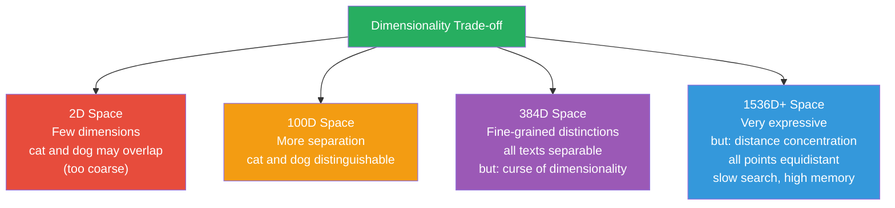
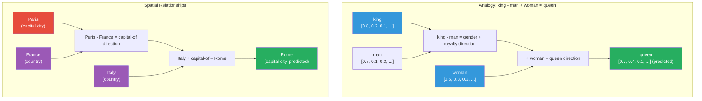

# What are Embeddings?

## The Core Problem

Computers understand **numbers**, not words. To use text with machine learning
algorithms, we need to convert words and sentences into **vector representations** —
lists of numbers.

But not just any numbers — the numbers must capture **semantic meaning**.

## What is an Embedding?

An **embedding** is a dense vector of floating-point numbers that represents
the semantic meaning of a piece of text.

### From Text to Vector

```
"Hello" → [0.23, -0.87, 0.45, 0.12, ...]  (384 numbers)
"World" → [-0.34, 0.91, 0.02, 0.67, ...]
```

The key property: **semantically similar texts produce similar vectors**.

```mermaid
graph TD
    subgraph "Semantic Similarity in Embedding Space"
        Good["\"Good\"<br/>[0.5, 0.3, -0.1, 0.8, ...]"]
        Great["\"Great\"<br/>[0.6, 0.4, -0.2, 0.7, ...]"]
        Close["→ Close together<br/>(small distance)"]
        Good --> Close
        Great --> Close

        Apple["\"Apple\"<br/>[0.1, -0.5, 0.9, -0.3, ...]"]
        Car["\"Car\"<br/>[-0.8, 0.2, 0.1, 0.7, ...]"]
        Far["→ Far apart<br/>(large distance)"]
        Apple --> Far
        Car --> Far
    end

    style Good fill:#3498db,color:#fff
    style Great fill:#3498db,color:#fff
    style Close fill:#27ae60,color:#fff
    style Apple fill:#e74c3c,color:#fff
    style Car fill:#e74c3c,color:#fff
    style Far fill:#e74c3c,color:#fff
```

## Why Embeddings Are Required

### The Bag-of-Words Problem

Traditional text representations (like TF-IDF) create **sparse** vectors:

```mermaid
graph LR
    V["Vocabulary: 10,000 words<br/>(cat, dog, car, tree, ...)"] --> ENC["One-hot / Count Encoding<br/>Each word = one dimension"]
    ENC --> VEC["\"cat sat on the mat\" → [1, 0, 0, 0, 1, 0, ...]<br/>(384-dim sparse vector,<br/>99%+ zeros"]

    VEC --> P1["Problem: High dimensionality<br/>→ 10,000+ dimensions"]
    VEC --> P2["Problem: No semantic similarity<br/>\"cat\" and \"dog\" are as distant<br/>as \"cat\" and \"car\""]
    VEC --> P3["Problem: Memory-inefficient<br/>→ Mostly zeros, no information"]

    style V fill:#3498db,color:#fff
    style ENC fill:#9b59b6,color:#fff
    style VEC fill:#e74c3c,color:#fff
    style P1 fill:#f39c12,color:#fff
    style P2 fill:#f39c12,color:#fff
    style P3 fill:#f39c12,color:#fff
```

Problems:
- **High dimensionality** — one dimension per word (10,000+ dimensions)
- **No semantic similarity** — "cat" and "dog" are as distant as "cat" and "car"
- **Memory-inefficient** — mostly zeros

### Dense Embeddings Solve This

```mermaid
graph LR
    subgraph "Dense Embeddings"
        CAT["\"cat sat on the mat\"<br/>→ [0.23, -0.87, 0.45, 0.12, 0.66, ...]<br/>(384-dim dense vector)"]
        DOG["\"dog sat on the rug\"<br/>→ [0.25, -0.85, 0.48, 0.14, 0.64, ...]<br/>(384-dim dense vector)"]
        SIM["→ Very similar!<br/>Small distance in vector space"]
        CAT --> SIM
        DOG --> SIM
    end

    subgraph "Key Properties"
        LOW["Low dimensionality<br/>typically 256–1536 dimensions"]
        SEM["Semantic similarity<br/>similar meanings → nearby vectors"]
        COMP["Compact<br/>all values are meaningful, no zeros"]
    end

    subgraph "Trade-offs"
        TRADE["Curse of dimensionality:<br/>More dimensions ≠ always better<br/>Distance concentration at high D"]
    end

    CAT --> LOW
    DOG --> SEM
    SIM --> COMP

    style CAT fill:#3498db,color:#fff
    style DOG fill:#3498db,color:#fff
    style SIM fill:#27ae60,color:#fff
    style LOW fill:#9b59b6,color:#fff
    style SEM fill:#9b59b6,color:#fff
    style COMP fill:#9b59b6,color:#fff
    style TRADE fill:#f39c12,color:#fff
```

Dense embeddings:
- **Low dimensionality** (typically 256-1536 dimensions)
- **Semantic similarity** — similar meanings → nearby vectors
- **Compact** — all values are meaningful

## How Text Is Converted Into Embeddings

### The Process


### Step-by-Step

1. **Tokenization**: Split text into subword tokens
   ```python
   "Hello world" → ["Hello", "world"] → [1542, 1234]  # Token IDs
   ```

2. **Embedding lookup**: Map each token ID to a vector
   ```python
   Token "Hello" (ID 1542) → [0.1, 0.5, -0.3, ...]  (first vector)
   Token "world" (ID 1234) → [0.2, -0.1, 0.8, ...]  (second vector)
   ```

3. **Transformer processing**: Each token's vector is updated by attending to
   all other tokens
   ```python
   "Hello" (context-aware) → [0.3, 0.4, -0.2, ...]  # Now knows "world" is nearby
   "world" (context-aware)   → [0.1, -0.2, 0.7, ...]  # Now knows "Hello" is nearby
   ```

4. **Pooling**: Combine token vectors into a single sentence/document vector
   ```python
   Mean pooling: [0.2, 0.1, 0.25, ...]  # Average of all token vectors
   ```

## Embedding Dimensions

The **dimensionality** is the number of values in the vector:

| Model | Dimensions | Notes |
|-------|-----------|-------|
| all-MiniLM-L6-v2 | 384 | Lightweight, fast |
| text-embedding-3-small | 1536 | Balanced quality |
| text-embedding-3-large | 3072 | High quality |
| OpenAI ada-002 | 1536 | Older model |

### Why Dimensionality Matters



### Practical Guidance

| Dimensions | Use Case |
|-----------|----------|
| 64-128 | Very fast, low-memory, basic similarity |
| 256-512 | Good balance of speed and quality |
| 768-1536 | High quality, standard for most apps |
| 3072+ | Maximum quality, expensive |

The **curse of dimensionality**: as dimensions grow, distances between random
points become more uniform — making similarity harder to distinguish. This is
why not "more is always better."

## Semantic Meaning

Embeddings capture **semantic relationships**:



These relationships emerge because semantically related concepts
end up near each other in the embedding space.

## When Are Embeddings Useful?

| Task | Why Embeddings? |
|------|----------------|
| Semantic search | Find by meaning, not keywords |
| Clustering | Group similar documents |
| Recommendation | "Find things similar to this" |
| Classification | Feed into ML models |
| RAG | Connect queries to relevant documents |
| Anomaly detection | Find outliers in semantic space |

## In Our POC

The embedding service converts text to vectors:

```python
# app/embeddings/service.py
async def embed(self, text: str) -> list[float]:
    return await self.backend.embed(text)  # Returns 384-dim vector
```

The RAG pipeline uses embeddings to:
1. Encode documents during ingestion
2. Encode queries during retrieval
3. Find the most similar documents via vector search

## Next Steps

- [Distance Metrics](distance-metrics.md) — How to measure vector similarity
- [Embedding Models](models.md) — Different models and their tradeoffs
- [Python Examples](python-examples.md) — Hands-on code
