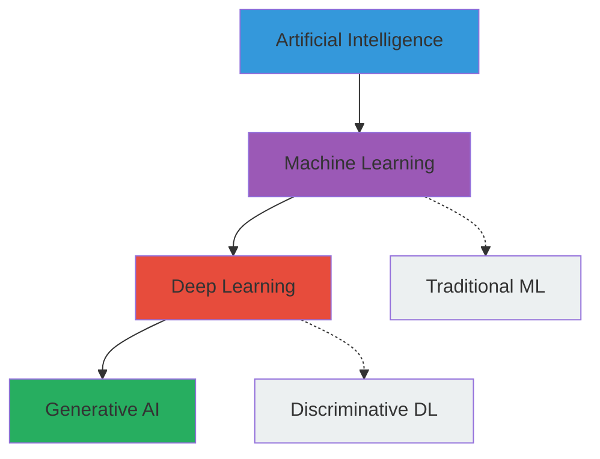

# What is Generative AI?

## Traditional AI vs. Generative AI

**Traditional (Predictive) AI** makes decisions and predictions:

| Task | What it does | Output |
|------|-------------|--------|
| Classification | "Is this email spam?" | Spam / Not spam |
| Regression | "What will the price be?" | A number |
| Clustering | "Group these customers" | Cluster labels |

Traditional AI maps inputs to **known categories or values**. It works within
boundaries defined by training data.

**Generative AI** creates new content:

| Task | What it does | Output |
|------|-------------|--------|
| Text generation | "Write a poem" | Original text |
| Image synthesis | "A cat riding a skateboard" | A new image |
| Code generation | "Write a Python function" | New code |
| Audio generation | "Compose a melody" | Music |

Generative AI maps inputs to **new, original outputs** that were not explicitly
in the training data.

## The Core Idea

Generative models learn the **probability distribution** of their training data.
Once trained, they can sample from that distribution to produce new examples
that look like they came from the same source.

For text: they learn "what words/characters are likely to come next given this
context?" and use that to generate coherent responses.

## Machine Learning vs. Deep Learning vs. Generative AI

- **Machine Learning**: Algorithms that learn patterns from data (e.g., linear
  regression, random forests). You often engineer features manually.

- **Deep Learning**: Neural networks with many layers. Features are learned
  automatically from raw data. Excels at unstructured data (images, text, audio).

- **Generative AI**: A subfield that *creates* new content — uses deep learning
  architectures (transformers, diffusion models) to generate text, images, code,
  audio, and more.

## Key Characteristics of Generative AI

### 1. Creativity
Can produce novel content, not just classify or predict.

### 2. Open-endedness
Given a prompt, can generate diverse outputs — there's no single "correct" answer.

### 3. Unpredictability
Outputs can vary; quality isn't guaranteed. Prompts and parameters matter.

### 4. Scale-Driven
Modern generative models require massive datasets and compute. "More data +
more parameters + more compute" has been the consistent scaling trend.

## How Generative AI Works (High Level)

1. **Training**: Feed massive amounts of text/images to a neural network.
   The network learns patterns — grammar, facts, styles, relationships.

2. **Inference**: Give the network a prompt. It generates a response token by
   token, sampling from its learned probability distribution.

## Generative Models by Modality

| Modality | Model Type | Examples |
|----------|-----------|----------|
| Text | Autoregressive / Encoder-Decoder | GPT, Claude, Llama |
| Images | Diffusion / GAN | DALL·E, Midjourney, Stable Diffusion |
| Audio | Diffusion / Autoregressive | Whisper, GPT-4o, Suno |
| Multimodal | Transformer (multi-encoder) | GPT-4V, Gemini |
| Code | Transformer (trained on code) | Codex, CodeLlama |

## Why This Matters Now

- **Transformer architecture** (2017) enabled efficient parallel training at scale
- **Scaling laws** showed predictable improvement with more data/compute/parameters
- **Emergent abilities** appear at certain scales — reasoning, in-context learning
- **API access** means developers can use powerful models without owning the infrastructure

## Next Steps

- Read about [Large Language Models](llms.md) — the engine behind most GenAI apps
- Explore the [Transformer architecture](transformers.md) — the technical foundation
- Jump to [Prompt Engineering](../prompting/what-is-a-prompt.md) — how you steer models
