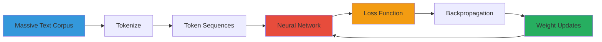
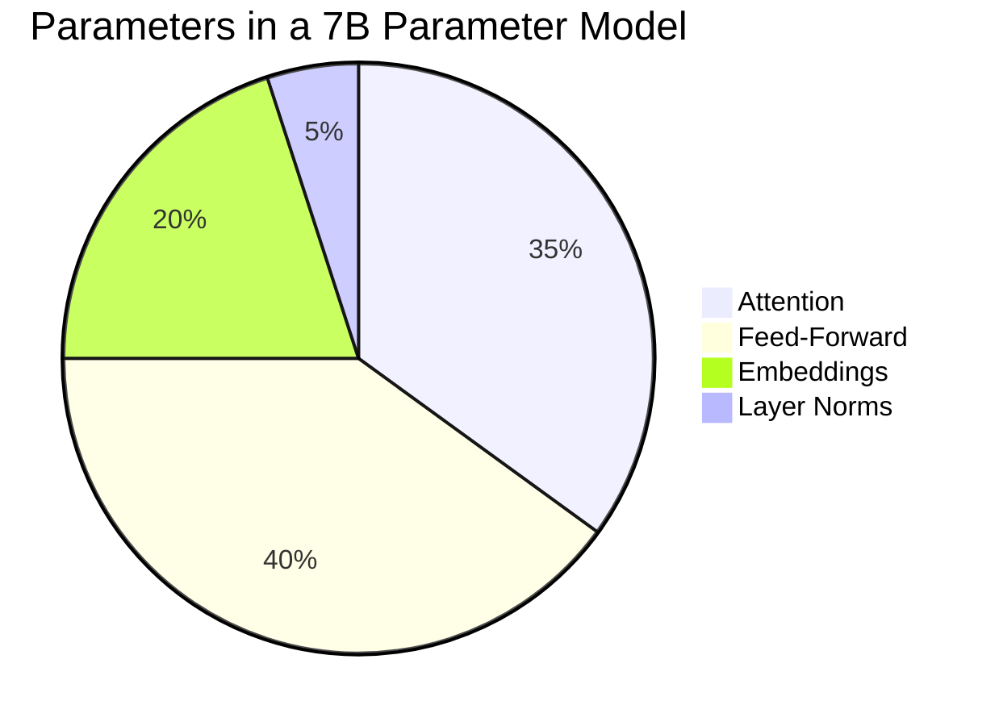

# Large Language Models (LLMs)

## What is an LLM?

A **Large Language Model** is a deep neural network trained on massive amounts
of text to predict the next token (word, subword, or character) in a sequence.

The "large" refers to:
- **Billions (or more) of parameters**
- **Trillions of training tokens**
- **Broad generalization** across tasks

## How LLMs Work (High Level)

### Training: Learn to Predict

During training, the model sees billions of text sequences and learns to
predict the next token given the preceding context:

```mermaid
flowchart LR
    Inp["Input: \"The capital of France is\""] --> Tok["Tokenizer<br/>Splits into subword tokens"]
    Tok --> EmbIn["Token IDs<br/>[1024, 2003, 4331, ...]"]
    EmbIn --> Model["Neural Network<br/>(Transformer layers)"]
    Model --> Dist["Probability Distribution<br/>over vocabulary"]
    Dist --> Target["Target: \"Paris\"<br/>(Most probable next token)"]

    Style1["The model predicts the next token<br/>by learning statistical relationships"]
    Dist --> Style1

    style Inp fill:#3498db,color:#fff
    style Model fill:#e74c3c,color:#fff
    style Target fill:#27ae60,color:#fff
```

The model doesn't memorize facts — it learns the **statistical relationships**
between tokens. "Paris" is the most probable token after "The capital of France is"
because it appeared frequently in that context during training.

### The Training Process



1. **Data collection**: Web pages, books, articles, code repositories
2. **Tokenization**: Split text into tokens (subwords)
3. **Forward pass**: Model processes a sequence, producing probability distributions
4. **Loss computation**: Compare predictions to actual next tokens (cross-entropy)
5. **Backpropagation**: Compute gradients — which direction each weight should move
6. **Weight update**: Adjust weights using gradient descent
7. Repeat billions of times

## Parameters

**Parameters** are the learnable weights in a neural network. They are what
the model "memorizes" during training.



### Why More Parameters?

| Model | Parameters | What it can do |
|-------|-----------|----------------|
| 125M | ~125 million | Basic text completion |
| 1.3B | ~1.3 billion | Coherent sentences |
| 7B | ~7 billion | Essay-length responses |
| 70B | ~70 billion | Complex reasoning |
| 1T+ | ~1 trillion+ | Near-human performance |

More parameters = more capacity to learn complex patterns. But it's not linear —
**emergent abilities** appear at certain scales (reasoning, coding, in-context learning).

## Tokens

A **token** is a unit of text that the model processes. The tokenizer splits text
into tokens:

```python
# Example tokenization (conceptual)
text = "Hello, world!"
# → ["Hello", ",", " world", "!"]  (4 tokens)
```

### Token Approximation

As a rough rule:
- 1 token ≈ 4 characters of text (English)
- 1 token ≈ ¾ of a word
- 100 tokens ≈ 75 words ≈ 450 characters

### Token Limits (Context Windows)

Every model has a **context window** — the maximum number of tokens it can
process at once:

| Model | Context Window |
|-------|---------------|
| GPT-3.5 | 16,385 tokens |
| GPT-4 | 8,192 — 128,000 tokens |
| Claude 3 | 200,000 tokens |
| Llama 3 | 8,000 tokens (standard) |
| Google Gemini | 1,000,000+ tokens |

If your input + output exceeds the context window, the oldest tokens are truncated
(unless using techniques like attention sink or chunking).

## Model Parameters (Controllable)

When calling an LLM, you can control its behavior:

### Temperature

Controls randomness. Lower = more deterministic, higher = more creative.

| Temperature | Behavior |
|-------------|----------|
| 0.0 | Always picks the most likely token (deterministic) |
| 0.7 | Balanced creativity and coherence |
| 1.0+ | More random, surprising outputs |

### Top-p (Nucleus Sampling)

Restricts sampling to the top-p probability mass. For example, top_p=0.9 means
the model only considers tokens that together account for 90% of the probability
mass.

### Max Tokens

The maximum number of tokens the model can generate in its response.

### Examples in Code

```python
response = await client.chat.completions.create(
    model="gpt-3.5-turbo",
    messages=[{"role": "user", "content": "Write a haiku about autumn"}],
    temperature=0.9,      # Creative
    top_p=0.9,            # Consider top 90% of probability mass
    max_tokens=50,        # Short response
)
```

In our POC, these parameters are exposed via the [LLM API](../architecture/api.md):

```python
from app.models.schemas import LLMRequest, ChatMessage

request = LLMRequest(
    messages=[
        ChatMessage(role="system", content="You are a helpful assistant."),
        ChatMessage(role="user", content="Explain quantum computing."),
    ],
    temperature=0.5,
    max_tokens=256,
    top_p=0.9,
)
```

## Training vs. Inference

| Phase | Description | Resource Need | Occurs |
|-------|-------------|--------------|--------|
| **Training** | Adjusting model weights on massive data | Massive GPU clusters, weeks | Rare (once per model) |
| **Inference** | Running the trained model to generate output | Single GPU or CPU | Every time you use the model |

Training is expensive and done once. Inference is what users pay for via APIs.

### Pre-training

Training on a general dataset (web text, books, code) — produces a model that
"knows" general language patterns and facts.

### Fine-tuning

Further training on a specific dataset to adapt the model for a domain
(e.g., medical text, legal documents).

### Instruction Tuning

Fine-tuning where the model learns to follow instructions — the dataset
contains input-output pairs formatted as instructions.

## Key Takeaways

1. **LLMs are statistical pattern matchers** trained on vast text corpora
2. **Parameters** are the model's learned knowledge — more is generally better
3. **Tokens** are the units of computation — the context window limits how much
   the model can see at once
4. **Temperature and top_p** control the creativity vs. determinism tradeoff
5. LLMs don't "know" facts — they "predict" probable token sequences

## Next Steps

- Learn about the [Transformer architecture](transformers.md)
- Explore [Prompt Engineering](../prompting/what-is-a-prompt.md)
- See the [API documentation](../architecture/api.md) for how our POC calls LLMs
