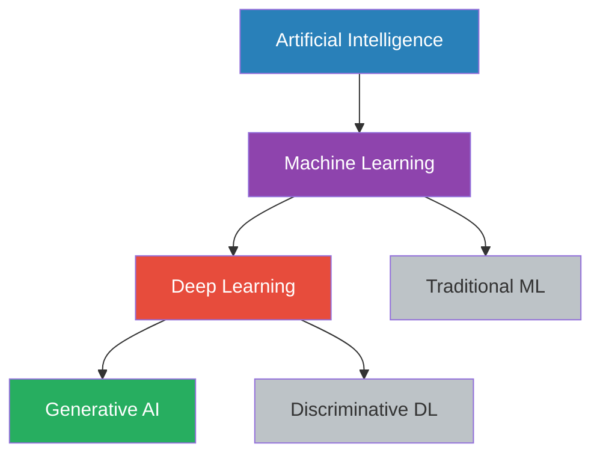
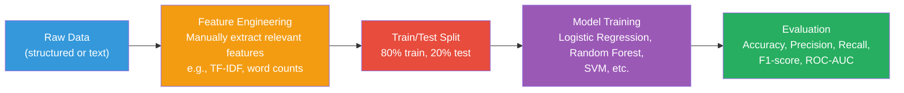
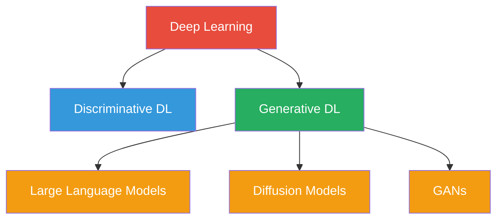

# ML vs. Deep Learning vs. Generative AI

## The Hierarchy



## Artificial Intelligence (AI)

The broadest field — machines performing tasks that, if done by humans,
would require intelligence. Encompasses everything from chess engines to
self-driving cars.

## Machine Learning (ML)

A subset of AI where algorithms learn patterns from data rather than
following explicit rules.

### Traditional ML Workflow



**Feature engineering** is key — you must manually design what information
the model sees. Examples:

- Logistic Regression: You choose which columns to use
- Random Forest: You decide how to split the data

**Strengths**: Works well on small datasets, interpretable, fast to train.
**Limitations**: Requires domain expertise for feature engineering, struggles
with unstructured data (raw text, pixels).

### Example: Traditional ML Pipeline

```python
from sklearn.feature_extraction.text import TfidfVectorizer
from sklearn.linear_model import LogisticRegression

# Text → numerical features (TF-IDF)
vectorizer = TfidfVectorizer(max_features=1000)
X = vectorizer.fit_transform(documents)

# Train a classifier
classifier = LogisticRegression()
classifier.fit(X_train, y_train)
```

## Deep Learning

A subset of ML using **neural networks with many layers** (hence "deep").
The key advantage: **automatic feature learning**.

### How Deep Learning Differs

| Aspect | Traditional ML | Deep Learning |
|--------|---------------|--------------|
| Feature Engineering | Manual | Automatic (learned from data) |
| Data Needed | Small datasets | Large datasets |
| Compute | CPU-friendly | GPU-intensive |
| Interpretability | High | Low (black box) |
| Data Type | Structured/tabular | Unstructured (text, images, audio) |

### Neural Network Basics


- **Input layer**: receives raw data (e.g., pixels of an image)
- **Hidden layers**: each layer transforms the input, learning progressively more
  abstract features
- **Output layer**: produces the final prediction

Each connection between neurons has a **weight** that the network adjusts during
training. The network learns by minimizing a loss function (gradient descent).

### Example: Deep Learning for Text

```python
import torch
import torch.nn as nn

class TextClassifier(nn.Module):
    def __init__(self, vocab_size, embed_dim, hidden_dim, num_classes):
        super().__init__()
        self.embedding = nn.Embedding(vocab_size, embed_dim)
        self.lstm = nn.LSTM(embed_dim, hidden_dim, batch_first=True)
        self.fc = nn.Linear(hidden_dim, num_classes)

    def forward(self, x):
        embedded = self.embedding(x)
        lstm_out, _ = self.lstm(embedded)
        return self.fc(lstm_out[:, -1, :])
```

## Generative AI as a Subset

Generative AI **sits on top of** deep learning:



### Discriminative vs. Generative (Deep Learning)

- **Discriminative models** learn the boundary between classes.
  They answer: *"Given these features, which class does this belong to?"*
  - Image classification
  - Sentiment analysis

- **Generative models** learn how the data was generated.
  They answer: *"How would a sample from this class look?"*
  - Text generation
  - Image synthesis
  - Music composition

### Generative AI Techniques

| Technique | How It Works | Examples |
|----------|-------------|----------|
| Autoregressive | Predict next token iteratively | GPT, Llama |
| Autoencoder | Compress then reconstruct | VAEs |
| Diffusion | Gradually add then remove noise | DALL·E 2, Stable Diffusion |
| GAN | Generator vs. discriminator competition | StyleGAN |
| Flow-based | Learn invertible transformations | Glow |

## The Scaling Perspective

Generative AI's recent breakthrough wasn't a new algorithm — it was **scale**:

| Model | Year | Parameters | Data | Notable Capability |
|-------|------|-----------|------|-------------------|
| GPT-1 | 2018 | 117M | 4M web pages | Basic text generation |
| GPT-2 | 2019 | 1.5B | 40GB web text | Coherent paragraphs |
| GPT-3 | 2020 | 175B | 300B tokens | Few-shot learning |
| GPT-4 | 2023 | ~1.8T* | Trillion+ tokens | Complex reasoning |

\* Parameter count for GPT-4 is estimated.

## Practical Takeaway

When building the GenAI POC in this project:

- We use **deep learning** (transformer models) as the engine
- We focus on **generative** capabilities (text generation, embeddings)
- We use **traditional ML** techniques (TF-IDF, similarity metrics) alongside
  for comparison and understanding

The code is structured so you can see both the deep learning components
(LLM, embeddings) and the classical ML components (similarity computation),
making the relationships clear.
