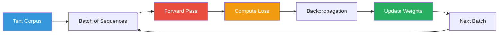
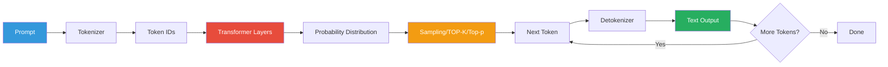

# Training vs. Inference

Large Language Models go through two distinct phases:

## Training

Training is the process of **building** the model — adjusting its parameters
to learn patterns from data.

### The Training Loop

### What Happens During Training

1. **Input**: A batch of token sequences from a massive corpus (web text, books, code)
2. **Forward pass**: The model predicts the next token for each position
3. **Loss computation**: Cross-entropy loss compares predictions vs. actual next tokens
4. **Backpropagation**: Gradients tell us how to change each weight
5. **Weight update**: Optimizer (e.g., AdamW) adjusts weights slightly

This process runs for **billions of iterations** on specialized hardware (GPUs/TPUs).

### Training Costs

| Model | Compute (GPU hours) | Cost Estimate |
|-------|-------------------|---------------|
| GPT-3 (175B) | ~36,000 A100-GPU hours | $4-12 million |
| Llama 2 (70B) | ~1,800 A100-GPU hours | ~$200,000 |
| A small 7B model | ~12,000 GPU hours | ~$10,000 |

### Why You Usually Don't Train

Training LLMs requires:
- Massive datasets (terabytes of text)
- Expensive hardware (hundreds of GPUs)
- Weeks of compute time
- ML expertise

Instead, most developers **use pre-trained models** via APIs or local inference.

## Inference

Inference is the process of **using** a trained model — feeding it input and
getting output.

### The Inference Loop

### Key Differences

| Aspect | Training | Inference |
|--------|----------|-----------|
| **Purpose** | Build the model | Use the model |
| **Compute** | Massive (cluster, weeks) | On-demand (single GPU/CPU) |
| **Data** | Terabytes of text | One prompt at a time |
| **Cost** | Millions of dollars | Per-token API cost |
| **Frequency** | Once per model | Millions of times |
| **Speed** | Can be slow (parallel) | Should be fast |

### Inference Optimization

Modern inference uses many optimization techniques:

- **Quantization**: Reduce model precision (FP32 → INT8) to save memory
- **KV caching**: Cache attention keys/values to avoid recomputation
- **Speculative decoding**: Use a smaller model to guess tokens, then verify
- **Model distillation**: Train a smaller "student" model to mimic a larger one

## Where Our POC Fits

This POC focuses entirely on **inference** — it uses pre-trained models to:

1. Generate text (via OpenAI LLM API)
2. Create embeddings (via sentence-transformers)

It does **not** train any models. This reflects the typical developer experience:
you use pre-trained models, you don't build them from scratch.

### Training Methods (Reference)

There are three main ways to get a model that does what you want:

1. **Pre-training**: Train from scratch on a massive, general dataset
2. **Fine-tuning**: Start with a pre-trained model and continue training on
   a smaller, domain-specific dataset
3. **Instruction tuning**: Fine-tune on instruction-response pairs so the model
   learns to follow prompts better

The fourth approach used in our POC is no training at all — just **prompting**
the pre-trained model directly, which is why prompt engineering matters so much.

## Next Steps

- Read about [Training Methods](training-methods.md) for more on fine-tuning and RLHF
- Learn about [Prompt Engineering](../prompting/what-is-a-prompt.md) — how to steer
  pre-trained models without retraining
