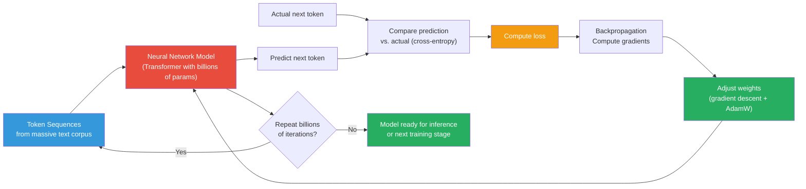
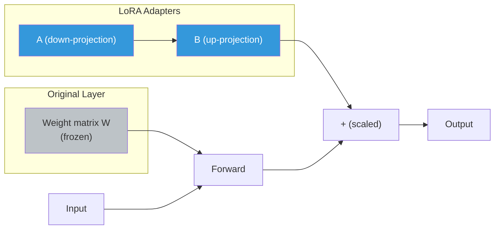
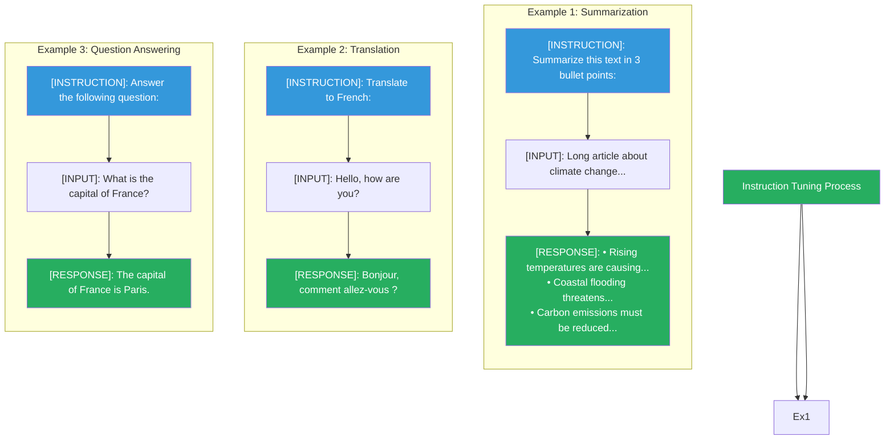
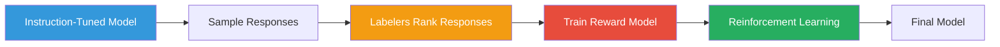

# Training Methods: Pre-training, Fine-tuning, Instruction Tuning, RLHF

## The Three Training Stages

Modern LLMs typically go through three stages:

## 1. Pre-training

### What it is
Training a language model from scratch on a massive, general-purpose text corpus.

### The Data
The training data is typically a diverse mix of:
- Web pages (Common Crawl)
- Books and articles
- Wikipedia
- Source code (GitHub)
- Technical documentation

### The Process

### Characteristics

| Property | Value |
|----------|-------|
| **Data size** | Hundreds of GB to TB |
| **Compute** | Thousands of GPU days |
| **Cost** | Millions of dollars |
| **Output** | A general-purpose "base model" |

### Output Behavior
A pre-trained model can:
- Predict likely next words
- Write coherent text
- Answer simple questions

But it lacks:
- Following instructions well
- Being helpful, honest, and harmless
- Domain-specific knowledge

### Example
GPT-3 was pre-trained on 300 billion tokens from Common Crawl, web texts, and books.

## 2. Fine-tuning

### What it is
Starting from a pre-trained model and continuing training on a smaller,
domain-specific dataset.

### When to use it
- You need domain expertise (medical, legal, finance)
- You want the model to speak in a specific style
- You want better reasoning in a specific area

### Approaches

| Approach | Description | Data Needed |
|----------|-------------|-------------|
| **Full fine-tuning** | Update all model weights | Large, high-quality dataset |
| **LoRA** | Low-rank adaptation — train small adapter layers | Small dataset |
| **Prompt tuning** | Learn soft prompt tokens | Very small dataset |

#### LoRA (Low-Rank Adaptation)

Instead of updating the full weight matrix, LoRA adds:
- `W + (B × A) × scaling`
- A is a down-projection (rank r), B is an up-projection
- Only A and B are trained; W stays frozen
- Dramatically reduces memory and compute

### Fine-tuning vs. Training from Scratch

| Aspect | Fine-tuning | Training from Scratch |
|--------|------------|----------------------|
| **Cost** | Low (thousands of dollars) | High (millions) |
| **Data needed** | Small, specialized | Massive, general |
| **Risk** | Low | High (might fail to converge) |
| **Time** | Hours to days | Weeks to months |

## 3. Instruction Tuning

### What it is
Fine-tuning where the training data consists of **instruction-response pairs**:

### Purpose
Teaches the model to:
- Understand and follow instructions
- Respond in a helpful assistant style
- Adapt to user intent

### Example Datasets
- **FLAN** (Google): 1.8K tasks formatted as instructions
- **Self-Instruct**: Model-generated instruction-following data
- **Open Instruction Generalist**: 16K tasks across 61 types

## 4. RLHF (Reinforcement Learning from Human Feedback)

### Why RLHF?
Pre-trained and instruction-tuned models still:
- Can produce harmful or biased content
- May make up facts (hallucinate)
- Might not be helpful in the way humans want

RLHF aligns models with human values and preferences.

### The RLHF Pipeline

### Steps

1. **Generate responses**: The instruction-tuned model produces several
   responses to the same prompt
2. **Human labeling**: Human labelers rank responses from best to worst
3. **Train reward model**: A classifier learns to predict which response humans
   prefer
4. **RL fine-tuning**: Use the reward model as a reward function for PPO
   (Proximal Policy Optimization) to optimize the model

### PPO (Proximal Policy Optimization)

PPO is a reinforcement learning algorithm that:
- Maximizes expected reward (human preference)
- Avoids large policy updates (stays close to the original model)
- Balances exploration and exploitation

### What RLHF Achieves

- **Helpfulness**: Answers are more useful and relevant
- **Honesty**: Reduces hallucinations (somewhat)
- **Harmlessness**: Avoids dangerous/offensive content

### Limitations
- RLHF is expensive (requires lots of human labeling)
- It optimizes for average human preference, not truth
- Can introduce bias from labeler demographics
- May make the model less creative or overly cautious

## Comparison Table

| Method | Cost | Data | Purpose | Example |
|--------|------|------|---------|---------|
| **Pre-training** | $$$ | Massive general text | Build general model | GPT-3 |
| **Fine-tuning** | $$ | Small domain data | Domain adaptation | Med-PaLM |
| **Instruction tuning** | $ | Instruction-response | Follow instructions | FLAN-T5 |
| **RLHF** | $$ | Human rankings | Safety + helpfulness | ChatGPT, Claude |

## How This Connects to Our POC

Our POC uses models that have already gone through all three training stages:

- **OpenAI models** (gpt-3.5-turbo, gpt-4): Pre-trained → Instruction-tuned → RLHF
- **sentence-transformers** (all-MiniLM-L6-v2): Pre-trained → Fine-tuned on
  sentence pairs for semantic similarity

We use **prompting** (not more training) to adapt these models to our use case.
This is the practical reality for most developers.
