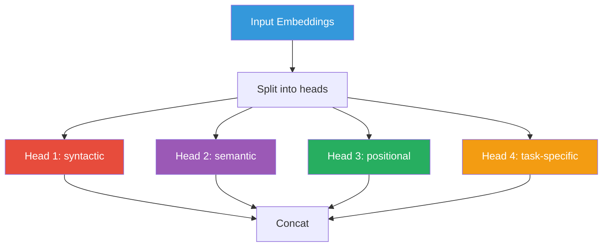
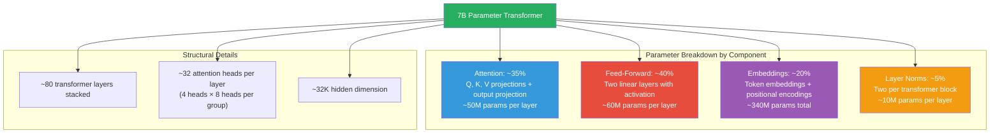

# Transformer Architecture

## What is a Transformer?

The **transformer** is a neural network architecture introduced in the 2017 paper
*"Attention Is All You Need"*. It replaced older architectures (RNNs, LSTMs) and
enabled training LLMs at scale.

### The Problem Transformers Solved

| Architecture | Problem |
|-------------|---------|
| RNN | Slow (sequential), loses long-range information |
| LSTM | Better at long sequences, but still sequential |
| Transformer | Parallel processing, excellent at long-range dependencies |

## Core Concepts

### Attention Mechanism

Attention allows the model to focus on relevant parts of the input when generating
each output token.

```mermaid
flowchart LR
    subgraph "When generating 'it'"
        Q[Query: "bank"]
        K1[Key: "river"]
        K2[Key: "money"]
        K3[Key: "river"]
    end

    Q --> K1
    Q --> K2
    Q --> K3

    style Q fill:#3498db,color:#fff
    style K1 fill:#e74c3c,color:#fff
    style K2 fill:#e74c3c,color:#fff
    style K3 fill:#e74c3c,color:#fff
```

When the model encounters the word "bank", attention helps it decide whether
"river" or "money" is the relevant context.

### Self-Attention

In self-attention, each token computes its relationship with **every other token**
in the sequence simultaneously:

```mermaid
flowchart TD
    subgraph "Self-Attention Weight Matrix"
        TokenThe["Token: \"The\""]
        TokenFish["Token: \"fish\""]
        TokenSwims["Token: \"swims\""]
        TokenNear["Token: \"near\""]
        TokenThe2["Token: \"the\""]
        TokenBank["Token: \"bank\""]
    end

    subgraph "Attention Weights"
        WThe["\"The\" → [0.2, 0.1, 0.1, 0.3, 0.2, 0.1]"]
        WFish["\"fish\" → [0.1, 0.3, 0.2, 0.1, 0.1, 0.2]"]
    end

    TokenThe --> WThe
    TokenFish --> WFish

    style TokenThe fill:#3498db,color:#fff
    style TokenFish fill:#3498db,color:#fff
    style WThe fill:#9b59b6,color:#fff
    style WFish fill:#9b59b6,color:#fff
```

Each row in the weight matrix represents one token's attention to all others.
Each token asks: *"How much should I pay attention to every other token?"*

### Multi-Head Attention

Instead of one attention "head", the model uses multiple heads — each learning
different types of relationships:



### Positional Encoding

Transformers process all tokens **in parallel**, so they need a way to know the
order of tokens. Positional encodings add information about token position:

```python
# Simplified sinusoidal positional encoding
def positional_encoding(position, d_model):
    # ...sine and cosine waves of different frequencies
    return encoding
```

### The Transformer Block


1. **Self-Attention**: Each token attends to all other tokens
2. **Residual connection + Layer Norm**: Adds original input back (helps gradients flow)
3. **Feed-Forward Network**: Two linear layers with a non-linear activation
4. **Residual connection + Layer Norm**: Again

### Encoder vs. Decoder

```mermaid
flowchart LR
    subgraph Encoder["Encoder (e.g., BERT)"
        E1["Input"] --> E2["Self-Attention"]
        E2 --> E3["FFN"]
        E3 --> E4["Output (representations)"]
    end

    subgraph Decoder["Decoder (e.g., GPT)"
        D1["Input"] --> D2["Masked Self-Attention"]
        D2 --> D3["Encoder-Decoder Attention"]
        D3 --> D4["FFN"]
        D4 --> D5["Output (next token)"]
    end

    style Encoder fill:#e74c3c,color:#fff
    style Decoder fill:#3498db,color:#fff
```

- **Encoder-only** (BERT): Great for understanding/classification. All tokens
  can see all other tokens.
- **Decoder-only** (GPT, Llama): Great for generation. Uses masked attention
  (each position can only see previous positions).
- **Encoder-Decoder** (T5): Good for translation, summarization.

## Why Transformers Enable LLMs

1. **Parallelization**: Unlike RNNs, transformers process all tokens at once —
   GPUs can train on massive batches simultaneously

2. **Long-range dependencies**: Self-attention connects any two tokens directly,
   regardless of distance

3. **Scalability**: No architectural limit on sequence length (unlike RNNs)

4. **Composability**: Easy to stack layers and scale up

## Parameters in a Transformer Layer

A typical transformer layer has:



## Next Steps

- Read about [Training Methods](training-methods.md) (pre-training, fine-tuning, RLHF)
- Explore [Prompt Engineering](../prompting/what-is-a-prompt.md) to see how we
  communicate with transformers
- See how our POC integrates with transformers in
  [Embedding Service Documentation](../embeddings/what-are-embeddings.md)
