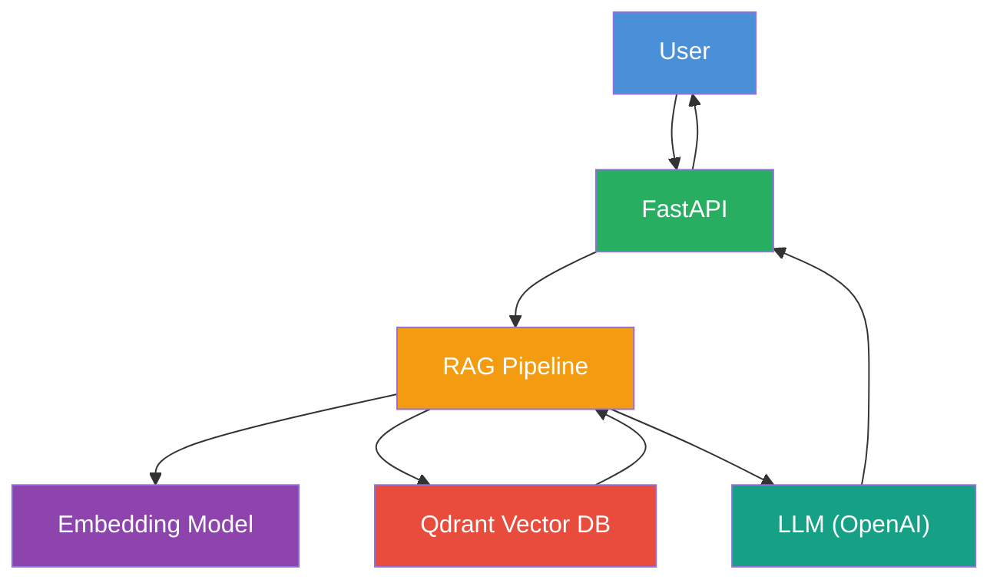
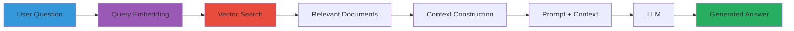

# GenAI Learning Lab

A hands-on **proof-of-concept** for learning Generative AI concepts with Python and FastAPI.

## What This Is

This project is a **learning laboratory**, not a production system. Every component is
written to be readable and instructive — abstractions are minimized so you can see
exactly how each GenAI building block works and how they connect.

## What You'll Learn

By building and exploring this POC, you'll understand:

- **What Generative AI is** and how it differs from traditional AI
- **How LLMs work** at a high level — transformers, attention, context windows
- **How applications call LLMs** — chat/completion APIs, parameters, streaming
- **How prompts influence** LLM responses — system/user/assistant messages, techniques
- **What embeddings are** — turning text into vectors, similarity metrics
- **What vector databases do** — storing and searching embeddings semantically
- **How RAG works** — grounding LLMs with retrieved, up-to-date context
- **How to build a GenAI app** — FastAPI + Qdrant + sentence-transformers + OpenAI

## Architecture Overview



## The RAG Flow (The Heart of This POC)



## Getting Started

### Quick Start with Docker

```bash
# Start the entire stack
docker compose up

# API docs: http://localhost:8000
# API: http://localhost:8000/api/v1/
# Qdrant UI: http://localhost:6333
# Documentation: http://localhost:8001
```

### Local Development

```bash
# Install Poetry (if not already installed)
pip install poetry

# Install dependencies
poetry install

# Set up environment
cp .env.example .env
# Edit .env with your API keys

# Run the server
poetry run uvicorn app.main:app --reload

# Run tests
poetry run pytest
```

## Project Structure

```mermaid
graph TD
    ROOT(["genai-poc/"])

    subgraph "Application"
        APP(["app/"])
        API(["api/v1/ - REST API endpoints"])
        CORE(["core/ - Configuration"])
        EMB(["embeddings/ - Text → vector conversion"])
        LLM(["llm/ - LLM API wrapper"])
        MODELS(["models/ - Pydantic schemas"])
        RAG(["rag/ - RAG pipeline<br/>(ingest → retrieve → generate)"])
        SVC(["services/ - Vector DB service"])
        MAIN(["main.py - FastAPI app"])

        APP --> API
        APP --> CORE
        APP --> EMB
        APP --> LLM
        APP --> MODELS
        APP --> RAG
        APP --> SVC
        APP --> MAIN
    end

    subgraph "Documentation & Infrastructure"
        DOCS(["docs/ - MkDocs learning documentation"])
        TESTS(["tests/ - Test suite"])
        DOCKER(["Dockerfile - App container"])
        DOCKER_DOCS(["dockerfile.docs - Documentation container"])
        COMPOSE(["docker-compose.yml - Full stack orchestration"])
        MKDOCS(["mkdocs.yml - Documentation config"])
        PYPROJ(["pyproject.toml - Poetry dependencies"])
        README(["README.md - This file"])
    end

    ROOT --> APP
    ROOT --> DOCS
    ROOT --> TESTS
    ROOT --> DOCKER
    ROOT --> DOCKER_DOCS
    ROOT --> COMPOSE
    ROOT --> MKDOCS
    ROOT --> PYPROJ
    ROOT --> README

    style ROOT fill:#3498db,color:#fff
    style APP fill:#9b59b6,color:#fff
    style DOCS fill:#e74c3c,color:#fff
    style TESTS fill:#e74c3c,color:#fff
    style DOCKER fill:#e74c3c,color:#fff
    style DOCKER_DOCS fill:#e74c3c,color:#fff
    style COMPOSE fill:#e74c3c,color:#fff
    style MKDOCS fill:#e74c3c,color:#fff
    style PYPROJ fill:#e74c3c,color:#fff
    style README fill:#e74c3c,color:#fff
```



## Navigation

Use the sidebar to explore topics in order:

1. **GenAI Fundamentals** — start here if you're new
2. **Prompt Engineering** — how to steer LLMs
3. **LLM APIs** — how the code talks to models
4. **Embeddings** — math of representing text as vectors
5. **Vector Databases** — where we store and search vectors
6. **RAG** — the core pattern this POC demonstrates
7. **Advanced** — agents, tools, observability, security
8. **Architecture** — how this project is structured

---

*This is a learning resource. The code prioritizes clarity over performance.*
